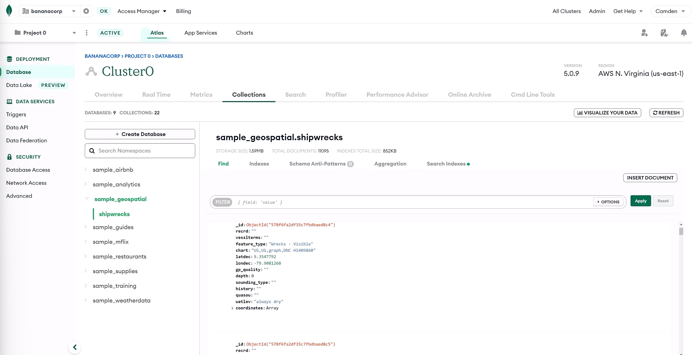
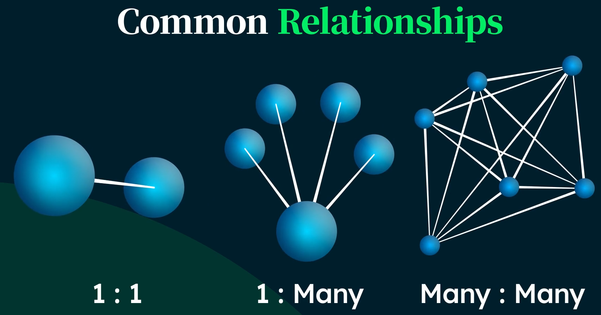
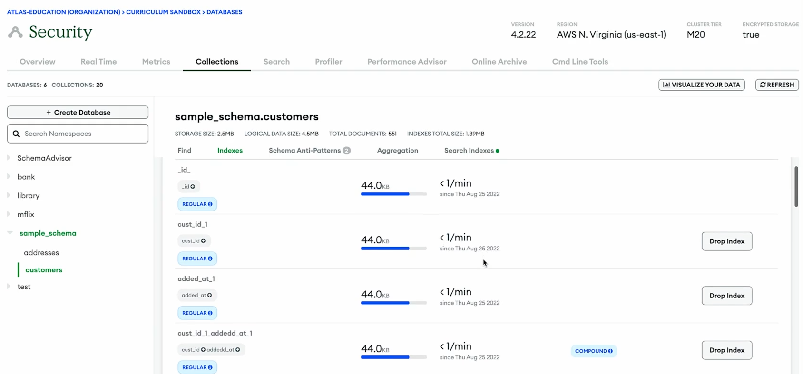
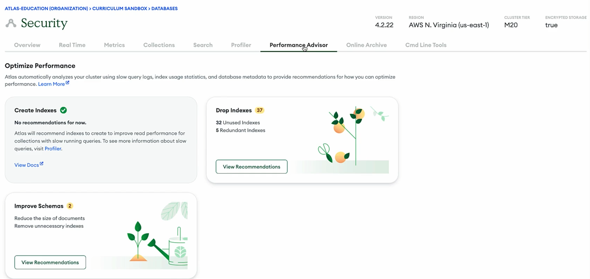

# 목차<!-- TOC -->

- [목차](#목차)
  - [MongoDB and the Document Model](#mongodb-and-the-document-model)
    - [Lesson 1. Introduction to MongoDB](#lesson-1-introduction-to-mongodb)
      - [MongoDB Database](#mongodb-database)
        - [How MongoDB is classified and commonly used](#how-mongodb-is-classified-and-commonly-used)
        - [Document Model](#document-model)
        - [Use Cases](#use-cases)
      - [How data is organized](#how-data-is-organized)
        - [Document](#document)
        - [Collection](#collection)
        - [Database](#database)
      - [How MongoDB relates to Atlas](#how-mongodb-relates-to-atlas)
        - [MongoDB database](#mongodb-database-1)
        - [Atlas](#atlas)
      - [Quiz](#quiz)
    - [Lesson 2. The MongoDB Document Model](#lesson-2-the-mongodb-document-model)
      - [Document Structure](#document-structure)
        - [BSON](#bson)
          - [Date](#date)
          - [정규표현식](#정규표현식)
          - [내장 도큐먼트](#내장-도큐먼트)
          - [배열](#배열)
          - [이진 데이터](#이진-데이터)
          - [코드](#코드)
          - [Number](#number)
          - [ObjectID](#objectid)
      - [Quiz](#quiz-1)
    - [Lesson 3. Managing Databases, Collections, and Documents in Atlas Data Explorer](#lesson-3-managing-databases-collections-and-documents-in-atlas-data-explorer)
      - [Atlas Data Explorer](#atlas-data-explorer)
      - [Quiz](#quiz-2)
    - [Overview of MongoDB and the Document Model](#overview-of-mongodb-and-the-document-model)
      - [Resources](#resources)
        - [Lesson 01: Introduction to MongoDB](#lesson-01-introduction-to-mongodb)
        - [Lesson 02: The MongoDB Document Model](#lesson-02-the-mongodb-document-model)
        - [Lesson 03: Managing Databases, Collections, and Documents in Atlas Data Explorer](#lesson-03-managing-databases-collections-and-documents-in-atlas-data-explorer)
  - [MongoDB Data Modeling Intro](#mongodb-data-modeling-intro)
    - [Lesson 1. Introduction to Data Modeling](#lesson-1-introduction-to-data-modeling)
      - [Purpose of data modeling](#purpose-of-data-modeling)
      - [Data Modeling](#data-modeling)
        - [Data](#data)
        - [Schema flexible](#schema-flexible)
      - [Quiz](#quiz-3)
    - [Lesson 2. Types of Data Relationships](#lesson-2-types-of-data-relationships)
      - [Common Relationships](#common-relationships)
        - [1:1](#11)
        - [1:N](#1n)
        - [M:N](#mn)
      - [Ways to model relationships](#ways-to-model-relationships)
        - [Embedding](#embedding)
        - [Referencing](#referencing)
      - [Quiz](#quiz-4)
    - [Lesson 3. Modeling Data Relationships](#lesson-3-modeling-data-relationships)
      - [1:1](#11-1)
      - [1:N](#1n-1)
      - [Quiz](#quiz-5)
        - [Hint](#hint)
    - [Lesson 4. Embedding Data in Documents](#lesson-4-embedding-data-in-documents)
      - [Embedding](#embedding-1)
        - [Warning, pitfalls](#warning-pitfalls)
      - [Quiz](#quiz-6)
    - [Lesson 5. Referencing Data in Documents](#lesson-5-referencing-data-in-documents)
      - [Reference](#reference)
      - [Quiz](#quiz-7)
    - [Lesson 6. Scaling a Data Model](#lesson-6-scaling-a-data-model)
      - [Optimum efficiency of:](#optimum-efficiency-of)
        - [Unbounded documents are documents that grow infinitely.](#unbounded-documents-are-documents-that-grow-infinitely)
      - [Quiz](#quiz-8)
    - [Lesson 7. Using Atlas Tools for Schema Help](#lesson-7-using-atlas-tools-for-schema-help)
      - [Schema anti-patterns](#schema-anti-patterns)
      - [MongoDB tools in Atlas](#mongodb-tools-in-atlas)
        - [Data Explorer](#data-explorer)
        - [Performance Advisor](#performance-advisor)
      - [Quiz](#quiz-9)
    - [Introduction to MongoDB Data Modeling](#introduction-to-mongodb-data-modeling)
    - [Resources](#resources-1)
      - [Lesson 01: Introduction to Data Modeling](#lesson-01-introduction-to-data-modeling)
      - [Lesson 02: Types of Data Relationships](#lesson-02-types-of-data-relationships)
      - [Lesson 03: Modeling Data Relationships](#lesson-03-modeling-data-relationships)
      - [Lesson 04: Embedding Data in Documents](#lesson-04-embedding-data-in-documents)
      - [Lesson 05: Referencing Data in Documents](#lesson-05-referencing-data-in-documents)
      - [Lesson 06: Scaling a Data Model](#lesson-06-scaling-a-data-model)
      - [Lesson 07: Using Atlas Tools for Schema Help](#lesson-07-using-atlas-tools-for-schema-help)
  - [The MongoDB Shell](#the-mongodb-shell)
    - [Lesson 1. Installing and Connecting to the MongoDB Shell](#lesson-1-installing-and-connecting-to-the-mongodb-shell)
      - [Install mongosh in an Ubuntu environment](#install-mongosh-in-an-ubuntu-environment)
      - [Connect to a MongoDB Atlas cluster](#connect-to-a-mongodb-atlas-cluster)
      - [Quiz](#quiz-10)
    - [Lesson 2. Configuring the MongoDB Shell](#lesson-2-configuring-the-mongodb-shell)
      - [Configure mongosh by Using the config API](#configure-mongosh-by-using-the-config-api)
      - [Configure mongosh by Using the Configuration File](#configure-mongosh-by-using-the-configuration-file)
      - [Configure mongosh by Using the --eval Flag](#configure-mongosh-by-using-the---eval-flag)
      - [Quiz](#quiz-11)
    - [Lesson 3. Using the MongoDB Shell](#lesson-3-using-the-mongodb-shell)
      - [Run External Scripts](#run-external-scripts)
      - [Edit Commands in an External Editor](#edit-commands-in-an-external-editor)
    - [Lesson 3. Using the MongoDB Shell](#lesson-3-using-the-mongodb-shell-1)
      - [Write and use JavaScript functions in mongosh](#write-and-use-javascript-functions-in-mongosh)
      - [Switch between and reference multiple databases within a script](#switch-between-and-reference-multiple-databases-within-a-script)
      - [Load that script into monosh](#load-that-script-into-monosh)
        - [Run External Scripts](#run-external-scripts-1)
      - [Edit commands in editor of choice](#edit-commands-in-editor-of-choice)
        - [Edit Commands in an External Editor](#edit-commands-in-an-external-editor-1)
      - [Quiz](#quiz-12)
    - [Lesson 4. Using the MongoDB Shell Library (.mongoshrc.js)](#lesson-4-using-the-mongodb-shell-library-mongoshrcjs)
      - [db.adminCommand():](#dbadmincommand)
      - [.mongoshrc.js](#mongoshrcjs)
        - [fcv()](#fcv)
      - [Quiz](#quiz-13)
    - [Lesson 5. MongoDB Shell Tips and Tricks](#lesson-5-mongodb-shell-tips-and-tricks)
      - [Code Summary: MongoDB Shell Tips and Tricks](#code-summary-mongodb-shell-tips-and-tricks)
        - [Use Node.js APIs to Read and Write Files](#use-nodejs-apis-to-read-and-write-files)
        - [Generate Seed Data](#generate-seed-data)
      - [Quiz](#quiz-14)
    - [The MongoDB Shell Summary](#the-mongodb-shell-summary)
      - [Resources](#resources-2)
  - [Connecting to a Mongodb Database](#connecting-to-a-mongodb-database)
    - [Lesson 1. Using MongoDB Connection String](#lesson-1-using-mongodb-connection-string)
      - [How to use the connection string](#how-to-use-the-connection-string)
        - [Connection string format](#connection-string-format)
      - [Where to locate the connection string](#where-to-locate-the-connection-string)
      - [What the string consists of](#what-the-string-consists-of)
      - [Quiz](#quiz-15)
    - [Lesson 2. Connecting to a MongoDB Atlas Cluster with the Shell](#lesson-2-connecting-to-a-mongodb-atlas-cluster-with-the-shell)
      - [Connect to the MongoDB Shell](#connect-to-the-mongodb-shell)
      - [Node.js REPL environment](#nodejs-repl-environment)
      - [Quiz](#quiz-16)
    - [Lesson 3. Connecting to a MongoDB Atlas Cluster with Compass](#lesson-3-connecting-to-a-mongodb-atlas-cluster-with-compass)
      - [MongoDB Compass](#mongodb-compass)
      - [Quiz](#quiz-17)
    - [Lesson 4. Connecting to a MongoDB Atlas Cluster from an Application](#lesson-4-connecting-to-a-mongodb-atlas-cluster-from-an-application)
      - [MongoDB Drivers](#mongodb-drivers)
      - [Driver docuementation](#driver-docuementation)
      - [Quiz](#quiz-18)
    - [Lesson 5. Troubleshooting MongoDB Atlas Connection Errors](#lesson-5-troubleshooting-mongodb-atlas-connection-errors)
      - [Network access errors](#network-access-errors)
      - [User authentication errors](#user-authentication-errors)
      - [Quiz](#quiz-19)
    - [Summarize](#summarize)
      - [Resources](#resources-3)
        - [Lesson 01: Using MongoDB Connection Strings](#lesson-01-using-mongodb-connection-strings)
        - [Lesson 02: Connecting to a MongoDB Atlas Cluster with the Shell](#lesson-02-connecting-to-a-mongodb-atlas-cluster-with-the-shell)
        - [Lesson 03: Connecting to a MongoDB Atlas Cluster with Compass](#lesson-03-connecting-to-a-mongodb-atlas-cluster-with-compass)
        - [Lesson 04: Connecting to a MongoDB Atlas Cluster from an Application](#lesson-04-connecting-to-a-mongodb-atlas-cluster-from-an-application)
        - [Lesson 05: Troubleshooting MongoDB Atlas Connection Errors](#lesson-05-troubleshooting-mongodb-atlas-connection-errors)

<!-- /TOC --> 1주차
## MongoDB and the Document Model
### Lesson 1. Introduction to MongoDB
#### MongoDB Database
##### How MongoDB is classified and commonly used
- A General Purpose Document Database
- The MongoDB database structures data in documents
    - which are similar to JSON objects
- This is fundamentally different from how relational databases structure data in tables of rows and columns.
- Documents offer a flexible and developer-friendly way to work with your data.
- Example
  ```json
  {
	"_id" : 1,
	"name" : {
		"first" : "Ada",
		"last" : "Lovelace"
	},
	"title" : "The First Programmer",
	"interests" : ["mathematics", "programming"]
  }
  ```
##### Document Model

- Easier to plan how application data will correspond to data in the database.
- Documents can be used to model data of any shape or structure.
- Document can model everything
    - Key-value
    - Text
    - Geospatial indexes
    - Time series
    - Graph data
    - and more…
- one format for any application

##### Use Cases

- E-commerce
- Content management
- IoT and time-series data
- Trading and Payments
- Gaming
- Mobile Apps
- Real-time analytics and AI

#### How data is organized

##### Document

- The basic unit of data in MongoDB

##### Collection

- A grouping of documents
- RDB의 Table

##### Database

- A container for collections
- DB

#### How MongoDB relates to Atlas

##### MongoDB database

- the core of Atlas
- 무료 OpenSource

##### Atlas

- Full text search
- Data visualization
- Data lake storage
- Mobile device sync
- Cloud의 비싼 DB

---

#### Quiz

1. **What is the relationship between the MongoDB database and MongoDB Atlas? (Select one.)**

- **A.** The MongoDB database is the locally deployed version of MongoDB Atlas.
    
    **Incorrect**.
    
    The MongoDB database can be deployed in the cloud via MongoDB Atlas, as well as locally. How might the MongoDB database and MongoDB Atlas be related?
    
- **B.** The MongoDB database is a core element of MongoDB Atlas, which is a multi-cloud developer data platform.
    
    **Correct.**
    
    The MongoDB database is the foundation of MongoDB Atlas. The additional functionality that Atlas offers—such as full-text search, data visualization, data lake storage, and mobile device sync—are built on top of data stored in cloud-hosted MongoDB database deployments.
    
- **C.** The MongoDB database is the free version of MongoDB Atlas.
    
    **Incorrect.**
    
    The MongoDB database can be deployed for free in the cloud via MongoDB Atlas, as well as locally. How might the MongoDB database and MongoDB Atlas be related?
    
2. **Jenni works at an e-commerce start-up that uses MongoDB for its customer data managament, product catalog and payment processing. Her startup now wants to add personalized recommendations for customers using real-time analytics. Jenni and her team will need to move data to a separate analytics database to handle this new use case.**
- **A.**
    
    True
    
    **Incorrect.**
    
    Consider the types of workloads that the MongoDB database can handle.
    
- **B.**
    
    False
    
    **Correct.**
    
    MongoDB is a general-purpose database that can handle most types of workloads, including real-time analytics.
    
3. **What is the basic unit of data in MongoDB? (Select one.)**

- **A.** Collection
    
    **Incorrect.**
    
    A collection is a grouping of the basic units of data in MongoDB.
    
- **B.** Database
    
    **Incorrect**.
    
    A database is a grouping of one or more collections in MongoDB. It is not the basic unit of data.
    
- **C.** Document
    
    **Correct.**
    
    A document is the basic unit of data in MongoDB. For this reason, MongoDB is classified as a document database.
    
- **D.** Row
    
    **Incorrect.**
    
    A row is a basic unit of data in a relational database. MongoDB structures data differently than relational databases.

### Lesson 2. The MongoDB Document Model
#### Document Structure

- Documents may contain different fields.
- Fields may contain different types.
- Flexible schema enables us to iterate quickly and evolve as our requirements change.
- The values in a document can be any data type, including strings, objects, arrays, booleans, nulls, dates, ObjectIds, and more. Here's the syntax for a MongoDB document, followed by an example:

Syntax:

```json
{
"key": value,
"key": value,
"key" : value
}

```

Example:

```json
{
"_id": 1,
"name": "AC3 Phone",
"colors" : ["black", "silver"],
"price" : 200,
"available" : true
}
```

##### BSON

- MongoDB documents are displayed in JSON format, but stored in BSON.
- Adds support data types unavailable in JSON
    - Dates, Numbers, ObjectIDs

###### Date

- 1970년 1월 1일부터의 시간을 1/1000초 단위로 나타내는 64비트 정수로 날짜를 저장
- 표준 시간대(time zone)는 저장하지 않는다.
    - 또 다른 키 값으로 저장 가능
    
    ```json
    {"x" : new Date()}
    ```
    

###### 정규표현식

- 쿼리는 자바스크립트의 정규 표현식 문법을 사용할 수 있다.

```json
{"x" : /foobar/i}
```

###### 내장 도큐먼트

- 부모 도큐먼트의 값으로 내장된 도큐먼트 전체를 포함할 수 있다.

```json
{"x" : {"foo" : "bar"} }
```

###### 배열

- 정렬 연산, ordered operation (리스트, 스택, 큐)과 비정렬 연산, unordered operation (셋) 호환

```json
{"things" : ["pie", 3.14]}
// 서로 다른 데이터형을 값으로 포함 가능
// 중첩 배열, nested array 가능
```

###### 이진 데이터

- 임의의 바이트 문자열
- 셸에서는 조작 불가능
- 데이터베이스에서 UTF-8이 아닌 문자열을 저장하는 유일한 방법

###### 코드

- 쿼리와 도큐먼트는 임의의 자바스크립트 코드를 포함할 수 있다.

```json
{"x" : function() { /* ... */ } }
```

###### Number

- 셸은 64bit 부동소수점 수를 기본으로 사용
    
    ```json
    {"x" : 3.14}
    {"x" : 3}
    ```
    
- 부호 정수 signed integer
    - 4 byte : NumberInt
        
        ```json
        {"x" : NumberInt("3")}
        ```
        
    - 8 byte : NumberLong
        
        ```json
        {"x" : NumberLong("3")}
        ```
        

###### ObjectID

- 도큐먼트용 12 byte ID
    - 24자리 16진수 문자열 표현 가능
    - 바이트당 2자리 사용
    - 0 1 2 3 (타임 스탬프) 4 5 6 7 8 (랜덤) 9 10 (카운터) 11 (랜덤 시작 값)
        - 타임 스탬프
            - 초 단위의 유일성 제공
            - 입력 순서대로 정렬
- A data type used to create unique identifiers for the required _id field.
- Every document requires an _id field, which acts as a primary key.
- If an inserted document doesn’t include the _id field, MongoDB automatically generates an ObjectId for the _id field.
- 프로세스당 1초에 256³(1677만7216)개까지 생성

```json
{"x" : ObjectId()}
```

---

#### Quiz

1. **Which of the following are data types that are supported by MongoDB by using BSON? (Select all that apply.)**
- **A.** 32-bit integer
    
    **Correct.**
    
    32-bit integer is one of several numeric data types that are supported by BSON. The other numeric data types supported by BSON are 64-bit integers, double (for floating point data), and decimal128.
    
- **B.** Object
    
    **Correct.**
    
    The object data type is used to embed documents within a parent document.
    
- **C.** Array
    
    **Correct**.
    
    Arrays can contain items of any other BSON data type, including other arrays and objects.
    
- **D.** ObjectId
    
    **Correct**.
    
    ObjectId is the data type used to auto-generate a unique identifier for a document if an inserted document does not include `_id` field.
    
- **E.** _id
    
    **Incorrect**.
    
    `_id` is a required field in every MongoDB document, but it's not a data type. If an inserted document does not include an `_id` field, MongoDB will automatically create the `_id` field and populate it with a value of type `ObjectId`.
    
2. Which of the following statements are true about the **_id** field in MongoDB? (Select all that apply.)
- **A.** The user must specify the _id field for each inserted document.
    
    **Incorrect.**
    
    If an inserted document omits the `_id` field, MongoDB automatically generates an ObjectId and assigns it as the value for the `_id` field.
    
- **B.** The _id field is required for each document.
    
    **Correct.**
    
    Every MongoDB document must include a `_id` field with a unique value, whether it's included in the inserted document or auto-generated by MongoDB.
    
- **C.** The _id field must be unique.
    
    **Correct.**
    
    The `_id` field is used as a unique identifier in MongoDB.
    
- **D.** The _id field is automatically included and populated with an ObjectId if the _id field is omitted in an inserted document.
    
    **Correct**.
    
    The `_id` field is automatically included and populated with an ObjectId if it's omitted in the inserted document.
    
3. Use the following documents labeled Document A and Document B to answer this question.

Elena's company has been storing customer data in records that are structured like Document A. Her company wants to add a new field to their customer records so that they are structured like Document B. Before inserting records like Document B, Elena and her team must update all older records to include the new field.

**Document A**

```json
{
  "username": "vreddy",
  "name": "Vasanti Reddy",
  "email": "vreddy1@gmail.com",
  "location": {
    "city": "Delhi",
    "country": "India"
  }
}
```

**Document B**

```json
{
  "username": "avasa",
  "name": "Asad Vasa",
  "email": "avasa1@yahoo.com",
  "social_media": {
    "Twitter": "avasa",
    "Instagram": "Asad101",
    "LinkedIn": "AsadVasa"
  },
  "location": {
    "city": "Los Angeles",
    "country": "United States"
  }
}
```

- **A.**
    
    True
    
    **Incorrect.**
    
    Consider whether MongoDB can store documents with different fields and value types in the same collection.
    
- **B.**
    
    False
    
    Correct
    
    MongoDB has a flexible schema model, which means that documents in the same collection are not required to share a common structure of fields and value types by default.

### Lesson 3. Managing Databases, Collections, and Documents in Atlas Data Explorer

#### Atlas Data Explorer

- Atlas’ built-in tool to visually interact and manage data from Atlas UI

    

---

#### Quiz

1. **To view databases and collections in the Atlas Data Explorer, which button should you select? (Select one.)**
- **A.** Connect
    
    Incorrect. The Connect button will open a menu that allows you to select a connection method for connecting your cluster to your application.
    
- **B.** View Monitoring
    
    Incorrect. The View Monitoring button will show you the metrics for your cluster.
    
- **C.** Browse Collections
    
    Correct! The Browse Collections button will allow you to examine the databases and collections within your cluster.
    
- **D.** Create
    
    Incorrect. The Create button is used to create a new cluster.
    
1. **Using the Atlas Data Explorer, how can you add a collection to an existing database? (Select one.)**
- **A.** Select the database, then click the Create Collection button
    
    Correct! To add a collection to an existing database, select the database and then select the Create Collection button.
    
- **B.** Select the Create Database button
    
    Incorrect. You cannot add a collection to an existing database with the Create Database button. You use the Create Database button to create a new database.
    
- **C.** You cannot add a collection to an existing database in Atlas Data Explorer, you must use the terminal.
    
    Incorrect. You can add a collection to an existing database using the Atlas Data Explorer. To do so, select the database and then select the Create Collection button.

### Overview of MongoDB and the Document Model
In this unit, you learned about the relationship between MongoDB and Atlas. MongoDB is a general-purpose database that can be used for a variety of use cases. It’s part of Atlas, the developer data platform. You also learned about the MongoDB document model. Specifically, you learned about these key features:

- Data is organized into documents, collections, and databases.
- Documents are stored in BSON, which supports a large range of data types, including all JSON data types, dates, numbers, and ObjectIds.
- Every document requires an `_id` field, which acts as a primary key or unique identifier. If an inserted document doesn’t have an `_id` field, MongoDB automatically generates one.
- MongoDB has a flexible schema, which means that documents with different structures can be stored in the same collection.

Finally, you learned how to use Atlas Data Explorer to create a database, collection, and a document and begin storing your own data.

#### Resources

Use the following resources to learn more about inserting and finding documents in MongoDB:

##### Lesson 01: Introduction to MongoDB

- [What Is MongoDB?](https://www.mongodb.com/what-is-mongodb?_ga=2.64483046.810066485.1665291537-836515500.1666025886)
- [MongoDB Use Cases](https://www.mongodb.com/use-cases?_ga=2.64483046.810066485.1665291537-836515500.1666025886)

##### Lesson 02: The MongoDB Document Model

- [MongoDB Docs: Documents](https://www.mongodb.com/docs/manual/core/document/?_ga=2.64483046.810066485.1665291537-836515500.1666025886)
- [MongoDB Docs: BSON Types](https://www.mongodb.com/docs/manual/reference/bson-types/?_ga=2.64483046.810066485.1665291537-836515500.1666025886)
- [Explaining BSON with Examples](https://www.mongodb.com/basics/bson?_ga=2.64483046.810066485.1665291537-836515500.1666025886)
- [JSON and BSON](https://www.mongodb.com/json-and-bson?_ga=2.64483046.810066485.1665291537-836515500.1666025886)

##### Lesson 03: Managing Databases, Collections, and Documents in Atlas Data Explorer

- [MongoDB Docs: Create, View, and Drop Databases](https://www.mongodb.com/docs/atlas/atlas-ui/databases/?_ga=2.64483046.810066485.1665291537-836515500.1666025886)
- [MongoDB Docs: Databases and Collections](https://www.mongodb.com/docs/manual/core/databases-and-collections/?_ga=2.97437654.810066485.1665291537-836515500.1666025886)

## MongoDB Data Modeling Intro
### Lesson 1. Introduction to Data Modeling
#### Purpose of data modeling

- Differences between the traditional relational data model and the document model
- Advantages of the document model

#### Data Modeling

- the process of defining how data is stored and the relationships that exist among different entities in your data.
- the organization of data inside a database as a schema
- Questions
    - What does my application do?
    - What data will I store?
    - How will users access this data?
    - What data will be most valuable to me?
    
    - Your tasks as well as those of users
    - What your data looks like
    - The relationships among the data
    - The tooling you plan to have
    - The access patterns that might emergy.
- make it easier to manage data
- make queries more efficient
- use less memory and CPU
- reduce costs

##### Data

- Data that is accessed together should be stored together.

##### Schema flexible

- the MongoDB document is not schemaless
- you’re encouraged to define a schema, you can use schema validation
- you can store any kind of data in MongoDB
- you can even store documents that have other documents that are nested or embedded.
    - Embedded document model enables us to build complex relationships among data
- you can normalize your data by using database references
    - How your application will use the data rather than how it’s stored in the database.

---

#### Quiz 

1. **Which of the following statements is/are true about data modeling? (Select all that apply.)**

- **A.** Data modeling is the process of defining how data is stored.
    
    **Correct!**
    
    Defining how data is stored is one function of data modeling. Data modeling helps you use your data effectively to meet information needs.
    
- **B.** Data modeling is the process of defining the relationships that exist among different entities in your data.
    
    **Correct!**
    
    Defining the relationships that exist among different entities in your data is one function of data modeling. Data modeling enables you to document data requirements for applications and identify errors in development plans before any code is written.
    
- **C.** Data modeling is the process of collecting data.

2. **Which of the following are benefits of a proper data model? (Select all that apply.)**

- **A.** A proper data model makes it easier to manage your data.
    
    **Correct!**
    
    A proper data model makes it easier to manage your data. It will sustain growing data volumes and adjust easily to the addition or deletion of data.
    
- **B.** A proper data model makes queries more efficient.
    
    **Correct!**
    
    A proper data model makes queries more efficient. It helps developers understand the database and tune it for fast performance, which makes reading and writing to the database faster.
    
- **C.** A proper data model uses less memory and CPU.
    
    **Correct!**
    
    A proper data model uses less memory and CPU. Data modeling helps you better estimate and model memory requirements.
    
- **D.** A proper data model reduces costs.
    
    **Correct!**
    
    A proper data model can reduce costs by using your database more efficiently. Data modeling catches errors and oversights early, when they are easier to fix.
    
3. **Which of the following is a benefit of the document model?**
- **A.**
    
    The document model does not enforce any document structure by default. This means that documents even in the same collection can have different structures.
    
    **Correct!**
    
- **B.**
    
    The document model makes having a schema useless.
    
- **C.**
    
    The document model supports only simple relationships among data to make data wrangling easier.

### Lesson 2. Types of Data Relationships
#### Common Relationships



##### 1:1

- One-to-one
- A relationship where a data entity in one set is connected to exactly one data entity in another set

```json
{
	"title" : "Star Wars: Episode IV - A New Hope",
	"director": "George Lucas",
}
```

##### 1:N

- One-to-many
- A relationship where a data entity in one set is connected to any number of data entities in another set
- Embedding

```json
{
	"cast": [
		{"actor": "Mark Hamill", "character" : "Luke Skywalker"},
		{"actor": "Harrison Ford", "character" : "Han Solo"},
		{"actor": "Carrie Fisher", "character" : "Princess Leia Organa"},
		...
	]
}
```

##### M:N

- Many-to-many
- A relationship where any number of data entities in one set are connected to any number of data entities in another set

#### Ways to model relationships

##### Embedding

- We take related data and insert it into our document
- 비정규화

```json
{
	"cast": [
		{"actor": "Mark Hamill", "character" : "Luke Skywalker"},
		{"actor": "Harrison Ford", "character" : "Han Solo"},
		{"actor": "Carrie Fisher", "character" : "Princess Leia Organa"},
		...
	]
}
```

##### Referencing

- We refer to documents in another collection in our document
- 정규화

```json
{
	"filming_locations" : [
		ObjectID("654a1420f29313fggbcd718"),
		ObjectID("654a1420f29313fggbcd719"),
		...
	]
}
```

---

#### Quiz

1. **Which of the following are common types of relationships that are found in every database? (Select all that apply.)**

- **A.** One-to-one relationship
    
    **Correct!**
    
    A one-to-one relationship is one of the most common types of relationships found in a database. One-to-one is a relationship where a data entity in one set is connected to exactly one data entity in another set.
    
- **B.** One-to-many relationship
    
    **Correct!**
    
    A one-to-many relationship is one of the most common types of relationships found in a database. One-to-many is a relationship where a data entity in one set is connected to any number of data entities in another set.
    
- **C.** Many-to-many relationship
    
    **Correct!**
    
    A many-to-many relationship is one of the most common types of relationships found in a database. Many-to-many is a relationship where any number of data entities in one set are connected to any number of data entities in another set.
    
- **D.** One-to-zillions relationship

2. What is the type of relationship shown in the following document?

```json
{
    "_id": ObjectId("00000001"),
    "name": "Marnie Dupree",
    "grade": "Freshman",
    "studentId": 123456,
    "email": "mdupree@college.edu"
}
```

- **A.** One-to-one relationship
    
    **Correct!**
    
    There is a one-to-one relationship in this document. This is a document for a single student that contains her unique identifying fields.
    
- **B.** One-to-many relationship
- **C.** Many-to-many relationship

### Lesson 3. Modeling Data Relationships
#### 1:1

```json
{
	"student": "John Smith",
	"student_id": "001",
	"age": "18",
	"home_phone": "2125550000",
	"cell_phone": "2125550001",
	"email": "johnsmith@mongodb.edu",
	"grade_level": "freshman",
	"street": "3771 McClintock Ave",
	"city": "Los Angeles",
	"state": "CA",
	"zip": "90089",
	"emergency_contact_name": "Mary Smith",
	"emergency_contact_number": "2125550002",
	"emergency_contact_relation": "Mother",
}
```

#### 1:N

```json
{
	"student": "John Smith",
	"student_id": "001",
	"age": "18",
	"email": "johnsmith@mongodb.edu",
	"grade_level": "freshman",
	"street": "3771 McClintock Ave",
	"city": "Los Angeles",
	"state": "CA",
	"zip": "90089",
	"contact_phone": ["2125550000", "2125550002", "2125550001"]
}
```

```json
{
	"student": "John Smith",
	"student_id": "001",
	"age": "18",
	"email": "johnsmith@mongodb.edu",
	"grade_level": "freshman",
	"street": "3771 McClintock Ave",
	"city": "Los Angeles",
	"state": "CA",
	"zip": "90089",
	"contact_number": [
		{"number": "2125550000", type: "home"},
		{"number": "2125550001", type: "cell"},
		{"number": "2125550002", type: "emergency"}
	]
}
```

---

```json
{
	"student": "John Smith",
	"student_id": "001",
	"age": "20",
	"contact_number": [
		{"number": "2125550000", type: "home"},
		{"number": "2125550001", type: "cell"},
		{"number": "2125550002", type: "emergency"}
	]
		"email": "johnsmith@mongodb.edu",
		"grade_level": "junior",
		"gpa": "4.0",
		"street": "3771 McClintock Ave",
		"city": "Los Angeles",
		"state": "CA",
		"zip": "90089",
		"emergency_contact_name": "Mary Smith",
		"emergency_contact_relation": "Mother",
		**"courses": [
			{"course_id": "CS150",
				"course_name": "MongoDB101."
			},
			{
				"course_id": "CS177",
				"course_name": "Introduction to Programming in Python."
			}
		]**
}
```

```json
{
	"courses":[
		{"course_id": "CS100",
		"course_name": "An Introduction to Computer Science",
		"professor": "Sarah Lambert",
		"Offered": "Spring, Summer, Fall, Winter"},
		
		{"course_id": "CS150",
		"course_name":"MongoDB101",
		"professor": "Bernie Hacker",
		"Offered": "Fall, Spring"},
		
		{"course_id": "CS177",
		"course_name": "Introduction to Programming in Python",
		"professor": "Bernie Hacker",
		"Offered": "Winter", }
	]
}
```

---

#### Quiz

1. A legacy bank database has been ported to MongoDB, resulting in a set of collections that were mapped to their original tables.

You're tasked with redesigning the `accounts` collection of the `banking` database to make the information clearer. The bank would like you to keep the customers' contact information and account information separate.

The following is a sample document in the `accounts` collection:

```json
{
  "account_id": "MDB653115886",
  "account_holder": "Herminia Mckinney",
  "account_type": "savings",
  "balance": 6617.34,
  "street_num": 123,
  "street": "Main St",
  "city": "Tulsa",
  "state": "OK",
  "zip": 74008,
  "country": "USA",
  "home_phone": 1234567890,
  "cell_phone": 1111111111,
  "transfers": [
    ...
  ],
}
```

Which of the following actions can be made to improve this schema? Consider the following requirements:

- Preserve the one-to-one relationship among all the fields.
- Keep the contact and account information separate.
- Store data together that is accessed together.

##### Hint

Remember that you can embed subdocuments and create separate collections.


- **A.** Create two collections: one for accounts and one for customer_info.
    
    **Correct!**
    
    Creating two collections, one for `accounts` and one for `customer_info`, aligns with the customer's requirements. It also ensures that data that is accessed together is stored together.
    
- **B.** Embed the phone numbers as a subdocument.
    
    **Correct!**
    
    Embedding the phone numbers as a subdocument can improve the schema, and it ensures that data that is accessed together is stored together.
    
- **C.** Create two collections that have no overlapping fields.
    
    **Incorrect.**
    
    Creating two collections that have no overlapping fields would not keep related information together, as there would not be references to link the two collections. This would not follow the principle of storing data together that is accessed together.
    
- **D.** Keep the current schema as is.
    
    **Incorrect.**
    
    Keeping the current schema as is would not be the best option here given the requirements. The current schema does not keep contact information and account information separate, and it does not follow the principle of storing data together that is accessed together.

### Lesson 4. Embedding Data in Documents
#### Embedding

- Ideal for one-to-many and many-to-many relationships among data.
- Store related data in a single document.
- Simplify queries and improves overall query performance.
- Example

```json
{
	name: {firstName: "Sarah", lastName: "Davis"}
	Job: professor
	Address:
		{mailingAddress:
			Street: 402 Maple
			City: Chicago
			Zipcode: 81442 }
		{secondaryAddress:
			Street: 318 University Blvd
			City: Chicago
			Zipcode: 81445}
		{emergencyAddress:
			Name: Kerri Davis
			Street: 42 Wallaby Way
			City: Sydney
			Zipcode: 78 AUZ90
			Country: Australia }
			
}
```

- Avoids application joins
- Provides better performance for read operations
- Allows developers to update related data in a single write operation

##### Warning, pitfalls

- Embedding data into a single document can create large documents.
    - Large documents have to be read into memory in full, which can result in a slow application performance for your end user.
- Continuously adding data without limit creates unbounded documents.
    - Unbounded documents may exceed the BSON document threshold of 16 MB.

---

#### Quiz

1. **Which of the following statements is/are true about embedding data in documents? (Select all that apply.)**

- **A.** Embedding data in documents simplifies queries.
    
    **Correct!**
    
    Embedding data simplifies queries because it avoids application joins. It fulfills the principle that data that is accessed together should be stored together.
    
- **B.** Embedding data in documents improves the overall performance of queries.
    
    **Correct!**
    
    Embedding data provides better performance for read operations. Embedded documents enable you to store all kinds of related information in a single document.
    
- **C.** Embedding data in documents makes your document smaller over time.
- **D.** Embedding data in documents never results in an unbounded document.

2. **Which of the following relationship types often use embedding? (Select all that apply.)**

- **A.** One-to-one relationship
    
    **Correct!**
    
    With MongoDB, embedding a one-to-one relationship means putting the two pieces of information in the same document. You could also opt to use a subdocument to group related information, such as the components of an address.
    
- **B.** One-to-many relationship
    
    **Correct!**
    
    Embedding is often used when there are one-to-many relationships in the data that's being stored. MongoDB recommends embedding documents to simplify queries and improve overall query performance.
    
- **C.** Many-to-many relationship
    
    **Correct!**
    
    Embedding is often used when there are many-to-many relationships in the data that's being stored. MongoDB recommends embedding documents to simplify queries and improve overall query performance. It is important to note that embedding this type of relationship may introduce data duplication.

### Lesson 5. Referencing Data in Documents
#### Reference

- Save the _id field of one document in another document as a link between the two.
- Using references is called linking or data normalization
- No duplication of data
- Smaller documents
- Querying from multiple documents costs extra resources and impacts read performance
- Example

```json
{
	"student": "John Smith",
	"student_id": "001",
	"age": "18",
	"email": "johnsmith@mongodb.edu",
	"grade_level": "freshman",
	"gpa": "4.0",
	"street": "3771 McClintock Ave",
	"city": "Los Angeles",
	"state": "CA",
	"zip": "90089",
	"emergency_contact_name": "Mary Smith",
	"emergency_contact_relation": "Mother",
	"courses":
		{
			**"course_id": "CS150",**
			"course_name": "MongoDB101."
		}
		{
			**"course_id": "CS177",**
			"course_name": "Introduction to Programming in Python."
		}
}
```

| Embedding | Referencing |
| --- | --- |
| Single query to retrieve data | No duplication |
| Single operation to update/delete data | Smaller documents |
| Data duplication | Need to join data from multiple documents |
| Large documents |  |

---

#### Quiz

1. **Which of the following statements is/are true about referencing data in documents? (Select all that apply.)**

- **A.** Referencing data in documents avoids duplication of data.
    
    **Correct!**
    
    Referencing allows you to store data in two different collections and ensure that the collections are related. This avoids duplication of data.
    
- **B.** Referencing data in documents may result in smaller documents.
    
    **Correct!**
    
    Referencing avoids duplication of data and, in most cases, results in smaller documents.
    
- **C.** Referencing data in documents links documents by using the same field.
    
    **Correct!**
    
    References save the `_id` field of one document in another document as a link between the two.
    
- **D.** Referencing data in documents improves read performance.

2. **Imagine the following are a sample of documents from a `users` collection:**

```json
...
{
    "id": "AL001",
    "name": "Ella Richardson"
},
{
    "id": "AL002",
    "name": "Jackie Thomas"
},
{
    "id": "AL003",
    "name": "Justin McDonald"
},
...
```

**Consider the following document from a `posts` collection, which contains data about a blog post and its comments. Which field is used as a reference? (Select one.)**

```json
{
    "author": "Aileen Long",
    "title": "Learn MongoDB in 30 Mins",
    "published_date": ISODate("2020-05-18T14:10:30Z"),
    "tags": ["mongodb", "introductory", "database", "nosh"],
    "comments": [
        {
            "comment_id": "LM001",
            "user_id": "AL001",
            "comment_date": ISODate("2020-05-19T14:22:00Z"),
            "comment": "Great read!"
        },
        {
            "comment_id": "LM002",
            "user_id": "AL002",
            "comment_date": ISODate("2020-06-01T08:00:00Z"),
            "comment": "So easy to understand - thanks!"
        }
    ]
}
```

- **A.** comment_id
- **B.** comments
- **C.** date
- **D.** user_id
    
    **Correct.**
    
    `user_id` is a reference to a document in the `users` collection. Reference: https://www.mongodb.com/docs/manual/reference/database-references/

### Lesson 6. Scaling a Data Model
#### Optimum efficiency of:

- Query result times
- Memory usage
- CPU usage
- Storage

##### Unbounded documents are documents that grow infinitely.

```json
{
	title: "Basics of MongoDB",
	url: "https://www.mongodbbasics.com",
	text: "Let's learn the basics of MongoDB!”,
	comments: [{
		name: "John Smith",
		created_on: ISODate("2022-07-21T11:00:00Z")
		comment: "I learned a lot!”
		}, {
		name: "Jane Doe"
		created_on: ISODate("2022-07-22T11:00:00Z"),
		comment: "Looks great"
		}]
}
```

- Problems as the array grows larger:
    - It will take up more space in memory
    - May impact write performance
    - Difficult to perform pagination of comments
    - Maximum document size of 16 MB will lead to strage problems

`blog_post` collection
```json

{
	_id: 1,
	title: "Basics of MongoDB",
	url: "https://www.mongodbbasics.com",
	text: "Let's learn the basics of MongoDB!"
}

```
`comments` collection
```json
{
	blog_entry_id: 1,
	name: "John Smith",
	created_on: ISODate("2022-07-21T11:00:00Z"),
	comment: "I learned a lot!"
}
{
	blog_entry_id: 1,
	name: "Jane Doe",
	created_on: ISODate("2022-07-22T11:00:00Z"),
}
```

---

#### Quiz

1. **What are the effects of creating unbounded documents when embedding data? (Select all that apply.)**

- **A.** Unbounded documents impact write performance.
    
    **Correct!**
    
    Embedding data will make the document larger and impact write performance. As more data is added to each document, the entire document is rewritten into MongoDB data storage.
    
- **B.** Unbounded documents improve pagination performance.
- **C.** Unbounded documents cause storage problems.
    
    **Correct!**
    
    Unbounded documents caused by embedding will eventually run into storage problems by exceeding the maximum document size of 16 MB.
    
2. **What is the recommended way to avoid the unbounded document sizes that may result from embedding?**
- **A.**
    
    Break data into multiple collections and use references.
    
    **Correct!**
    
    To prevent unbounded document sizes that may result from embedding, you can break up your data into multiple collecitons and use references to keep frequently accessed data together.
    
- **B.**
    
    Break data into multiple databases.
    
    Incorrect
    
- **C.**
    
    Separate documents to store on different servers.
    
    Incorrect
    

3. **What is MongoDB's principle for how you should design your data model?**
- **A.**
    
    Data that is accessed together should be stored together.
    
    **Correct!**
    
    Data that is accessed together should be stored together. How you model your data depends entirely on your particular application's data access patterns. You want to structure your data to match the ways that your application queries and updates it.
    
- **B.**
    
    Data that is collected in the same day should be stored together.
    
    Incorrect
    
- **C.**
    
    Data that is not in a one-to-one relationship should be stored together.
    
    Incorrect

### Lesson 7. Using Atlas Tools for Schema Help
#### Schema anti-patterns

- Schema design patterns are guidelines that help developers plan, organize, and model data.
- Schema anti-patterns results:
    - Sub-optimal performance
    - Non-scalable solutions
- Common schema anti-patterns:
    - Massive arrays
    - Massive number of collections
    - Bloated documents
    - Unnecessary indexes
    - Queries without indexes
    - Data that’s accessed together, but stored in different collections

#### MongoDB tools in Atlas

##### Data Explorer

- Free tier
- Shows schema ani-patterns
- Collection and inex stats for each collection
    - Storage Size
    - Logical Data Size
    - Total Documents
    - Indexes Total Size



##### Performance Advisor

- M10 tier or higher
- Analyzes the most active collections
- Recommends schema improvements



---

#### Quiz

1. **Which tab in Data Explorer shows ways to improve your schemas?**
- **A.** Indexes
    
    Incorrect
    
- **B.** Schema Anti-Patterns
    
    **Correct!**
    
    The Schema Anti-Patterns tab highlights any issues in the collection and provides details to resolve them. You can improve your schema by resolving the anti-patterns that are shown.
    
- **C.** Find
    
    Incorrect
    
1. **What is the minimum Atlas Cluster tier that you must have to use the Performance Advisor tool?**
- **A.** M0
    
    Incorrect
    
- **B.** M10
    
    **Correct!**
    
    The Performance Advisor tool is available in M10+ cluster tiers.
    
- **C.**
    
    M30
    
    Incorrect

### Introduction to MongoDB Data Modeling

In this unit, you learned how to:

- Explain the purpose of data modeling.
- Identify the types of data relationships (one to one, one to many, many to many).
- Model data relationships.
- Identify the differences between embedded and referenced data models.
- Scale a data model.
- Use Atlas Tools for schema help.


### Resources

Use the following resources to learn more about the basics of data modeling:

#### Lesson 01: Introduction to Data Modeling

- [Data Modeling Introduction](https://www.mongodb.com/docs/manual/core/data-modeling-introduction/?_ga=2.60935781.810066485.1665291537-836515500.1666025886)
- [Separating Data That is Accessed Together](https://www.mongodb.com/developer/products/mongodb/schema-design-anti-pattern-separating-data/?_ga=2.60935781.810066485.1665291537-836515500.1666025886)

#### Lesson 02: Types of Data Relationships

- [Data Model Design](https://www.mongodb.com/docs/manual/data-modeling/schema-design-process/)
- [Model Relationships Between Documents](https://www.mongodb.com/docs/v4.2/applications/data-models-relationships/?_ga=2.19332209.810066485.1665291537-836515500.1666025886)
- [Embedding MongoDB](https://www.mongodb.com/basics/embedded-mongodb?_ga=2.19332209.810066485.1665291537-836515500.1666025886)
- [MongoDB Schema Design Best Practices](https://www.mongodb.com/developer/products/mongodb/mongodb-schema-design-best-practices/?_ga=2.19332209.810066485.1665291537-836515500.1666025886)

#### Lesson 03: Modeling Data Relationships

- [Data Model Design](https://www.mongodb.com/docs/manual/data-modeling/schema-design-process/)
- [Model Relationships Between Documents](https://www.mongodb.com/docs/v4.2/applications/data-models-relationships/?_ga=2.19332209.810066485.1665291537-836515500.1666025886)

#### Lesson 04: Embedding Data in Documents

- [Embedding MongoDB](https://www.mongodb.com/basics/embedded-mongodb?_ga=2.19332209.810066485.1665291537-836515500.1666025886)
- [Model One-to-One Relationships with Embedded Documents](https://www.mongodb.com/docs/manual/tutorial/model-embedded-one-to-one-relationships-between-documents/?_ga=2.19332209.810066485.1665291537-836515500.1666025886)
- [Model One-to-Many Relationships with Embedded Documents](https://www.mongodb.com/docs/manual/tutorial/model-embedded-one-to-many-relationships-between-documents/?_ga=2.19332209.810066485.1665291537-836515500.1666025886)

#### Lesson 05: Referencing Data in Documents

- [Normalized Data Models](https://www.mongodb.com/docs/manual/data-modeling/#references)
- [Model One-to-Many Relationships with Document References](https://www.mongodb.com/docs/manual/tutorial/model-referenced-one-to-many-relationships-between-documents/?_ga=2.64006886.810066485.1665291537-836515500.1666025886)

#### Lesson 06: Scaling a Data Model

- [Operational Factors and Data Models](https://www.mongodb.com/docs/manual/core/data-model-operations/?_ga=2.64006886.810066485.1665291537-836515500.1666025886)
- [Performance Best Practices: MongoDB Data Modeling and Memory Sizing](https://www.mongodb.com/blog/post/performance-best-practices-mongodb-data-modeling-and-memory-sizing?_ga=2.64006886.810066485.1665291537-836515500.1666025886)

#### Lesson 07: Using Atlas Tools for Schema Help

- [A Summary of Schema Design Anti-Patterns and How to Spot Them](https://www.mongodb.com/developer/products/mongodb/schema-design-anti-pattern-summary/?_ga=2.64006886.810066485.1665291537-836515500.1666025886)

## The MongoDB Shell
### Lesson 1. Installing and Connecting to the MongoDB Shell
#### Install mongosh in an Ubuntu environment

```sh
// update apt
sudo apt update

// install GnuPG package
sudo apt install gnupg

// add the MongoDB public GPG key
wget -qO - https://www.mongodb.org/static/pgp/server-6.0.asc | sudo apt-key add - 

// Create a list file for MongoDB
echo "deb [ arch=amd64,arm64 ] https://repo.mongodb.org/apt/ubuntu 
focal/mongodb-org/6.0 multiverse" | sudo tee 
/etc/apt/sources.list.d/mongodb-org-6.0.list

// Update apt and install mongosh.
sudo apt update
sudo apt install -y mongodb-mongosh

// Check that mongosh is installed.
mongosh --version

Exit mongosh.
exit
```

#### Connect to a MongoDB Atlas cluster

```sh
// Connection String
mongosh "mongodb+srv://cluster.mongodb.net/<dbname>" -username <username>

// Run the mongosh command followed by your connection string.
mongosh "mongodb+srv://<username>:<password>@<cluster_name>.example.mongodb.net"

// Alternatively, you can log in by providing the username and password as a command line argument with -u and -p.
mongosh -u exampleuser -p examplepass "mongodb+srv://myatlasclusteredu.example.mongodb.net"

// information about the role of the mongod instance you are connected to.
db.hello()

// db helper to return the current database that we're connected to
db

// change databases
use sample_training

// show collections
show collections

// show dbs
show dbs

// insertOne, updateOne, deleteOne, db.zips.find(), db.zips.findOne({_id:ObejctId("")})

```

---

#### Quiz

1. **Which of the following commands can be used to connect to a database called `students` on a local MongoDB instance? (Select one.)**

- **A.** mongosh
    
    **Incorrect.**
    
    This command will connect to a MongoDB instance, but it will not connect to a database called `students`. Instead, it will connect to the `test` database.
    
- **B.** mongosh --host localhost --db students
    
    **Incorrect.**
    
    This command will connect to a MongoDB instance, but the `--db` option is not valid for `mongosh`. You can, however, connect to localhost and a database called `students` by adding the database after the host, like this: `mongosh –host localhost students`.
    
- **C.** mongosh --db students
    
    **Incorrect.**
    
    This command will connect to a MongoDB instance, but the `--db` option is not valid for `mongosh`. You can, however, connect to localhost and a database called `students` by removing the `--db` flag from the command, like this: `mongosh students`.
    
- **D.** mongosh students
    
    **Correct.**
    
    This command will connect to a local MongoDB instance and select the `students` database. This method is also the shortest.
    
2. **Which of the following are valid methods for connecting `mongosh` to a MongoDB Atlas cluster and selecting the `sample_training` database? (Select all that apply.)**

- **A.** mongosh "mongodb+srv://<clustername>.mongodb.net/?database=sample_training" –username <username>
    
    **Incorrect.**
    
    Although using the `--username` flag is a valid way to pass in the database user, passing the database name as a query parameter within the connection string will result in an error.
    
- **B.** mongosh "mongodb+srv://<username>:<password>@<clustername>.mongodb.net/sample_training"
    
    **Correct.**
    
    This connection string is valid for connecting `mongosh` to a MongoDB Atlas cluster and selecting the `sample_training` database. This connection string appends the database name to the connection string as part of its URI.
    
- **C.** mongosh "mongodb+srv://<clustername>.mongodb.net/" –username <username> --db sample_training
    
    **Incorrect.**
    
    Although this command allows you to connect to the Atlas cluster, the `--db` flag is not recognized in `mongosh`. Therefore, the user will be connected to the `test` database rather than the `sample_training` database.
    
- **D.** mongosh "mongodb+srv://<clustername>.mongodb.net/sample_training" --username <username>
    
    **Correct.**
    
    This connection string is valid for connecting `mongosh` to a MongoDB Atlas cluster and selecting the `sample_training` database. You can use the `--username` flag to specify the username, which will prompt the user for their password.

### Lesson 2. Configuring the MongoDB Shell
 
The following sections explain how to configure the MongoDB Shell, or `mongosh`, by using the `config` API, the configuration file, and the `--eval` flag.

#### Configure mongosh by Using the config API

The `config` API allows you to configure the behavior of `mongosh` by retrieving, setting, and resetting configuration options. To get a list of the available configuration options, run the following command:

```
config
```

The available configuration options are as follows:

```json
- `displayBatchSize` - The number of documents to display when using the `it` iterator.
- `maxTimeMS` - The maximum amount of time to allow a query to run.
- `enableTelemetry` - Whether to enable telemetry.
- `editor` - The editor to use when editing code.
- `snippetIndexSourceURLs` - The URLs to use when fetching snippet index files.
- `snippetRegistryURL` - The URL to use when fetching snippet registry files.
- `snippetAutoload` - Whether to automatically load snippets.
- `inspectCompact` - Whether to use compact mode when inspecting objects.
- `inspectDepth` - The maximum depth to use when inspecting objects.
- `historyLength` - The number of history entries to keep.
- `showStackTraces` - Whether to show stack traces when errors occur.
- `redactHistory` - Whether to redact sensitive information from history.
```

To retrieve the value of a specific configuration option, use the `config.get()` method. As an example, here’s the command to get the current value of `enableTelemetry`:

```sh
config.get('enableTelemetry') // returns true or false
```

To set the value of a specific configuration option, use the `config.set()` method, and pass in the name of the option and the value that you want to set:

```sh
config.set('enableTelemetry', false)
```

To reset the value of a specific configuration option, use the `config.reset()` method, and pass in the name of the option that you want to reset:

```sh
config.reset('enableTelemetry')
```

#### Configure mongosh by Using the Configuration File

You can also configure `mongosh` by using a configuration file called `mongosh.conf`. The location of this file depends on your operating system. The following code snippet shows the location of the file on Windows, macOS, and Linux systems:

```json
- Windows: `mongosh.cfg`, in the same directory as the `mongosh.exe` binary.
- macOS:
 - `/usr/local/etc/mongosh.conf`
 - `/etc/mongosh.conf`
 - `/opt/homebrew/etc/mongosh.conf`
- Linux: `/etc/mongosh.conf`
```

The `mongosh.conf` file uses YAML format. The following code shows how to configure the `displayBatchSize`, `inspectDepth`, and `redactHistory` options in `mongosh.conf`:

```sh
mongosh:
 displayBatchSize: 50
 inspectDepth: 20
 redactHistory: "remove-redact"

```

#### Configure mongosh by Using the --eval Flag

Finally, you can set configuration options in `mongosh` by using the `--eval` flag with a command. For example, to disable telemetry, you would run the following command to invoke the `disableTelemetry()` function:

```json
mongosh --eval "disableTelemetry()"
```

You can also use the `--eval` flag to run queries and other commands. For example, to run a query for some documents, you would run the following command:

```scss
mongosh --eval "db.accounts.find().limit(3)" --quiet
```

---

#### Quiz

1. **What method from the `config` API allows you to set a configuration option in `mongosh`? (Select one.)**
- **A.** config.get()
    
    **Incorrect.**
    
    The `config.get()` method is used to retrieve a configuration option in `mongosh`.
    
- **B.** config.set()
    
    **Correct.**
    
    The `config.set()` method, one of the methods available in the `config` API, allows you to set the value of a specific configuration option by passing the name of the option that you want to set and the value. For example, if you want to disable telemetry, you would use `config.set('enableTelemetry', false)`.
    
- **C.** config.apply()
    
    **Incorrect.**
    
    The `config.apply()` method is not a valid method in `mongosh`.
    
- **D.** db.config.set()
    
    **Incorrect.**
    
    The `db.config.set()` method is not a valid method in `mongosh`.
    
2. **Which of the following settings can be adjusted by editing an option in the `mongosh.conf` file? (Select all that apply.)**
- **A.** The color of the font that’s displayed in mongosh
    
    **Incorrect.**
    
    The `mongosh.conf` file is used to configure the behavior of `mongosh`. It does not affect the font color.
    
- **B.** How many items per batch are displayed when using the “it” iterator
    
    **Correct.**
    
    The `mongosh.conf` file can be used to change the `displayBatchSize` option, which controls how many items per batch are displayed when using the `it` iterator. For example, running `db.accounts.find()` would return a batch of 10 documents, assuming the `displayBatchSize` is set to 10, instead of returning all documents in the collection.
    
- **C.** The editor used by mongosh when using the edit() method
    
    **Correct.**
    
    The `mongosh.conf` file can be used to change the editor option, which determines the editor that’s used by `mongosh` when using the `edit()` method. By default, no editor is set. So, if you run `config.get(“editor”)`, it will return a `null` value.
    
- **D.** Whether mongosh prompts the user for confirmation before running a deleteOne() or deleteMany() command
    
    **Incorrect.**
    
    There is no option in the `mongosh.conf` file that allows the user to confirm whether they want to delete documents when `deleteOne()` or `deleteMany()` is run against the database.

### Lesson 3. Using the MongoDB Shell
The following sections explain how to use `mongosh` to run external scripts and to edit commands in an external editor.

#### Run External Scripts

To run an external script in `mongosh`, use the `load()` method. For example, to run the `randomPost.js` file, you would run the following code:

```sql
load('randomPost.js')
```

Within your script, you can use the `db.getSiblingDB()` method to access a database without having to switch to it in `mongosh`. For example, here’s how you would access the `sample_training` database in the `randomPost.js` script:

```jsx
db = db.getSiblingDB("sample_training");
console.log(`\nCurrent database: ${db.getName()}`);
console.log("Random post sample of 500 words:\n");
let result = db.posts.aggregate({
 $sample: { size: 1 },
});
printjson(result.next().body.slice(0, 500) + " ...");
```

#### Edit Commands in an External Editor

To edit a function or command in an external text editor, like Vim or nano, while using `mongosh`, use the `edit` command. To use this command, you must first set the `config.editor` value in `mongosh`. To do so, use the `config.set()` method:

```sql
config.set("editor", "vim")
```

Once the editor is set, you can then use `edit` to modify a new or existing command. For example, to edit the `giveMeADate` function, you would run the following code:

```
edit giveMeADate
```

### Lesson 3. Using the MongoDB Shell
The following sections explain how to use `mongosh` to run external scripts and to edit commands in an external editor.

#### Write and use JavaScript functions in mongosh

```jsx
function giveMeADate(year, month, day = 1) {
... !year || !month ? new Error("Year and month are required") : null;
... month = typeof month == "number" && month < 10 ? `0${month}` : month;
... day = typeof day == "number" && day < 10 ? `0${day}` : day;
... return ISODate(`${year}-${month}-${day}T00:00:00.000Z`);
... }

giveMeADate(2024, 7, 8)
```

#### Switch between and reference multiple databases within a script

```jsx
db.getSiblingDB()

db = db.getSiblingDB("sample_training");
let result = db.posts.aggregate({
	$sample: { size: 1 },
});
print(result.next().body);
```

#### Load that script into monosh

##### Run External Scripts

To run an external script in `mongosh`, use the `load()` method. For example, to run the `randomPost.js` file, you would run the following code:

```jsx
load('randomPost.js')
```

Within your script, you can use the `db.getSiblingDB()` method to access a database without having to switch to it in `mongosh`. For example, here’s how you would access the `sample_training` database in the `randomPost.js` script:

```jsx
db = db.getSiblingDB("sample_training");
console.log(`\nCurrent database: ${db.getName()}`);
console.log("Random post sample of 500 words:\n");
let result = db.posts.aggregate({
 $sample: { size: 1 },
});
printjson(result.next().body.slice(0, 500) + " ...");
```

#### Edit commands in editor of choice

##### Edit Commands in an External Editor

To edit a function or command in an external text editor, like Vim or nano, while using `mongosh`, use the `edit` command. To use this command, you must first set the `config.editor` value in `mongosh`. To do so, use the `config.set()` method:

```jsx
config.get('editor')
config.set("editor", "vim")
config.set("editor", "nvim")
```

Once the editor is set, you can then use `edit` to modify a new or existing command. For example, to edit the `giveMeADate` function, you would run the following code:

```jsx
edit giveMeADate
```

---

#### Quiz

1. **You want to use an external JavaScript file within an active `mongosh` session. What method should you use? (Select one.)**

- **A.** load()
    
    **Correct.**
    
    The `load()` method allows you to load and use an external JavaScript file within an active `mongosh` session. For example, if you have a file named `myScript.js` in the current working directory, you can load it by running `load('myScript.js')`.
    
- **B.** loadjs()
    
    **Incorrect.**
    
    The `loadjs()` method is not a valid method in `mongosh`.
    
- **C.** run()
    
    **Incorrect.**
    
    The `run()` method is not a valid method in `mongosh`.
    
- **D.** You cannot use external JavaScript files within an active mongosh session.
    
    **Incorrect.**
    
    `mongosh` allows you to load JavaScript files into the shell by using a particular method. What method is used to load an external JavaScript file into an active `mongosh` session?
    

2. **What method is used to change databases within a script by using the `load()` method in `mongosh`? (Select one.)**

- **A.** db.getDb()
    
    **Incorrect.**
    
    The `db.getDb()` method is not a valid method for use in `mongosh`. It will throw an error when used within a script that’s loaded into `mongosh` by using the `load()` method.
    
- **B.** db.getMongo()
    
    **Incorrect.**
    
    The `db.getMongo()` method will return the connection string for the current deployment when used in a script or `mongosh`. However, it will not allow you to change databases.
    
- **C.** use
    
    **Incorrect.**
    
    The `use` helper can be used to change databases when using `mongosh`. However, it will throw an error when used in a script that’s loaded into `mongosh` by using the `load()` method.
    
- **D.** db.getSiblingDB()
    
    **Correct.**
    
    The `db.getSiblingDB()` method allows you to change databases within a script that gets loaded into `mongosh` by using the `load()` method. The `db.getSiblingDB()` method accepts one argument, which is a string that contains the name of the database that you want to switch to.

### Lesson 4. Using the MongoDB Shell Library (.mongoshrc.js)
#### db.adminCommand():

- Runs commands against the admin database
- Command shoud be passed as a document
- Command name should be one of the keys in the document and, in most cases, the value should be set to 1
- Example:
    - db.adminCommand({CommandName:1})

```jsx
db.adminCommand({ getParameter: 1, featureCompatibilityVersion: 1})

MongoServerError[AtlasError]: {getParameter: 1, featureCompatibilityVersion: ""} not allowed in this atlas tier

// { featureCompatibilityVersion: { version: '5.0' }, ok: 1 } 이 나온다함

```

#### .mongoshrc.js

- Add functionality to the MongoDB Shell
- Add custom helper functions

```jsx
touch .mongoshrc.js
vim .mongoshrc.js
```

##### fcv()

- Add a helper function called fcv() to the mongoshrc.js file

```jsx
const fcv = () => db.adminCommand({getParameter: 1, featureCompatibilityVersion: 1})

fcv()
```

- Customize the prompt

```jsx
prompt = () => {
 let returnString = "";
 const dbName = db.getName();
 const isEnterprise = db.serverBuildInfo().modules.includes("enterprise");
 const mongoURL = db.getMongo()._uri.includes("mongodb.net");
 const nonAtlasEnterprise = isEnterprise && !mongoURL;
 const usingAtlas = mongoURL && isEnterprise;
 const readPref = db.getMongo().getReadPrefMode();
 const isLocalHost = /localhost|127\.0\.0\.1/.test(db.getMongo()._uri);
 const currentUser = db.runCommand({ connectionStatus: 1 }).authInfo
   .authenticatedUsers[0]?.user;
 if (usingAtlas) {
   returnString += `Atlas || ${dbName} || ${currentUser} || ${readPref} || =>`;
 } else if (isLocalHost) {
   returnString += `${
     nonAtlasEnterprise ? "Enterprise || localhost" : "localhost"
   } || ${dbName} || ${readPref} || =>`;
 } else if (nonAtlasEnterprise) {
   returnString += `Enterprise || ${dbName} || ${currentUser} || ${readPref} || =>`;
 } else {
   returnString += `${dbName} || ${readPref} || =>`;
 }
 return returnString;
};

Atlas || test || admin primary || =>
```

---

#### Quiz

1. **Where should the `.mongoshrc.js` file be located? (Select one.)**

- **A.** The same directory as the mongosh executable.
    
    **Incorrect.**
    
    The `.mongoshrc.js` file should not be located in the same directory as the `mongosh` executable, as `mongosh` won’t be able to use the file.
    
- **B.** The user's home directory.
    
    **Correct.**
    
    The `.mongoshrc.js` file should be located in the user's home directory so that `mongosh` will be able to load and use it.
    
- **C.** The file must be loaded into the mongosh session by using the load() method.
    
    **Incorrect.**
    
    The `.mongoshrc.js` file is loaded automatically when you start a new `mongosh` session. It does not need to be loaded by using the `load()` method.
    
2. **Which of the following methods terminate an active `mongosh` session? (Select one.)**

- **A.** exit
    
    **Correct.** You can end the current `mongosh` session by running `exit` in the shell. You can also end the current session by using `quit`, or by pressing Ctrl + D on your keyboard.
    
- **B.** db.exit()
    
    **Incorrect.**
    
    In `mongosh`, `db.exit()` is not recognized as a valid method for terminating a session. Doing so will throw an error message that states `db.exit is not a function`.
    
- **C.** db.quit()
    
    **Incorrect.**
    
    In `mongosh`, `db.quit()` is not recognized as a valid method for terminating a session. Doing so will throw an error message that states `db.quit is not a function`.

### Lesson 5. MongoDB Shell Tips and Tricks
#### Code Summary: MongoDB Shell Tips and Tricks

The following sections explain some tips and tricks for using `mongosh`.

##### Use Node.js APIs to Read and Write Files

- `mongosh` provides access to all native Node.js APIs, including the file system module, or `fs`.
    - This means that you can use `mongosh` to read and write files.
- supports require() statements
    - Grants access to npm packages for use in scripts.
- In the following example, we assign the result of a query to a variable called `customers` so that it can be used later:

```jsx
const customers = db.sales.find({}, {customer: 1, _id: 0 })

const customers = db.sales.aggregate([
 {
   $project: {
     _id: 0,
     customer: 1
   }
 }
]).toArray()
```

Next, we use the `fs` module to write the results of the query to a file called `customers.json`. To do this, we pass in the `customers` variable and use the `EJSON.stringify()` method to convert the array to a string. We also use the `null` and `2` parameters to format the output so that it’s easier to read:

```sql
fs.writeFileSync('customers.json', EJSON.stringify(customers.toArray(), null, 2));

fs.writeFileSync('customers.json', EJSON.stringify(customers, null, 2));
```

```jsx
exit
code customers.json
```

##### Generate Seed Data

You can also use `npm` packages in `mongosh`, as they support external scripts and `require` statements. In the following example, we use the faker package to generate an array of 10 fake users:

```bash
npm install @faker-js/faker
```

```jsx
const { faker } = require('@faker-js/faker');

const users = [];

for (let i = 0; i < 10; i++) {
 users.push({
   name: faker.person.fullName(),
   email: faker.internet.email(),
   phone: faker.phone.number(),
   address: faker.location.streetAddress()
 });
}

console.log("Inserting fake users ...");
db.getSiblingDB("test_data").users.insertMany(users);

```

**Note:** To use the faker package, you must first install it by using `npm install faker` in the same directory as your external script. 

Or, you can install the package globally by using `npm install -g faker`.

Finally, you can use the `users` array to insert multiple documents into a new database and collection, as shown in the following example:

```scss
db.getSiblingDB('test_data').users.insertMany(users)
```

```bash
load("fakeUsers.js")
use test_data
db.users.countDocuments()
db.users.findOne()
```

---

#### Quiz

1. **Which of the following examples demonstrates the correct usage of the `EJSON.stringify()` method in `mongosh` to convert an extended JSON object into a string? (Select one.)**

**A.** `EJSON.stringify({ name: “Test User”, dob: new Date(“1990-01-01”)})`

**B.** `EJSON.stringify(name: “Test User”, dob: new Date(“1990-01-01”)`

**C.** `({name: “Test User”, dob: new Date(“1990-01-01”)}).EJSON.stringify()`

**D.** `EJSON.stringify = { name: “Test User”, dob: new Date(“1990-01-01”)}`

- **A.** Option A
    
    **Correct.**
    
    The proper syntax for the `EJSON.stringify()` method is to pass the `EJSON` object into the method as an argument.
    
- **B.** Option B
    
    **Incorrect.**
    
    While the method is invoked correctly, and the argument is passed to the method, the argument that’s passed is not an object.
    
- **C.** Option C
    
    **Incorrect.**
    
    The way that the method is invoked in this example implies that `EJSON.stringify` is a method on the object that precedes it. This is not the case.
    
- **D.** Option D
    
    **Incorrect.**
    
    The syntax in this example attempts to reassign the value of `EJSON.stringify` to an object.
    
2. **In `mongosh`, what Node.js `fs` module API method can be used to write the results of a query to a file? (Select one.)**

- **A.** fs.write()
    
    **Incorrect.**
    
    The Node.js `fs` module does have a `write()` method, but it’s used to indicate a position and buffer that you want to write to.
    
- **B.** fs.writeFileSync()
    
    **Correct.**
    
    The Node.js `fs` module’s `writeFileSync()` method allows you to specify a path to write to as well as the data to write. It can be used in `mongosh` to write the results of a query after converting the results to an `EJSON` string.
    
- **C.** fs.commit()
    
    **Incorrect.**
    
    The Node.js `fs` module does not have a `commit()` method. There are two methods available in the `fs` API that enable writing to files, one that is synchronous and another that is asynchronous.
    
- **D.** EJSON.stringify()
    
    **Incorrect.**
    
    The `EJSON.stringify()` method is not specific to Node.js. It’s used in `mongosh` for converting extended JSON objects into strings.
    
3. **You want to load a script into `mongosh` that requires an `npm` package. To do so, where should the `npm` package be installed? (Select all that apply.)**

- **A.** An option for using an npm package in an external script is to install the package globally and then require it in the script.
    
    **Correct.**
    
    An option for using an `npm` package in an external script is to install the package globally and then require it in the script.
    
- **B.** The package can be installed in the node_modules directory in your current working directory. Then it can be added to a mongosh script that can be used with the load() method.
    
    **Correct.**
    
    An option for using an `npm` package in an external script is to install the package in the same directory as the script and then require it in the script.
    
- **C.** mongosh will automatically download and install the necessary dependencies when the script is run in the shell with the load() method.
    
    **Incorrect.**
    
    `mongosh` will not automatically download and install the necessary dependencies when the script is loaded. Like a Node.js application, when working in `mongosh`, you must install the necessary dependencies before you can use them by using a package manager like `npm`.

### The MongoDB Shell Summary

In this unit, you learned how to:

- Install the MongoDB Shell (`mongosh`) and connect to self-hosted and Atlas deployments
- Configure `mongosh` by using the `config` API and setting options in the configuration file (`mongosh.conf`)
- Pass command line arguments to `mongosh`
- Write a JavaScript function inside `mongosh`
- Use `db.getSiblingDb()` to change databases within a script by using the MongoDB Shell's `load()` method
- Edit a function or variable from `mongosh` in an external text editor
- Add a helper function to `.mongoshrc.js` to add functionality to the MongoDB Shell
- Add information to the `mongosh` prompt by editing the `.mongoshrc.js` file

#### Resources

Use the following resources to learn more about how to install, use, and customize the MongoDB Shell, or `mongosh`.

General

- [Getting Started with MongoDB Atlas](https://learn.mongodb.com/courses/getting-started-with-mongodb-atlas)
- [mongodb-js/mongosh (GitHub)](https://github.com/mongodb-js/mongosh)

Lesson 1: Installing and Connecting to the MongoDB Shell

- [Install mongosh](https://www.mongodb.com/docs/mongodb-shell/install/)
- [Connect to a Deployment](https://www.mongodb.com/docs/mongodb-shell/connect/)
- [Connect to a Database Deployment (for Atlas)](https://www.mongodb.com/docs/atlas/connect-to-database-deployment/)
- [MongoDB Shell Options](https://www.mongodb.com/docs/mongodb-shell/reference/options/)
    - [Host](https://www.mongodb.com/docs/mongodb-shell/reference/options/#std-option-mongosh.--host)
    - [Port](https://www.mongodb.com/docs/mongodb-shell/reference/options/#std-option-mongosh.--port)
    - [Username](https://www.mongodb.com/docs/mongodb-shell/reference/options/#std-option-mongosh.--username)

Lesson 2: Configuring the MongoDB Shell

- [Configure mongosh](https://www.mongodb.com/docs/mongodb-shell/configure-mongosh/)
- [Configure Settings Using the API](https://www.mongodb.com/docs/mongodb-shell/reference/configure-shell-settings-api/#std-label-configure-settings-api)
- [Configure Settings Using a Configuration File](https://www.mongodb.com/docs/mongodb-shell/reference/configure-shell-settings-global/#std-label-configure-settings-global)
- [Configure Settings](https://www.mongodb.com/docs/mongodb-shell/reference/configure-shell-settings/#std-label-mongosh-shell-settings)

Lesson 3: Using the MongoDB Shell

- [Write Scripts](https://www.mongodb.com/docs/mongodb-shell/write-scripts/)
- [db.getSiblingDB()](https://www.mongodb.com/docs/manual/reference/method/db.getSiblingDB/)
- [Use an Editor for Commands](https://www.mongodb.com/docs/mongodb-shell/reference/editor-mode/)
- [Gist for randomPost.js](https://gist.github.com/nol166/298d1c0f02fb1837f546e16163e097f5)
- [Gist for giveMeADate.js](https://gist.github.com/nol166/16565bcf9705e086aac6e80a44254e16)

Lesson 4: Using the MongoDB Shell Library (.mongoshrc.js)

- [Run Code From a Configuration File](https://www.mongodb.com/docs/mongodb-shell/write-scripts/#std-label-mongosh-write-scripts-config-file)
- [Customize the mongosh Prompt](https://www.mongodb.com/docs/mongodb-shell/reference/customize-prompt/#std-label-customize-the-mongosh-prompt)
- [Gist for featureCompatibityVersion Helper](https://gist.github.com/nol166/63d84e25f4de0a27a0e0b93c284f8295) (.mongoshrc.js)
- [Gist for Additional Information in the mongosh Prompt](https://gist.github.com/nol166/c93e1b52b31488f7a17b50e0f66114ea) (.mongoshrc.js)

Lesson 5: MongoDB Shell Tips and Tricks

- [MongoDB Shell Tips and Tricks](https://dev.to/mongodb/mongodb-shell-tips-and-tricks-1ceg)
- [writeFileSync() (Node.js Documentation)](https://nodejs.org/api/fs.html#fswritefilesyncfile-data-options)
- [Faker npm Package](https://fakerjs.dev/guide/)
- [load() in mongosh](https://www.mongodb.com/docs/v5.2/reference/method/load/)
- [require() in mongosh](https://www.mongodb.com/docs/mongodb-shell/write-scripts/require-external-modules/#require-a-local-file)

## Connecting to a Mongodb Database
### Lesson 1. Using MongoDB Connection String
#### How to use the connection string

- Mongo Shell
- MongoDB Compass
- Applications

##### Connection string format

- Standard
    - Used to connect to standalone clusters, replica sets, or sharded clusters
- DNS seed list
    - released in MongoDB 3.6.
    - provides a DNS server list to our connection string
        - Gives more flexibility of deployment
    - ability to change servers in rotation without reconfiguring clients

#### Where to locate the connection string

[Connecting to a MongoDB Database - Learn | MongoDB](https://learn.mongodb.com/learn/course/connecting-to-a-mongodb-database/lesson-1-using-mongodb-connection-strings/learn?client=customer&page=2)

#### What the string consists of

```bash
mongodb+srv://admin:<password>@cluster0.uyygxou.mongodb.net/?retryWrites=true&w=majority&appName=Cluster0
```

- mongodb+srv://
    - mongodb
        - MongoDB Connection string으로 식별하는 필수 접두어
    - srv
        - TLS 보안 옵션을 true로 자동 설정
        - MongoDB DNS seed list 사용
- username:password@
    - These are the credentials that the client attempts to authenticate with.
- host:[:port]
    - This is where our database instance is running.
    - You can specify a host name, IP address, or UNIX domain socket.
    - MongoDB's default port number is 27017
- ?<options>
    - This is where we can specify specific connection options.
    - Each option is separated by a `?`, followed by the `<name>=<value>` pair option. Options are optional, thus the name.
    - retryWrites=true
        - tells MongoDB drivers to automatically retry when certain types of write operations fail.

---

#### Quiz

1. Which of the pre-formatted connection strings are available in the Atlas dashboard? (Select all that apply.)

- **A.** Connect with the MongoDB Shell
    
    **Correct.**
    
    MongoDB provides a pre-formatted connection string to use with the MongoDB Shell. The connection string looks like the following:
    
    ```sql
    mongosh "mongodb+srv://mdb-training-cluster.swnn5.mongodb.net/myFirstDatabase" --apiVersion 1 --username MDBUser
    ```
    
- **B.** Connect your application
    
    **Correct.**
    
    MongoDB provides a pre-formatted connection string to use when connecting to an application. The connection string looks like the following:
    
    ```sql
    mongodb+srv://MDBUser:<password>@mdb-training-cluster.swnn5.mongodb.net/myFirstDatabase?retryWrites=true&w=majority
    ```
    
- **C.** Connect using MongoDB Compass
    
    **Correct.**
    
    MongoDB provides a pre-formatted connection string to use with MongoDB Compass. The connection string looks like the following:
    
    ```xml
    mongodb+srv://MDBUser:<password>@mdb-training-cluster.swnn5.mongodb.net/test
    ```
    
- **D.** Connect with MongoDB Charts
    
    **Incorrect.**
    
    MongoDB Charts is a data visualization tool that you can use with your MongoDB data. Open the Atlas dashboard to check which connection strings are available.

### Lesson 2. Connecting to a MongoDB Atlas Cluster with the Shell

#### Connect to the MongoDB Shell

1. Log in to your `Atlas account`
2. Navigate `Database` tab
3. Click on `Connect`
4. Select `Connect with the MongoDB Shell`
5. Click the `copy button`
6. Paste our `connection string`

#### Node.js REPL environment

- *Read-Eval(evaluation)-Print Loop*
- 사용자가 특정 코드를 입력하면 그 코드를 평가하고 코드의 실행 결과를 출력해주는 것을 반복해주는 환경
- JavaScript
    - Variables
    - Functions
    - Conditions
    - Loops
    - Control Flow Statements
    - , …

```jsx
const greetingArray = ["hello", "world", "welcome"];
const loopArray = (array) => array.forEach(el => console.log(el));
loopArray(greetingArray);
```

---

#### Quiz

1. **Which REPL environment does the MongoDB Shell use? (Select one.)**

- **A.** Python
    
    **Incorrect.**
    
    The MongoDB Shell does not use a Python REPL environment. The MongoDB Shell uses a REPL environment that gives us access to JavaScript variables, functions, conditionals, loops, and control flow statements.
    
- **B.** Node
    
    **Correct.**
    
    The MongoDB Shell uses a Node REPL environment. This means that we are able to use JavaScript variable declaration, function declaration, and loops.
    
- **C.** Bash
    
    **Incorrect.**
    
    The MongoDB Shell does not use a Bash REPL environment. The MongoDB Shell uses a REPL environment that gives us access to JavaScript variables, functions, conditionals, loops, and control flow statements.
    
- **D.** Perl
    
    **Incorrect.**
    
    The MongoDB Shell does not use a Perl REPL environment. The MongoDB Shell uses a REPL environment that gives us access to JavaScript variables, functions, conditionals, loops, and control flow statements.
    
2. **To connect your Atlas cluster with the MongoDB Shell, what do you need to run in the command line? (Select one.)**

- **A.** The _id of the document(s) you want to work with
    
    **Incorrect.**
    
    Before you start working with documents, you need to connect to your Atlas cluster with the MongoDB Shell.
    
- **B.** The name of the collection that you want to use
    
    **Incorrect.**
    
    Before you start working with a particular collection, you need to connect to your Atlas cluster with the MongoDB Shell.
    
- **C.** Your connection string
    
    **Correct!**
    
    You need to run your connection string in the command line r to connect to your Atlas cluster with the MongoDB Shell. To find your connection string, click the **Connect** in the Atlas dashboard and select the option for connecting with the MongoDB Shell.

### Lesson 3. Connecting to a MongoDB Atlas Cluster with Compass

#### MongoDB Compass

- a graphical user interface, or GUI,
    - allows us to query and analyze our data, and compose aggregation pipelines.

---

#### Quiz

1. **Open MongoDB Compass on your computer. From the following list, select all of the tabs that appear in the Compass UI: (Select all that apply.)**

- **A.** Clusters
    
    **Incorrect.**
    
    Clusters is not one of the tabs. Make sure that you are looking at the tabs located at the top center of the interface.
    
- **B.** My Queries
    
    **Correct.**
    
    The My Queries tab is where we can save queries that we created for easy access.
    
- **C.** Performance
    
    **Correct.**
    
    The Performance tab allows us to analyze our collections and queries for performance issues.
    
- **D.** Databases
    
    **Correct.**
    
    The Databases tab shows us our current databases and includes a button to create new databases.
    
2. **Which of the following describes MongoDB Compass? (Select one.)**

- **A.** A Node.js REPL environment that is used to interact with the database
    
    **Incorrect.**
    
    MongoDB Compass is not a Node REPL environment, but the MongoDB shell is a Node REPL environment. MongoDB Compass helps you work with your data in MongoDB.
    
- **B.** A data visualization tool that allows you to create and embed visualizations in your application
    
    **Incorrect.**
    
    MongoDB Compass is not a data visualization tool, but MongoDB does offer a data visualization tool called Charts. MongoDB Compass helps you work with your data in MongoDB.
    
- **C.** A tool that allows you to query, transform, and move data across Amazon S3 and Atlas clusters
    
    **Incorrect.**
    
    MongoDB Compass does not allow you to query, transform, and move data across Amazon S3 and Atlas clusters specifically. MongoDB offers a tool called Atlas Data Lake that performs those actions.
    
- **D.** A graphical user interface (GUI) for querying, aggregating, and analyzing data in MongoDB
    
    **Correct.**
    
    MongoDB Compass is a graphical user interface (GUI) for querying, aggregating, and analyzing data in MongoDB.

### Lesson 4. Connecting to a MongoDB Atlas Cluster from an Application

#### MongoDB Drivers

- connect our application to our database by using a connection string

#### Driver docuementation

- [mongodb.com/docs/drivers](https://www.mongodb.com/docs/drivers/)
- https://www.mongodb.com/developer/
- https://learn.mongodb.com/

---

#### Quiz

1. **What does a MongoDB driver do? (Select one.)**

- **A.** Executes an aggregation pipeline
    
    **Incorrect.**
    
    MongoDB drivers can be used with the aggregation framework, but that is not the sole purpose of a MongoDB driver. MongoDB drivers allow you to use MongoDB with your applications.
    
- **B.** Connects MongoDB to applications via programming languages
    
    **Correct.**
    
    MongoDB drivers provide a way to connect our database with our application.
    
- **C.** Controls replication and sharding across servers
    
    **Incorrect.**
    
    MongoDB drivers do not handle replication and sharding; this is handled in Atlas. MongoDB drivers allow you to use MongoDB with your applications.
    
- **D.** Creates different types of charts of our data
    
    **Incorrect.**
    
    MongoDB drivers do not perform any type of visualization. We can use MongoDB Charts for data visualization. MongoDB drivers allow you to use MongoDB with your applications.
    
2. **Visit the official [MongoDB driver documentation](https://www.mongodb.com/docs/drivers/). Which of the following languages have drivers that are supported by MongoDB? (Select all that apply.)**

- **A.** C#
    
    **Correct.**
    
    MongoDB provides a driver to connect to C# applications.
    
- **B.** Go
    
    **Correct.**
    
    MongoDB provides a driver to connect to Go applications.
    
- **C.** Node
    
    **Correct.**
    
    MongoDB provides a driver to connect to Node applications.
    
- **D.** Pascal
    
    **Incorrect.**
    
    MongoDB does not support a Pascal driver. Visit the [MongoDB driver documentation](https://www.mongodb.com/docs/drivers/) for the list of drivers that MongoDB supports.

### Lesson 5. Troubleshooting MongoDB Atlas Connection Errors

#### Network access errors

- Add IP Address in Atlas
    - Add current IP Address

#### User authentication errors

- check your password or connection string

---

#### Quiz

1. **How can you fix the following error? (Select one.)**

`MongoServerSelectionError: connection <monitor> to 34.239.188.169:27017 closed`

- **A.** Update database access with the correct user credentials.
    
    **Incorrect.**
    
    This is an authentication error. You would have to update your database user if you were experiencing an authentication error. What are the other types of errors commonly experienced when trying to connect to MongoDB, and how do we address them?
    
- **B.** Add your IP address in the Network Access panel in Atlas.
    
    **Correct.**
    
    This is a network access error. You need to check the Network Access panel to ensure that your desired IP address is on the allowlist. If not, you may experience a connection timeout.
    
- **C.** Create a new database on your Atlas cluster.
    
    **Incorrect.**
    
    Creating a new database will not fix this error. How would you fix a network access error?
    
2. **How can we fix the following error? (Select all that apply.)**

`MongoServerError: bad auth : Authentication failed.`

- **A.** Check that you are connecting to the correct database deployment.
    
    **Correct.**
    
    Even if you enter the correct username and password, you should confirm that you are connecting to the correct database deployment if you receive an authentication error.
    
- **B.** Update your IP address in the Network Access panel.
    
    **Incorrect.**
    
    Updating your IP address in the Network Access panel would resolve a network access error. How do you resolve an authentication error?
    
- **C.** Check that your username and password are spelled correctly in your connection string.
    
    **Correct.**
    
    Often, a simple misspelling of login credentials will result in an authentication error.

### Summarize

In this unit, you learned how to connect to Atlas by using:

- The MongoDB Shell
- MongoDB Compass
- Applications

Finally, you learned how to troubleshoot some common connection problems that can occur.

#### Resources

Use the following resources to learn more about connecting to your database.

##### Lesson 01: Using MongoDB Connection Strings

- [MongoDB Docs: Get Connection String](https://www.mongodb.com/docs/guides/atlas/connection-string/?_ga=2.2826361.818394043.1666026366-33697719.1666026366)
- [MongoDB Docs: Connection String URI Format](https://www.mongodb.com/docs/manual/reference/connection-string/)

##### Lesson 02: Connecting to a MongoDB Atlas Cluster with the Shell

- [MongoDB Docs: The MongoDB Shell](https://www.mongodb.com/docs/mongodb-shell/)

##### Lesson 03: Connecting to a MongoDB Atlas Cluster with Compass

- [MongoDB Docs: MongoDB Compass](https://www.mongodb.com/products/compass/)

##### Lesson 04: Connecting to a MongoDB Atlas Cluster from an Application

- [MongoDB Docs: Connect via Your Application](https://www.mongodb.com/docs/atlas/driver-connection/)

##### Lesson 05: Troubleshooting MongoDB Atlas Connection Errors

- [MongoDB Docs: Troubleshoot Connection Issues](https://www.mongodb.com/docs/atlas/troubleshoot-connection/)
