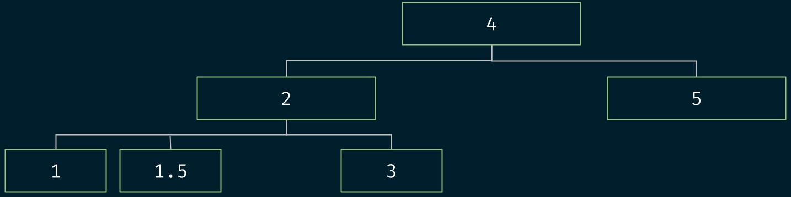
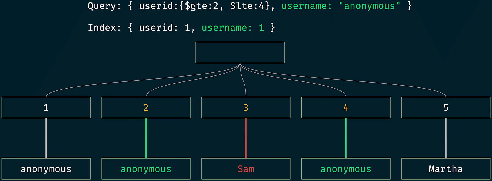
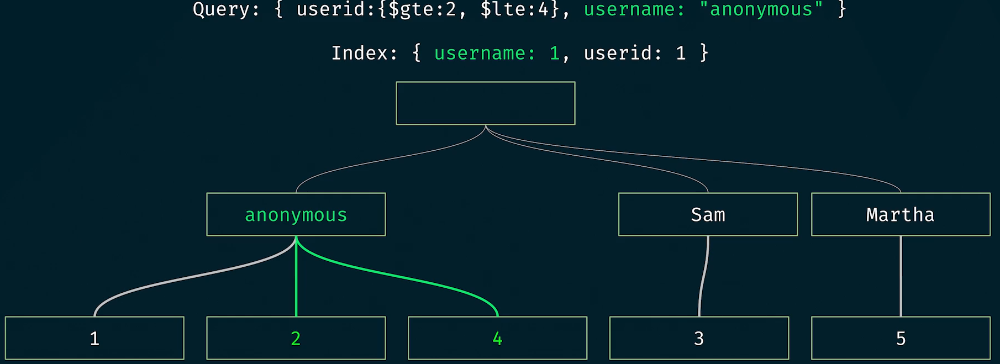
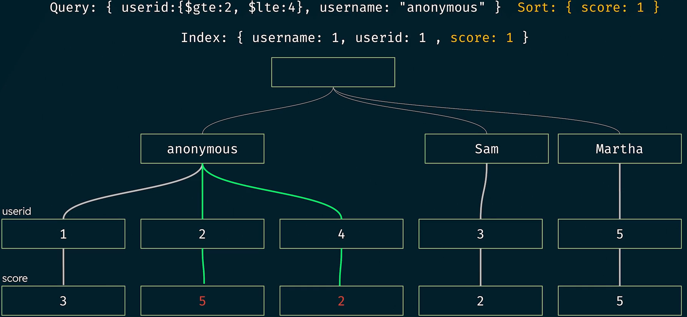
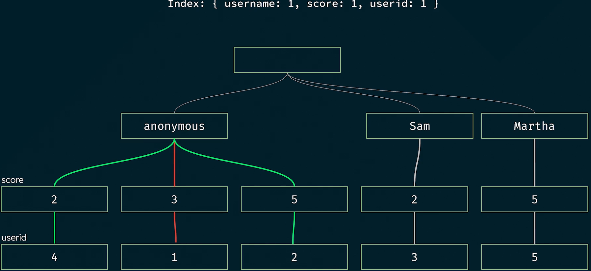

<!-- TOC -->

- [3주차](#3주차)
  - [Unit 8. MongoDB Indexes](#unit-8-mongodb-indexes)
    - [Lesson 1. Using MongoDB Indexes in Collections](#lesson-1-using-mongodb-indexes-in-collections)
      - [What indexes are](#what-indexes-are)
      - [How indexes can improve performance](#how-indexes-can-improve-performance)
        - [Without indexes](#without-indexes)
      - [Costs of using indexes](#costs-of-using-indexes)
      - [Most common index types](#most-common-index-types)
        - [Single field](#single-field)
        - [Compound](#compound)
        - [Multikey indexes operate on an array field](#multikey-indexes-operate-on-an-array-field)
      - [Quiz.](#quiz)
    - [Lesson 2. Creating a Single Field Index in MongoDB](#lesson-2-creating-a-single-field-index-in-mongodb)
      - [**A single field index**](#a-single-field-index)
        - [Create a Single Field Index](#create-a-single-field-index)
        - [Create a Unique Single Field Index](#create-a-unique-single-field-index)
        - [View the Indexes used in a Collection](#view-the-indexes-used-in-a-collection)
        - [Check if an index is being used on a query](#check-if-an-index-is-being-used-on-a-query)
      - [Quiz](#quiz-1)
    - [Lesson 3. Creating a Multikey Index in MongoDB](#lesson-3-creating-a-multikey-index-in-mongodb)
      - [Multikey indexes](#multikey-indexes)
      - [Quiz](#quiz-2)
    - [Lesson 5. Deleting MongoDB Indexes](#lesson-5-deleting-mongodb-indexes)
      - [View the Indexes used in a Collection](#view-the-indexes-used-in-a-collection-1)
      - [Delete an Index](#delete-an-index)
      - [Delete Indexes](#delete-indexes)
      - [Quiz](#quiz-3)
    - [Summary](#summary)
      - [Resources](#resources)
        - [Lesson 1 - Using MongoDB Indexes in Collections](#lesson-1---using-mongodb-indexes-in-collections)
        - [Lesson 2 - Creating a Single Field Index in MongoDB](#lesson-2---creating-a-single-field-index-in-mongodb)
        - [Lesson 3 - Creating a Multikey Index in MongoDB](#lesson-3---creating-a-multikey-index-in-mongodb)
        - [Lesson 4 - Working with Compound Indexes in MongoDB](#lesson-4---working-with-compound-indexes-in-mongodb)
        - [Lesson 5 - Deleting MongoDB Indexes](#lesson-5---deleting-mongodb-indexes)
  - [Unit 9. MongoDB Indexes II](#unit-9-mongodb-indexes-ii)
    - [Lesson 1. How Indexes Work](#lesson-1-how-indexes-work)
      - [How index values are stored](#how-index-values-are-stored)
        - [B-tree](#b-tree)
      - [How indexes work](#how-indexes-work)
      - [Quiz](#quiz-4)
    - [Lesson 2. Index Usage Details via Explain](#lesson-2-index-usage-details-via-explain)
      - [Explain():](#explain)
        - [Information it provides](#information-it-provides)
        - [Type of operations it can be used on](#type-of-operations-it-can-be-used-on)
      - [Quiz](#quiz-5)
    - [Lesson 3. Optimized Compound Indexes](#lesson-3-optimized-compound-indexes)
      - [Sample documents](#sample-documents)
      - [Query](#query)
      - [Break down the query into smaller parts](#break-down-the-query-into-smaller-parts)
        - [In-memory sorts:](#in-memory-sorts)
      - [Quiz](#quiz-6)
    - [Lesson 4. Wildcard Indexes](#lesson-4-wildcard-indexes)
      - [What Wildcard Indexes are](#what-wildcard-indexes-are)
      - [Use cases](#use-cases)
      - [How to create](#how-to-create)
      - [Limitations](#limitations)
      - [Sample Documents](#sample-documents-1)
      - [Quiz](#quiz-7)
    - [Lesson 5. Partial Indexes](#lesson-5-partial-indexes)
      - [Quiz](#quiz-8)
    - [Lesson 6. Sparse Indexes](#lesson-6-sparse-indexes)
      - [Quiz](#quiz-9)
    - [Lesson 7. Clustered Indexes](#lesson-7-clustered-indexes)
    - [Lesson 8. Time Series Collections](#lesson-8-time-series-collections)
      - [Time series collection](#time-series-collection)
      - [Clustered time series indexes](#clustered-time-series-indexes)
        - [Sample Docuemnts](#sample-docuemnts)
          - [Temperature measurements:](#temperature-measurements)
      - [Secondary Indexes](#secondary-indexes)
      - [Code Summary: Time Series Collections](#code-summary-time-series-collections)
      - [Quiz](#quiz-10)
    - [Lesson 9. How to Monitor Indexes](#lesson-9-how-to-monitor-indexes)
      - [How to Monitor Indexes](#how-to-monitor-indexes)
        - [$indexStats](#indexstats)
          - [accesses](#accesses)
        - [Database Profiler](#database-profiler)
      - [Quiz](#quiz-11)
    - [Summary](#summary-1)
        - [Resources](#resources-1)

<!-- /TOC -->
# 3주차

## Unit 8. MongoDB Indexes

### Lesson 1. Using MongoDB Indexes in Collections

#### What indexes are

- Special data structures for fast data retrieval
- Store small portion of the data
- Ordered and easy to search efficiently
- Point to the document identity
- allow you to look up access and update data faster
- Support equality matches and range-based operations and return sorted results

#### How indexes can improve performance

- Speed up queries
- Reduce disk I/O
- Reduce resources required
- With indexes, MongoDB only fetches the documents identified by the index based on the query.
- Returns results faster
- There is one default index per collection, which includes only the _id field.
- Every query should use an index
- cursor.explain(”executionStats”)
    - 인덱스를 이용한 쿼리의 효과를 이해하는데 도움
        - nReturned : 반환받은 결과의 개수
        - totalDocsExamined : 몽고DB가 쿼리를 실행하면서 살펴본 도큐먼트 개수
        - executionTimeMillis : 쿼리 계획 선택과 쿼리 실행에 필요한 총 시간(밀리초 단위)

##### Without indexes

- MongoDB reads all documents (`Collection Scan`)
- Sorts results in memory

#### Costs of using indexes

- If we insert or update documents, we need to update the index data structure
- Delete unnecessary or redundant indexes

#### Most common index types

##### Single field

- Indexes on one field only

##### Compound

- Indexes include more than one field in the index.

##### Multikey indexes operate on an array field

- Each array entry has a corresponding index entry.

---

#### Quiz.

1. **Which of the following statements about indexes are correct? (Select all the that apply.)**
- **A.** Indexes are data structures that improve performance, support efficient equality matches and range-based query operations, and can return sorted results.
    
    **Correct.**
    
    Indexes are data structures that improve performance, support efficient equality matches and range-based query operations, and can return sorted results. Indexes achieve this by allowing MongoDB to perform only the work necessary to return the data that is requested, rather than scanning the entire collection.
    
- **B.** Indexes are automatically created based on usage patterns.
    
    **Incorrect.**
    
    While users can create indexes on the data that's used most often to help improve the performance of a slow query, indexes are not automatically created based on usage patterns. However, MongoDB Atlas provides recommendations about which indexes to create or drop.
    
- **C.** Indexes are used to make querying faster for users. One of the easiest ways to improve the performance of a slow query is create indexes on the data that is used most often.
    
    **Correct.**
    
    Indexes help make querying faster for users by only scanning the indexes to find the data that is requested.
    
- **D.** When using an index, MongoDB reads every document in a collection to check if it matches the query that's being run.
    
    **Incorrect.**
    
    When indexes are available, MongoDB does not need to scan the entire collection to return the data that is requested by a query. Instead, MongoDB will only scan the indexes to find the data that is requested.
    

2. **Which of the following statements about indexes are true? (Select one.)**
- **A.** Indexes improve query performance and have no impact on write performance.
    
    **Incorrect.**
    
    While indexes improve query performance, they do come with a cost. For example, any time you run a write operation, all the indexes must be updated, which can be time-consuming.
    
- **B.** Indexes improve query performance at the cost of write performance.
    
    **Correct!**
    
    Indexes improve query performance at the cost of write performance. For most use cases, this tradeoff is acceptable. Indexes should be used on data that is frequently queried or on queries that are infrequent but costly in terms of computational resources.
    
- **C.** Indexes have no impact on query performance but improve write performance.
    
    **Incorrect.**
    
    Indexes improve query performance by allowing the database to use indexes to speed up the query process. However, indexes do come with a cost. For example, any time you run a write operation, all the indexes must be updated, which can be time-consuming.
    
- **D.** Indexes have a negative impact on query performance but improve write performance.
    
    **Incorrect.**
    
    Indexes have a positive impact on query performance but come with a cost. For example, any time you run a write operation, all the indexes must be updated, which can be time-consuming.


### Lesson 2. Creating a Single Field Index in MongoDB

#### **A single field index**

- an index that supports efficient querying against a single field.
- By default, all collections have a single field index on the `_id` field,
- but users can define additional indexes that support important queries.
- A single field index is also a multikey index if the value of the field is an array.

##### Create a Single Field Index

- Use `createIndex()` to create a new index in a collection.
- Within the parentheses of `createIndex()`, include an object that contains the field and sort order.

```scss
// syntax
db.collection.createIndex({fieldname:1})

db.customers.createIndex({
  birthdate: 1 // ascending
})

// birthdate_1 생성됨
```

- createIndex 호출이 몇 초 후에 반환되지 않을 때
    - db.currentOp() 또는 mongod의 로그를 확인해 인덱스 구축의 진행률 체크 가능
        - db.currentOp()
            
            ```json
            	MongoServerError[AtlasError]: Error validating $currentOp value. arg=allUsers isn't allowed in this atlas tier
            ```
            
        - mongod 로그
            
            ```json
            {"t":{"$date":"2024-07-17T06:00:11.666Z"},"s":"I","c":"MONGOSH","id":1000000007,"ctx":"repl","msg":"Evaluating input","attr":{"input":"db.customers.createIndex({\nbirthdate: 1\n})"}}
            {"t":{"$date":"2024-07-17T06:00:11.668Z"},"s":"I","c":"MONGOSH","id":1000000011,"ctx":"shell-api","msg":"Performed API call","attr":{"method":"createIndex","class":"Collection","db":"sample_analytics","coll":"customers","arguments":{"keys":{"birthdate":1},"options":{}}}}
            ```
            

##### Create a Unique Single Field Index

- Add `{unique:true}` as a second, optional, parameter in `createIndex()` to force uniqueness in the index field values. Once the unique index is created, any inserts or updates including duplicated values in the collection for the index field/s will fail.

```scss
db.customers.createIndex({ email: 1 }, { unique:true })
```

- MongoDB only creates the unique index if there is no duplication in the field values for the index field/s.
    - MongoServerError: E11000 duplicate key error collection

##### View the Indexes used in a Collection

- Use `getIndexes()` to see all the indexes created in a collection.

```scss
db.customers.getIndexes()
```

- Atlas에서도 Collection 내 Index 확인 가능

##### Check if an index is being used on a query

- Use `explain()` in a collection when running a query to see the Execution plan.
- This plan provides the details of the execution stages (IXSCAN , COLLSCAN, FETCH, SORT, etc.).
    - The `IXSCAN` stage indicates the query is using an index and what index is being selected.
    - The `COLLSCAN` stage indicates a collection scan is perform, not using any indexes.
    - The `FETCH` stage indicates documents are being read from the collection.
    - The `SORT` stage indicates documents are being sorted in memory.

```scss
db.customers.explain().find({
  birthdate: {
    $gt:ISODate("1995-08-01")
    }
  })
```

```scss
db.customers.explain().find({
  birthdate: {
    $gt:ISODate("1995-08-01")
    }
  }).sort({
    email:1
    })
 
db.customers.explain().find({accounts:871666})
```

---

#### Quiz

1. **What is a single field index? (Select one.)**
- **A.** An index that supports efficient querying against one field
    
    **Correct.**
    
    A single field index is an index that supports efficient querying against a single field. By default, all collections have a single field index on the `_id` field, but users can define additional indexes that support important queries. A single field index is also a multikey index if the value of the field is an array.
    
- **B.** An index that supports efficient querying against multiple fields
    
    **Incorrect.**
    
    An index that supports efficient queries against multiple fields is called a compound index.
    
- **C.** An index that only supports efficient querying against fields with scalar values
    
    **Incorrect.**
    
    Single field indexes can also support efficient querying against a single array field.
    
- **D.** An index that supports efficient querying against fields that are already indexed by another user-defined index
    
    **Incorrect.**
    
    A single field index doesn't support efficient querying against fields that are already indexed by another user-defined index. When a single field is already indexed—for example, by a compound index—creating an additional single field index can cause over-indexing and performance issues.
    

2. **You have a collection of customer details. The following is a sample document from the collection:**

```json
{
  "_id": { "$oid": "5ca4bbcea2dd94ee58162a6a" },
  "username": "hillrachel",
  "name": "Katherine David",
  "address": "55711 Janet Plaza Apt. 865\nChristinachester, CT 62716",
  "birthdate": { "$date": { "$numberLong": "582848134000" } },
  "email": "timothy78@hotmail.com",
  "Accounts": [
    { "$numberInt": "462501" },
    { "$numberInt": "228290" },
    { "$numberInt": "968786" },
    { "$numberInt": "515844" },
    { "$numberInt": "377292" }
  ],
  "tier_and_details": {}
}
```

**You create a single field index on the email field, with the unique constraint set to true:**

```scss
db.customers.createIndex({email:1}, {unique:true})
```

**What would happen if you attempt to insert a new document with an email that already exists in the collection? (Select one.)**

- **A.** The new document will be inserted and replace the old document in the collection.
    
    **Incorrect.**
    
    That is not how the `unique` constraint operates. Unique indexes ensure that indexed fields do not store duplicate values. The new document will not be inserted in this example because the email address already exists in another document in the collection.
    
- **B.** The new document will be inserted and the old document will remain in the collection.
    
    **Incorrect.**
    
    That is not how the `unique` constraint operates. Unique indexes ensure that indexed fields do not store duplicate values. The new document will not be inserted in this example. Because the email address already exists in another document in the collection, the unique constraint would prevent the new document from being inserted.
    
- **C.** MongoDB will return a duplicate key error, and the document will be inserted.
    
    **Incorrect.**
    
    That is not how the `unique` constraint operates. Unique indexes ensure that indexed fields do not store duplicate values. While a duplicate error key would be returned, the new document would not be inserted in this example because the email address already exists in another document in the collection.
    
- **D.** MongoDB will return a duplicate key error, and the document will not be inserted.
    
    **Correct.**
    
    Unique indexes ensure that indexed fields do not store duplicate values. In this example, MongoDB will return a duplicate key error if you attempt to insert a new document with an email that already exists in the collection, as the `unique` constraint was set to `true`.

### Lesson 3. Creating a Multikey Index in MongoDB

#### Multikey indexes

- Index on an array field
- can index primitives, subdocuments, or subarrays.
- can be single field or compound index
    
    ```json
    // accounts 필드가 array일 경우
    db.customers.createIndex({accounts:1})
    db.customers.createIndex({email:1, accounts:1})
    
    // 모두 Multikey indexes라고 할 수 있
    ```
    
- There is a limitation of only one array field per index.

```json
// accounts index 생성 전 explain()으로 확인
db.customers.explain().find({accounts:627788})
// accounts index 생성
db.customers.createIndex({accounts:1})
// accounts index 생성 후 explain()으로 확인
db.customers.explain().find({accounts:627788})
```

---

#### Quiz

1. **What is a multikey index? (Select one.)**
- **A.** An index on one field only where the field is not an array
    
    **Incorrect.**
    
    A multikey index is any index where one of the indexed fields contains an array, including both single field and compound indexes. In a compound index, only one of the fields can be an array.
    
- **B.** An index where one of the indexed fields contains an array
    
    **Correct.**
    
    Multikey indexes support efficient queries against array fields by creating an index key for each element in the array. This allows MongoDB to search for the index key of each element in the array rather than scan the entire array, which results in dramatic performance gains in your queries.
    
- **C.** An index on more than one field where none of the fields are arrays
    
    **Incorrect.**
    
    A multikey index is any index where one of the indexed fields contains an array, including both single field and compound indexes. In a compound index, only one of the fields can be an array.
    
- **D.** An index on more than one field where multiple fields are arrays
    
    **Incorrect.**
    
    A multikey index is any index where one of the indexed fields contains an array, including both single field and compound indexes. In a compound index, only one of the fields can be an array.
    

2. **What is the maximum number of array fields per multikey index? (Select one.)**
- **A.** 1
    
    Correct! The maximum number of array fields per multikey index is 1. If an index has multiple fields, only one of them can be an array.
    
- **B.** 3
    
    Incorrect. The maximum number of array fields per multikey index is not 3. However, there is a limitation on the number of array fields per index.
    
- **C.** 5
    
    Incorrect. The maximum number of array fields per multikey index is not 5. However, there is a limitation on the number of array fields per index.
    
- **D.** Unlimited
    
    Incorrect. The maximum number of array fields per multikey index is not unlimited.

### Lesson 5. Deleting MongoDB Indexes

#### View the Indexes used in a Collection

- Use `getIndexes()` to see all the indexes created in a collection.
- There is always a default index in every collection on _id field.
- This index is used by MongoDB internally and cannot be deleted.

#### Delete an Index

- Indexes improve performance but have a write cost.
    - Too many indexes in a collection can affect system performance.
        - Delete unused or redundant indexes
    - Recreating an index takes time and resources
    - Hide the index before deleting it
        - db.collection.hideIndex(<index>)
        
        ```json
        db.customers.hideIndex('active_1_birthdate_-1_name_1')
        db.customers.hideIndex({active:1,birthdate:-1,name:1})
        ```
        
- Use `dropIndex()` to delete an existing index from a collection.
- Within the parentheses of `dropIndex()`, include an object representing the index key or provide the index name as a string.
    - Delete index by name:
        - db.customers.dropIndex(  'active_1_birthdate_-1_name_1' )
    - Delete index by key:
        - db.customers.dropIndex({  active:1,   birthdate:-1,   name:1 })

#### Delete Indexes

Use `dropIndexes()` to delete all the indexes from a collection, with the exception of the default index on _id.

```scss
db.customers.dropIndexes()
```

The `dropIndexes()` command also can accept an array of index names as a parameter to delete a specific list of indexes.

```sql
db.collection.dropIndexes('indexName')
db.collection.dropIndexes([ 'index1name', 'index2name', 'index3name' ])
```

---

#### Quiz

1. What are the ramifications of deleting an index that is supporting a query? (Select one.)
- **A.** The performance of the query will improve.
    
    **Incorrect.**
    
    Deleting an index that is supporting a query won’t improve the performance. However, it might cause MongoDB to have to scan the entire database to find the documents that match the query.
    
- **B.** The performance of the query will be negatively affected.
    
    **Correct!**
    
    The performance of the query will be negatively affected by the deletion of the only index that is currently supporting that query. Indexes generally improve the performance and time efficiency of queries by reducing the number of times that the database needs to be accessed.
    
- **C.** The query will fail.
    
    **Incorrect.**
    
    Deleting the only index that is supporting a query won't cause it to fail. However, it might cause MongoDB to have to scan the entire database to find the documents that match the query.
    
- **D.** The query will perform as expected.
    
    **Incorrect.**
    
    Deleting an index that is supporting a query will have an impact. It might cause MongoDB to have to scan the entire database to find the documents that match the query.
    

2. **You have a collection of customer details. The following is a sample document from this collection:**

```json
{
  "_id": { "$oid": "5ca4bbcea2dd94ee58162a6a" },
  "username": "hillrachel",
  "name": "Katherine David",
  "address": "55711 Janet Plaza Apt. 865\nChristinachester, CT 62716",
  "birthdate": { "$date": { "$numberLong": "582848134000" } },
  "email": "timothy78@hotmail.com",
  "Accounts": [
    { "$numberInt": "462501" },
    { "$numberInt": "228290" },
    { "$numberInt": "968786" },
    { "$numberInt": "515844" },
    { "$numberInt": "377292" }
  ],
  "tier_and_details": {}
}
```

**You have an index on the `email` field. Here’s the command you used to create the index:**

```scss
db.customers.createIndex({email:1})
```

**Before deleting it, you want to assess the impact of removing this index on the performance of the query. To do this, which command should you use? (Select one.)**

- **A.** dropIndex()
    
    **Incorrect.**
    
    The `dropIndex()` command deletes an index. Deleting the only index supporting a query will affect the performance of that query. You should hide the index before deleting it. This way, you'll be able to assess the impact of removing the index on query performance. What command is used to hide indexes?
    
- **B.** dropIndexes()
    
    **Incorrect.**
    
    The `dropIndexes()` command deletes multiple indexes. Deleting the only index supporting a query will affect the performance of that query. You should hide the index before deleting it. This way, you'll be able to assess the impact of removing the index on query performance. What command is used to hide indexes?
    
- **C.** getIndexes()
    
    **Incorrect.**
    
    The `getIndexes()` command returns an array that holds a list of documents that identify and describe the existing indexes on the collection, including hidden indexes. What command is used to hide indexes?
    
- **D.** hideIndex()
    
    **Correct.**
    
    The `hideIndex()` command hides an index. By hiding an index, you'll be able to assess the impact of removing the index on query performance. MongoDB does not use hidden indexes in queries but continues to update their keys. This allows you to assess if removing the index affects the query performance and unhide the index if needed. Unhiding an index is faster than recreating it. In this example, you would use the command `db.customers.hideIndex({email:1})`.

### Summary

- Single-field (one field)
- Compound (2 to 32 fields)

We worked with index properties like unique and understood that Multikey indexes are indexes that include one array field.

We used the following commands in the collection to create or delete indexes:

- createIndex()
- dropIndex()

Finally, we learned how to view the indexes being used in a collection with the `getIndexes()` command and how to check if the index is being used in a query by executing the `explain()` command.

#### Resources

Use the following resources to learn more about indexes in MongoDB:

##### Lesson 1 - Using MongoDB Indexes in Collections

- [MongoDB Docs: Indexes](https://www.mongodb.com/docs/manual/indexes/?_ga=2.67626584.810066485.1665291537-836515500.1666025886)
- [MongoDB Docs: Indexes Reference](https://www.mongodb.com/docs/manual/reference/indexes/?_ga=2.67626584.810066485.1665291537-836515500.1666025886)

##### Lesson 2 - Creating a Single Field Index in MongoDB

- [MongoDB Docs: createIndex()](https://www.mongodb.com/docs/manual/reference/method/db.collection.createIndex/?_ga=2.67626584.810066485.1665291537-836515500.1666025886)
- [MongoDB Docs: Unique Indexes](https://www.mongodb.com/docs/manual/core/index-unique/?_ga=2.55479138.810066485.1665291537-836515500.1666025886)
- [MongoDB Docs: Measure Index Use](https://www.mongodb.com/docs/manual/tutorial/measure-index-use/?_ga=2.55479138.810066485.1665291537-836515500.1666025886)
- [MongoDB Docs: getIndexes()](https://www.mongodb.com/docs/manual/reference/method/db.collection.getIndexes/?_ga=2.55479138.810066485.1665291537-836515500.1666025886)

##### Lesson 3 - Creating a Multikey Index in MongoDB

- [MongoDB Docs: Multikey Indexes](https://www.mongodb.com/docs/manual/core/index-multikey/?_ga=2.55479138.810066485.1665291537-836515500.1666025886)

##### Lesson 4 - Working with Compound Indexes in MongoDB

- [MongoDB Docs: Compound Indexes](https://www.mongodb.com/docs/manual/core/index-compound/?_ga=2.55479138.810066485.1665291537-836515500.1666025886)
- [MongoDB Docs: Indexing Strategies](https://www.mongodb.com/docs/manual/applications/indexes/?_ga=2.55479138.810066485.1665291537-836515500.1666025886)

##### Lesson 5 - Deleting MongoDB Indexes

- [MongoDB Docs: dropIndex()](https://www.mongodb.com/docs/manual/reference/method/db.collection.dropIndex/?_ga=2.55479138.810066485.1665291537-836515500.1666025886)
- [MongoDB Docs: dropIndexes()](https://www.mongodb.com/docs/manual/reference/method/db.collection.dropIndexes/?_ga=2.55479138.810066485.1665291537-836515500.1666025886)

## Unit 9. MongoDB Indexes II

### Lesson 1. How Indexes Work

#### How index values are stored

##### B-tree

- a self-balancing tree data structure that is well suited for general database indexing
- Unlike binary trees, nodes within a B-tree can have more than two child nodes
- sort their stored data in ascending sequential order, from left to right.



#### How indexes work



- MongoDB scanned more documents than it needed to.



- By reordering the index keys, we’ve reduced the number of documents MongoDB needs to read



- Index is not supporting our query sort operation, which forces MongoDB to do an in-memory sort.
    - It takes time and resources



---

#### Quiz 

1. **Which of the following statements describe a B tree? (Select all that apply.)**
- **A.** B trees sort the stored data in ascending sequential order from left to right
    
    **Correct.**
    
    MongoDB stores the values of indexed fields using an optimized data structure known as a B tree. B trees sort their stored data in ascending sequential order, from left to right.
    
- **B.** Nodes in a B tree can have more than two child nodes
    
    **Correct.**
    
    MongoDB stores the values of indexed fields using an optimized data structure known as a B tree. Nodes in a B tree can have more than two child nodes.
    
- **C.** B tree stands for Binary tree
    
    **Incorrect.**
    
    MongoDB stores the values of indexed fields using an optimized data structure known as a B tree. B trees are self-balancing tree data structures, not binary tree structures.
    
- **D.** A B tree is a self-balancing tree data structure
    
    **Correct.**
    
    MongoDB stores the values of indexed fields using an optimized data structure known as a B tree. B trees are self-balancing tree data structures.
    
2. **Which index would most effectively support the following query? (Select one.)**

`db.collection.find({ username: "j0hnny", timestamp: { $gte: ISODate("2021-05-18T00:00:00.000Z"), $lt: ISODate("2021-05-18T13:00:00.000Z") }})`

**A.** `db.collection.createIndex({ username: 1, timestamp: 1 })`

**B.** `db.collection.createIndex({ timestamp: 1, username: 1 })`

**C.** `db.collection.createIndex({ username: 1 })`

**D.** `db.collection.createIndex({ timestamp: 1 })`

- **A.** Option A
    
    **Correct.**
    
    `db.collection.createIndex({ username: 1, timestamp: 1 })` is the most effective index for this query. This is because our equality match is the index prefix so MongoDB can quickly filter out the documents that don’t match before applying the range query.
    
- **B.** Option B
    
    **Incorrect.**
    
    `db.collection.createIndex({ timestamp: 1, username: 1 })` is not the most effective index for the given query. This index results in more index keys being scanned than documents returned due to the range query being the index prefix when we have an equality match in the query.
    
- **C.** Option C
    
    **Incorrect.**
    
    `db.collection.createIndex({ username: 1 })` is not the most effective index for the given query. This index will reduce the amount of documents scanned but we could improve it by making a compound index with the timestamp field.
    
- **D.** Option D
    
    **Incorrect.**
    
    `db.collection.createIndex({ timestamp: 1 })` is not the most effective index for the given query. This index will reduce the amount of documents scanned but we could improve it by making a compound index with the username field.
    

3. **Which index would most effectively support the following query? (Select one.)**

`db.collection.find({ timestamp: { $gte: ISODate("2021-05-18T00:00:00.000Z"), $lt: ISODate("2021-05-19T00:00:00.000Z") }, username: "j0hnny"}).sort({ rating: 1})`

**A.** `db.collection.createIndex({ timestamp: 1, username: 1, rating: 1 })`

**B.** `db.collection.createIndex({ username: 1, rating: 1, timestamp: 1 })`

**C.** `db.collection.createIndex({ rating: 1, timestamp: 1, username: 1 })`

**D.** `db.collection.createIndex({ rating: 1, username: 1, timestamp: 1 })`

- **A.** Option A
    
    **Incorrect.**
    
    This is not the most effective index for the given query. MongoDB will have to do an in-memory sort in order to get the correct results. Due to the order of the fields in this index, the documents that match the range filter will no longer be sorted when they get passed to the equality check. As a result, documents that match the name and range, need to be batched into memory and sorted, instead of the sorted results being returned directly from the index.
    
- **B.** Option B
    
    **Correct.**
    
    This is the most effective index for the given query. This index is using the equality field as the index predicate followed by the sort, and range. Putting the equality fields first in the index allows us to filter out documents before sorting or filtering, ideally eliminating 90% of possible document matches.. With the sort field second in the index, we can satisfy the sort request from the index without needing to do a blocking (in-memory) sort.
    
- **C.** Option C
    
    **Incorrect.**
    
    This is not the most effective index for the given query because this index has the sort as its predicate. Filtering based on the sort field first, we’re not able to avoid a blocking (in-memory) sort in subsequent stages.
    
- **D.** Option D
    
    **Incorrect.**
    
    This is not the most effective index for the given query because this index has the sort as its predicate. Filtering based on the sort field first, we’re not able to avoid a blocking (in-memory) sort in subsequent stages.

### Lesson 2. Index Usage Details via Explain

#### Explain():

- Syntax
    - db.collection.explain()
    - db.collection.find().explain()
    - db.collection.explain().help()

##### Information it provides

- The explain method returns information about an operations:
    - queryPlanner
        - the default verbosity mode for the explain method
        
        ```json
        db.collection.explain('queryPlanner').find({timestamp: {$gt: 2}, isActivated: true})
        db.collection.explain().find({timestamp: {$gt: 2}, isActivated: true})
        
        db.collection.find({timestamp: {$gt: 2}, isActivated: true}).explain().queryPlanner.winningPlan
        
        db.collection.find({timestamp: {$gt: 2}, isActivated: true}).explain().queryPlanner.rejectedPlans
        ```
        
        - Chooses and caches most efficient query plans
        - Cache stores entries in a least recently used(LRU) style for every collection
        - Cache entries are used for subsequent queries with same shape.
        - Least used entries are replaced when space is needed but can also be cleared by:
            - MongoDB system restart
            - Addition or removal of an index
            - Collection drop
            - db.collection.getPlanCache().clear()
    - executionStats
        
        ```json
        db.collection.explain('executionStats').find({timestamp: {$gt: 2}, isActivated: true}).sort({rating: -1})
        ```
        
        - queryPlanner 정보도 볼 수 있고 추가적으로 executionStats 정보가 나타난다.
            - nReturned : the number of documents that match the query condition.
            - executionTimeMillis : how long it took to select and exectue the plan.
            - totalKeysExamined : the number of index entries or keys that were scanned.
            - totalDocsExamined : the number of documents examined during query execution.
            - executionStages : in-memory sort or not
    - allPlansExecution
        
        ```json
        db.collection.explain('allPlansExecution').find({timestamp: {$gt: 2}, isActivated: true})
        ```
        
        - score : The higher the score, the more suitable the plan

##### Type of operations it can be used on

- find()
- findAndModify()
- findOneAndDelete()
- findOneAndReplace()
- findOneAndUpdate()
- update()
    - db.collection.explain().update()
        - Returns information about the write operation
        - But does not modify the database
- mapReduce()
- aggregate()
- distinct()
- count()
- remove()

---

#### Quiz

1. **From the following explain output, select the option that describes what the explain output it telling us: (Select one.)**

```jsx
{
  explainVersion: '1',
  queryPlanner: {
    namespace: 'sample_airbnb.listingsAndReviews',
    indexFilterSet: false,
    parsedQuery: {},
    queryHash: 'DD1CE27D',
    planCacheKey: 'DD1CE27D',
    maxIndexedOrSolutionsReached: false,
    maxIndexedAndSolutionsReached: false,
    maxScansToExplodeReached: false,
    winningPlan: {
      stage: 'SORT',
      sortPattern: { host: -1 },
      memLimit: 104857600,
      type: 'simple',
      inputStage: { stage: 'COLLSCAN', direction: 'forward' }
    },
    rejectedPlans: []
  },
  executionStats: {
    executionSuccess: true,
    nReturned: 5555,
    executionTimeMillis: 256,
    totalKeysExamined: 0,
    totalDocsExamined: 5555,
    executionStages: {
      stage: 'SORT',
      nReturned: 5555,
      executionTimeMillisEstimate: 130,
      works: 11113,
      advanced: 5555,
      needTime: 5557,
      needYield: 0,
      saveState: 13,
      restoreState: 13,
      isEOF: 1,
      sortPattern: { host: -1 },
      memLimit: 104857600,
      type: 'simple',
      totalDataSizeSorted: 100493513,
      usedDisk: false,
      spills: 0,
      inputStage: {
        stage: 'COLLSCAN',
        nReturned: 5555,
        executionTimeMillisEstimate: 0,
        works: 5557,
        advanced: 5555,
        needTime: 1,
        needYield: 0,
        saveState: 13,
        restoreState: 13,
        isEOF: 1,
        direction: 'forward',
        docsExamined: 5555
      }
    }
  },
  command: {
    find: 'listingsAndReviews',
    filter: {},
    sort: { host: -1 },
    '$db': 'sample_airbnb'
  },
  serverInfo: {
    host: 'M-C02GG1X2MD6M',
    port: 27017,
    version: '6.0.6',
    gitVersion: '26b4851a412cc8b9b4a18cdb6cd0f9f642e06aa7'
  },
  serverParameters: {
    internalQueryFacetBufferSizeBytes: 104857600,
    internalQueryFacetMaxOutputDocSizeBytes: 104857600,
    internalLookupStageIntermediateDocumentMaxSizeBytes: 104857600,
    internalDocumentSourceGroupMaxMemoryBytes: 104857600,
    internalQueryMaxBlockingSortMemoryUsageBytes: 104857600,
    internalQueryProhibitBlockingMergeOnMongoS: 0,
    internalQueryMaxAddToSetBytes: 104857600,
    internalDocumentSourceSetWindowFieldsMaxMemoryBytes: 104857600
  },
  ok: 1
}

```

- **A.** The explain method was used in the allPlansExecution mode. An index on the host field was used.
    
    **Incorrect.**
    
    The example output was not the result of using the explain method in `allPlansExecution` mode. Additionally, the output doesn’t indicate that an index was used.
    
- **B.** The explain method was used in the default queryPlanner mode. The winning plan was an in memory SORT stage and the query wasn’t supported by an index.
    
    **Incorrect.**
    
    The provided output is not the result of using the explain method in the default, `queryPlanner`, mode. However, the winning plan was an in-memory `SORT` stage and was not supported by an index.
    
- **C.** The explain method was used in the executionStats mode. The query was not supported by an index. The winning plan was SORT, requiring an in memory sort to return the results in order.
    
    **Correct.**
    
    The provided explain output is the result of using the explain method in `executionStats` mode. This is made evident by the presence of the `executionStats` object in the output. Additionally, we could tell that the query wasn’t supported by an index, required an in-memory sort, and the winning plan was the `SORT` stage.
    
- **D.** The explain method was used in the executionStats mode.The query was supported by an index on the host field.
    
    **Incorrect.**
    
    The provided output is the result of using the `executionStats` mode with the explain method, however the output doesn’t tell us that the query was supported by an index on the `host` field.
    

2. **Which of the following fields can help us determine the effectiveness of an index? (Select all that apply.)**
- **A.** nReturned
    
    **Correct.**
    
    `nReturned` shows the number of documents that match the query condition. If the `nReturned` is less than the number of total documents and keys examined, our index can be improved. With an efficient index, the number of documents returned by a query is the same as the number of documents and keys examined.
    
- **B.** executionSuccess
    
    **Incorrect.**
    
    `executionSuccess` only informs us if our operation was executed.
    
- **C.** totalDocsExamined
    
    **Correct.**
    
    `totalDocsExamined` shows the number of documents examined during query execution. With an efficient index, the number of documents returned by a query is the same as the number of documents and keys examined.
    
- **D.** executionStages
    
    **Correct.**
    
    `executionStages` can help determine if MongoDB had to perform an in-memory sort. In the event that an in-memory sort, or blocking sort, is taking place, the `executionStages` array will contain a `SORT` stage. This means that MongoDB couldn’t rely on the index to satisfy the sort requested in the query.
    
- **E.** totalKeysExamined
    
    **Correct.**
    
    `totalKeysExamined` shows the number of index entries scanned. With an efficient index, the number of documents returned by a query is the same as the number of documents and keys examined.

### Lesson 3. Optimized Compound Indexes

#### Sample documents

```jsx
db.getSiblingDB("sample_game").users.insertMany([
  {
    _id: new ObjectId("6488bcfe84b99e26917f78b1"),
    dob: new Date("1987"),
    username: "testAccount",
    inactive: false,
    score: 800,
  },
  {
    _id: new ObjectId("6488bcfe84b99e26917f78b2"),
    dob: new Date("1988"),
    username: "exampleUser",
    inactive: false,
    score: 700,
  },
  {
    _id: new ObjectId("6488bcfe84b99e26917f78b3"),
    dob: new Date("1989"),
    username: "coolperson",
    inactive: true,
    score: 998,
  },
  {
    _id: new ObjectId("6488bcfe84b99e26917f78b4"),
    dob: new Date("1990"),
    username: "randomGuy",
    inactive: false,
    score: 500,
  },
])
```

---

#### Query

- To get a sorted list of current scores, for active users born between 1988 and 1990 sorted by current score in descending order, the following query was used:
    
    ```jsx
    db.users.find({
      dob: { $gte: new Date("1988"), $lte: new Date("1990") }, inactive: false
    }).sort({ current_score: -1 })
    ```
    

---

#### Break down the query into smaller parts

```jsx
db.users.find({
  dob:{ $gte: new Date("1988"), $lte: new Date("1990")
}}).explain('executionStats').executionStats

db.users.createIndex({ dob: 1 })

db.users.find({
  dob:{ $gte: new Date("1988"), $lte: new Date("1990")
}}).explain('executionStats').executionStats
```

```jsx
db.users.find({
  dob: { $gte: new Date("1988"), $lte: new Date("1990") }, inactive: false
}).explain('executionStats').executionStats

db.users.createIndex({ dob: 1, inactive: 1})

db.users.find({
  dob: { $gte: new Date("1988"), $lte: new Date("1990") }, inactive: false
}).explain('executionStats').executionStats

db.users.find({
  dob: { $gte: new Date("1988"), $lte: new Date("1990") },
  inactive: false,
}).hint({
  dob: 1, inactive: 1
}).explain("executionStats").executionStats

db.users.createIndex({ inactive: 1, dob: 1})

db.users.find({
  dob: { $gte: new Date("1988"), $lte: new Date("1990") },
  inactive: false,
}).explain("executionStats").executionStats
```

```jsx
db.users.find({
  dob: { $gte: new Date("1988"), $lte: new Date("1990") },
  inactive: false,
}).sort({ current_score: -1 }).explain("executionStats").executionStats

db.users.createIndex({ inactive: 1, current_score: 1 })

db.users.explain("executionStats").find({
  dob: { $gte: new Date("1988"), $lte: new Date("1990") },
  inactive: false,
}).sort({ current_score: -1 })

db.users.createIndex({ inactive: 1, current_score: 1, dob: 1 })

db.users.explain("executionStats").find({
  dob: { $gte: new Date("1988"), $lte: new Date("1990") },
  inactive: false,
}).sort({ current_score: -1 }).hint({ inactive: 1, current_score: 1, dob: 1 })
```

---

- An effective index is one where the number of documents returned, the number of keys examined, and the number of documents examined are the same.
- When would the number of keys examined > than the number of returned documents?
    - When MongoDB has to examine index keys even if they don’t match the query.
- If no optimal index, MongoDB chooses the one with the best score based on execution metrics.
- hint() forces MongoDB to use the given index.
- The optimal order for indexes is to put equality fields first (in any order), followed by range fields, and sort fields behind both equality and range.
    - ESR(Equality - Sort - Range)

##### In-memory sorts:

- Cost CPU and RAM
- Limit of 100 MB
    - allowDiskUse()
        - enables MongoDB to exceed the 100-megabyte limit for in-memory sorts by allowing temporary files to be written to disk.

- MongoDB traverses the inactive-score index in reverse
- Sorting the current scores in the correct order.
- Checks each document to make sure the date of birth is in range.

---

#### Quiz

1. **The `SORT` stage will be present in the `executionStages` object of the `explain('executionStats')` output if a blocking (in-memory) sort took place.**
- **A.** True
    
    **Correct.**
    
    The presence of the `SORT` stage in the `executionStages` object of the `explain('executionStats')` output means that MongoDB had to sort the documents in memory, which can be computationally expensive.
    
- **B.** False
    
    **Incorrect.**
    
    The `SORT` stage’s presence in the `executionStages` object of the `explain('executionStats')` output means that MongoDB had to sort the documents in memory, which can be computationally expensive.
    

2. **You check the `executionStats` for a query using an index and see the following output:**

```jsx
{
  executionSuccess: true,
  nReturned: 2,
  executionTimeMillis: 0,
  totalKeysExamined: 3,
  totalDocsExamined: 3,
…
}

```

**Which of the following is true? (Select all that apply.)**

- **A.** MongoDB had to scan an extra document
    
    **Correct.** `totalDocsExamined` is three while `nReturned` is two which means MongoDB scanned an extra document. The number of documents and index keys examined should be the same as the number of documents returned. If MongoDB examines more documents than it returns, this indicates that the index used by this query could be optimized further.
    
- **B.** Two documents were returned
    
    **Correct.** `nReturned` signifies that two documents were returned. In this example, MongoDB returns two documents but scans three. This indicates that the index used by this query could be optimized further since the number of documents and index keys examined should be the same as the number of documents returned.
    
- **C.** MongoDB had to scan an extra index key
    
    **Correct.**
    
    `totalKeysExamined` is three while `nReturned` is two which means MongoDB scanned an extra index key. This indicates that the index used by this query could be optimized further since the number of index keys examined, and the number of documents examined, should be the same as the number of documents returned.
    
- **D.** This query is not using an index
    
    **Incorrect.**
    
    We can tell that an index was used since three index keys were scanned according to the `totalKeysExamined` field.

### Lesson 4. Wildcard Indexes

#### What Wildcard Indexes are

- Support queries against unknown or arbitrary fields
- Create an index on all fields in each document of a collection
- Embedded Documents:
    - The wildcard index descends into the embedded document and indexes its contents
    - Continues traversing any additional nested documents until it reaches a primitive value
- Arrays:
    - The wildcard index traverses the array and indexes each element
- ObjectId
    - The wildcard index do not index _id field
        - wildcardProjection
- Can have multiple wildcard indexes per collection
- May cover the same fields as other indexes in the collection

#### Use cases

- Useful if you have very dynamic documents
- Datasets with dynamic schemas
- E.g.: IoT, metadata, weather services

#### How to create

```jsx
// 모든 필드 index
db.products.createIndex( { "$**" : 1 } )

db.products.createIndex({ "product_attributes.$**" : 1 })
```

#### Limitations

- Cannot use the unique or TTL options

#### Sample Documents

```jsx
db.getSiblingDB("sample_products").products.insertMany([
  {
    _id: new ObjectId("64a36318574fd20cd8fb9798"),
    sku: 111,
    product_name: "Stero Speakers",
    price: 100,
    stock: 5,
    product_attributes: { color: "black", size: "5x5x5", weight: "5lbs" },
  },
  {
    _id: new ObjectId("64a36318574fd20cd8fb9799"),
    sku: 121,
    product_name: "Bread",
    price: 2,
    stock: 50,
    product_attributes: {
      type: "white",
      calories: 100,
      weight: "24g",
      crust: "soft",
    },
  },
  {
    _id: new ObjectId("64a36318574fd20cd8fb979a"),
    sku: 131,
    product_name: "Milk",
    price: 3,
    stock: 20,
    product_attributes: {
      type: "2%",
      calories: 120,
      weight: "1L",
      brand: "Dairy Farmers",
    },
  },
]);

```

To create a wildcard index on the product attributes field, use the `db.collection.createIndex()` method, passing in the name of the field you want to index appended with a dot, dollar sign and two asterisks:

```scss

db.products.createIndex({ "product_attributes.color" : 1 })
db.products.createIndex({ "product_attributes.weight" : 1 })
db.products.createIndex({ "product_attributes.type" : 1 })
db.products.createIndex({ "product_attributes.crust" : 1 })

db.products.createIndex({ "product_attributes.$**" : 1 })
```

To test the query using the explain method, use dot notation to inspect the winning plan and confirm that the wildcard index is being used:

```scss
db.products.find({
  "product_attributes.crust": false,
}).explain().queryPlanner.winningPlan

```

To specify which fields to include or exclude in a wildcard index, set the value of a given field in a wildcard projection to `1` to include or `0` to exclude. To include the `_id`, while excluding the `stock`, and `price` fields, use the following command:

```scss
db.products.createIndex(
  { "$**": 1 },
  { wildcardProjection: { _id: 1, stock: 0, prices: 0 } }
)

```

To test the wildcard index with an query on the `sku` field, run the following query to return the `winningPlan` object from the explain output:

```scss
db.products.find({ sku: 111 }).explain().queryPlanner.winningPlan
```

To test the wildcard index even further, run another query on one of the product attribute fields, like so:

```scss
db.products.find({
  "product_attributes.crust": false
}).explain().queryPlanner.winningPlan

```

To create a compound wildcard index (starting in MongoDB 7.0) on the `stock` field and all of the product attributes fields, use the following command:

```scss
db.products.createIndex({
  stock: 1, "product_attributes.$**" : 1
})
```

---

#### Quiz

1. **Why should you use a wildcard index to support queries in a MongoDB collection instead of a regular index? (Select one.)**
- **A.** Wildcard indexes have a smaller storage footprint than regular indexes.
    
    **Incorrect.**
    
    Wildcard indexes do not have a smaller storage footprint over regular indexes.
    
- **B.** Wildcard indexes make queries that use regular expressions more efficient.
    
    **Incorrect.**
    
    Wildcard indexes are not more efficient for queries that use regular expressions.
    
- **C.** Wildcard indexes can support queries against any field, even if that field is unknown at the time of querying.
    
    **Correct.**
    
    Wildcard indexes allow queries against unknown or arbitrary fields to be supported by an index.
    
- **D.** Wildcard indexes allow for efficient querying against time-series data.
    
    **Incorrect.**
    
    Wildcard indexes do not offer any advantages for querying against time series data.
    
2. **Given the following query:**

```jsx
db.people.find({ "metadata.likes": "golfing", "metadata.age": 30 })
```

**Which of the following indexes would support all the fields in the query? (Select one.)**

**A.** `db.people.createIndex({ name: 1 })`

**B.** `db.people.createIndex({ metadata: 1})`

**C.** `db.people createIndex({ metadata.likes, metadata.status })`

**D.** `db.people.createIndex({ ‘metadata.$**’: 1 })`

- **A.** Option A
    
    **Incorrect.**
    
    The original query doesn’t include an equality, sort or range query involving the `name` field. Therefore this index wouldn’t support all the fields in the query.
    
- **B.** Option B
    
    **Incorrect.** While queries against the metadata field as a whole would be supported by a single field index on the metadata field, this query attempts to search the fields within it and therefore wouldn’t benefit from this index.
    
- **C.** Option C
    
    **Incorrect.**
    
    While the `metadata.likes` field would be supported by this index, it fails to support a query that included other fields within the metadata document.
    
- **D.** Option D
    
    **Correct.**
    
    A wildcard index on all sub-fields within the metadata document would support the query. Additionally, if we were to add other fields to the query that were contained in the metadata document, those would be supported by this index as well.

### Lesson 5. Partial Indexes
- Only index documents that match a filter expression
- Reduced storage requirements, memory footprint for index
- `_id`, `shard key fields` cannot be added to a partial index because a full index of this field is required for the proper operation of the system
- Syntax
    
    ```jsx
    db.collection.createIndex(
    	{ x: 1, y: 1 },
    	{ partialFilterExpression: { z: { lte: 10 } }
    )
    ```
    
- operators
    - $eq
    - $exists: true expression
    - $gt, $gte, $lt, $lte expressions
    - $type expressions
    - $and operator
    - $or operator
    - $in operator
- Sample Document
    
    ```jsx
    {
    	_id: ObjectId("5c8eccc1caa187d17ca71b75"),
    	city: 'SOUTHFIELD',
    	zip: '48034',
    	loc: { y: 42.477676, x: 83.288295 },
    	pop: 28647,
    	state: 'MI'
    },
    ```
    
- To create a partial index on the `state` field using a `partialFilterExpression` that only indexes documents with a population greater than or equal to 10,000, use the following command:

```scss
db.zips.createIndex(
  { state: 1 },
  { partialFilterExpression: { pop: { $gte: 10000 } } }
)

```

- To test if the partial index is being used, run a query for documents with a state of California using the explain method.
- To return the most relevant results, use dot notation to return only the `queryPlanner.winningPlan` object, as shown in the following command:

```scss
db.zips.find({ state: "CA" }).explain().queryPlanner.winningPlan
```

- **Note** that the partial index wasn’t used since there are documents in the collection with a state of California, that also have a population less than 10,000.
- As a result, the index was ineligible.
- To test if the partial index is used on a different query, one that finds documents that have a population of less than or equal to 10,000, use the following command:

```scss
db.zips.find({ state: "CA", pop: { $gte: 10000 } }).explain().queryPlanner.winningPlan
```

- **Note** that the partial index was used, since the requested documents match the partial filter expression.
- To test the partial index one more time, run the following command to get the explain output and return just the `queryPlanner.winningPlan` object for a query that finds documents with a population of 12,000 or fewer:

```scss
db.zips.find({ state: "CA", pop: { $lte: 12000 } }).explain().queryPlanner.winningPlan
```

- **Note** that the partial index wasn’t used since there are documents in the result set that have a population of less than 10,000.

---

#### Quiz

1. **When should you use a partial index? (Select one.)**
- **A.** To index documents that match a specified filter document.
    
    **Correct.**
    
    Partial indexes are recommended when you want to index only documents that match a specific filter. For example, if we had a collection of movies and wanted to index only those that had an `imdb.rating` value of greater than 7, we could use a partial index. MongoDB recommends partial indexes over sparse indexes.
    
- **B.** To index based on ranges of documents rather than individual documents.
    
    **Incorrect.**
    
    Partial indexes can not be used to index ranges of documents. Partial indexes can be used to match documents based on complex filters, including the use of the operators like `$exists`, `$gt`, `$lt`, `$type`, `$and`, `$or`, and `$in`.
    
- **C.** To support queries against time series data.
    
    **Incorrect.**
    
    Partial indexes are not known for their ability to support efficient querying against time series data.
    
- **D.** To index a field that has a value of an array.
    
    **Incorrect.** Partial indexes do not directly support fields containing array values. Instead partial indexes evaluate documents based on a filter expression.
    

2. **Given the following query:**

```scss
db.zips.find({ state: "AZ", pop: { $gte: 20000} })

```

**Which Partial index will support this query? (Select one.)**

**A. `db.zips.createIndex( { state: 1 }, { partialFilterExpression: { pop: { $gte: 10000 } } } );`**

**B. `db.zips.createIndex( { state: 1 }, { partialFilterExpression: { pop: { $lte: 10000 } } } );`**

**C. `db.zips.createIndex( { state: 1 }, { partialFilterExpression: { pop: { $gte: 25000 } } } );`**

- **A.** Option A
    
    **Correct.**
    
    This index covers our query because it indexes every state with a population of 10000 or more.
    
- **B.** Option B
    
    **Incorrect.**
    
    This index only covers states with a population of 10000 or less. Our query matches AZ with a population of 20000 or more.
    
- **C.** Option C
    
    **Incorrect.**
    
    This index only covers states with a population of 25000 or greater which doesn’t cover all of the documents we want. Our query matches AZ with a population of 20000 or more.

### Lesson 6. Sparse Indexes
- 일반적인 createIndex는 해당 필드가 없는 document에도 index를 생성하지만 Sparse는 해당 필드가 있을 때만 index를 생성해주는 옵션
- Index types that are sparse by default:
    - 2D
    - 2Dsphere
    - GeoHaystack
    - Wildcard
- Sample documents

```jsx
db.getSiblingDB("sample_db").sparseExample.insertMany([
  {
    _id: new ObjectId("64920144bf3922c17f7181ca"),
    username: "coolUser",
    avatar_url: "https://api.multiavatar.com/coolUser.svg",
  },
  {
    _id: new ObjectId("64920144bf3922c17f7181cb"),
    username: "testUser",
    avatar_url: "https://api.multiavatar.com/testUser.svg",
  },
  {
    _id: new ObjectId("64920144bf3922c17f7181cc"),
    username: "anotherUser",
    avatar_url: "https://api.multiavatar.com/anotherUser.svg",
  },
  { _id: new ObjectId("64920173bf3922c17f7181cd"), username: "test" },
]);

```

- To create a sparse index on the `avatar_url` field use the `createIndex` method and provide an index specification document containing the field we want to index.
- For the options object, add an object with a field `sparse` and a value of `true`, as shown in the following command:

```scss
db.sparseExample.createIndex({ avatar_url: 1 }, { sparse: true })
```

- To test the index, run a query that looks for all documents in the `sparseExample` collection that contain an avatar image.
- A total of three documents should be returned:

```scss
db.sparseExample.find({ avatar_url: { $exists: true } })
```

- To see if the query is using the sparse index, use explain with the `executionStats` verbosity level.

```scss
db.sparseExample.find({ avatar_url: { $exists: true } }).explain("executionStats").executionStats
```

- **Note** In addition to the index being listed in `executionStages`, the `isSparse` field in the execution stats output should also have a value of `true` indicating that the index was used.
- To test the sparse index one more time, run the following command to get the explain output and return just the `executionStats` object for a query that finds all documents sorted by `avatar_url`:

```scss
db.sparseExample.find().sort({ avatar_url: 1 }).explain("executionStats").executionStats
```

- Limitations
    - the sparse index wasn’t used since using it would lead to incomplete results
    - Sparse index with unique doesn’t apply to documents that omit the indexed field.
        
        ```jsx
        db.sparseExample.createIndex({ username: 1}, {sparse: true, unique: true })
        
        db.sparseExample.insertOne({ avatar_url: "https://example.com/img/img1.png" })
        
        // username이 없으면 unique option이 소용없어진다.
        ```
        

---

#### Quiz

1. **Which of the following statements about sparse indexes are true? (Select all that apply.)**
- **A.** Sparse indexes only create index entries for documents that have null or non-null values for the indexed field.
    
    **Correct.**
    
    Sparse indexes only index specific documents that include the indexed field. The field may have null or non-null values. Indexes like 2d, 2dsphere, geohaystack, text, and wildcard are all considered sparse indexes by nature.
    
- **B.** Sparse indexes are used to support queries against documents that meet a specified filter expression.
    
    **Incorrect.**
    
    Indexes that are used to support queries against documents that meet a specific filter expression are referred to as partial indexes. Examples of sparse indexes include the likes of 2d, 2dsphere, geohaystack, text, and wildcard indexes.
    
- **C.** Sparse indexes will not be chosen by the query planner if it means the query results will be incomplete.
    
    **Correct.**
    
    The query planner won’t choose a sparse index when evaluating eligible indexes to support a query if doing so means the results of the query will be incomplete.
    
- **D.** Sparse indexes only create index entries for documents that have non-null values for the indexed field.
    
    **Incorrect.**
    
    Sparse indexes create index entries for documents that have null or non-null values for the indexed field. Documents where the field is missing will not be part of the index.
    

2. **Given the following index:**

`db.collection.createIndex({ stock: 1 }, { sparse: true })`

**Which document will be indexed? (Select one.)**

**A.** `{ sku: 131, product_name: "Milk", price: 3, }`

**B.** `{ sku: 121, product_name: "Bread", price: 2, stock: 50 }`

- **A.** Option A
    
    **Incorrect.**
    
    This document is missing the `stock` field so this document will not be indexed. Sparse indexes are those that contain entries for documents that contain a specific field, even if that field’s value is `null`.
    
- **B.** Option B
    
    **Correct.**
    
    This document will be indexed because it has the `stock` field, even if this field is `null`. Sparse indexes are those that contain entries for documents that contain a specific field, even if that field’s value is `null`.

### Lesson 7. Clustered Indexes

```jsx
// internal clustered index - db.runCommand( { listCollections: 1 } )
{
  name: 'system.buckets.weather',
  type: 'collection',
  options: {
    validator: { ... },
    clusteredIndex: true,
    timeseries: {
      timeField: 'timestamp',
      metaField: 'metadata',
      granularity: 'hours',
      bucketMaxSpanSeconds: 2592000
    }
  },
  info: { ... }
}

// secondary index - db.weather.getIndexes()
{
  v: 2,
  key: { 'metadata.sensorId': 1 },
  name: 'metadata.sensorId_1'
}

```

- **A.** Clustered index
    
    **Incorrect.**
    
    MongoDB’s query planner will check to see if any secondary indexes are eligible for use by a query. In which case, the secondary index will be used. In order to use the internal clustered index, you must provide a hint to use it.
    
- **B.** Secondary index
    
    **Correct.**
    
    The clustered index is not automatically used by the query optimizer if a usable secondary index exists. MongoDB can be instructed to use the index, however, by appending the hint method to the query and providing the name of the internal clustered index.

### Lesson 8. Time Series Collections

#### Time series collection

- Time series collections clustered by default
- Hold time series data
- Created a time series collection
- Examined use of clustered index
- Secondary indexes can optimize query performance

#### Clustered time series indexes

- Time series data is any kind of data that changes over time.
- three components
    - Time(timeField)
        - When creating a time series collection a clustered index is automatically created on the `time` field.
        - Corresponds to the name of the field that contains a date
        - Our data has a timestamp field that contains an ISODate indicating when data was recorded.
    - Metadata(metaField)
        - Optional but highly recommended
        - Label or tag that identifies a time series
        - Typically a device id or name of sensor that produces the measurements
        - Without this field, it can be difficult to properly identify your data
    - Measurements(granularity)
        - Optional field
        - Indicates the frequency at which we want to collect data
        - Options:
            - “seconds”, “minutes”, “hours”
        - By default, MongoDB sets this to seconds

```jsx
db.createCollection("weathere", {
	timeseries: {
		timeField: "timestamp",
		metaField: "metadata",
		granularity: "hours",
	},
});
```

##### Sample Docuemnts

###### Temperature measurements:

- Taken over a span of 2 days
- Temperature values ranging from 12 to 17

```jsx
{
	"metadata": {
		"sensorId": 5578,
		"type": "temperature"
	},
	"timestamp": ISODate("2021-05-18T00:00:00.000Z"),
	"temp": 12
}
```

#### Secondary Indexes

- Improve query performance
- Add one or more secondary compound indexes on timeField and metaField

---

#### Code Summary: Time Series Collections

To create a time series collection, called weather, use the `db.createCollection` method. The first argument should be the name of the collection, and the second argument should be an options object. The options object should contain the following fields, which align with the three components in a time series collection — time, metadata, and measurements.

- `timeField` - corresponds to the name of the field in the document that contains a valid BSON date type.
- `metaField` - optional but highly recommended field that is a label or tag associated with the time series. Typically this would be something like a device id or the name of the sensor that produces the measurements
- `granularity` - another optional field that indicates the frequency at which we want to collect data (`seconds`, `minutes`, `hours`).

```jsx
db.createCollection("weather", {
  timeseries: {
    timeField: "timestamp",
    metaField: "metadata",
    granularity: "hours",
  },
})

```

After running the command you will see an output that looks like this:

```
{ ok: 1 }
```

To test that the internal clustered index is being used, run the following command. This command uses JavaScript dot notation to access fields relevant to index usage. It accesses the `stages` object, and the first array element within it – the `$cursor` object. This stage contains the `queryPlanner.winningPlan` object.

**Note:** explain output for queries on time-series collections will look different than your typical explain output. It should be read as an aggregation output.

```scss
db.weather.find({
  timestamp: ISODate("2021-05-18T00:00:00.000Z")
}).explain().stages[0].$cursor.queryPlanner.winningPlan
```

After running the query, you should see a stage property with a value of `CLUSTERED_IXSCAN`, indicating that the internal clustered index was used for the query:

```scss
{
  stage: 'CLUSTERED_IXSCAN',
  filter: {  },
  direction: 'forward',
  minRecord: ObjectId("607b76800000000000000000"),
  maxRecord: ObjectId("60a30380ffffffffffffffff")
}

```

MongoDB recommends adding one or more secondary compound indexes on the fields designated as the `timeField` and `metaField`. To create a secondary index on the `metadata.sensorid` and `timestamp` fields, use the following command:

```jsx
db.weather.createIndex( { "metadata.sensorId": 1, "timestamp": 1 } )
```

After creating the secondary compound index, test it with the following command. This is a query (with explain) to find all documents with a specific `sensorid` sorted by `timestamp`:

```scss
db.weather.explain().find({ "metadata.sensorId": 5578 }).sort({ "timestamp": 1 })
```

In the explain output, check to see if the `queryPlanner.winningPlan` within the `$cursor` object/stage has an `inputStage` of `IXSCAN` and an `indexName` of `metadata.sensorId_1_timestamp_1`. If so, this indicates that the secondary index was used.

```scss
// truncated for space
stages: [
  {
    $cursor: {
      queryPlanner: {
...
        winningPlan: {
          stage: "FETCH",
          inputStage: {
            stage: "IXSCAN",
            keyPattern: {
              "meta.sensorId": 1,
              "control.min.timestamp": 1,
              "control.max.timestamp": 1,
            },
            indexName: "metadata.sensorId_1_timestamp_1"
         ...
            },
          },
        },
      },
    },
  },
```

---

#### Quiz

1. **What is the correct definition of a time series collection? (Select one.)**
- **A.** Time series collections efficiently store time series data. In time series collections, writes are organized so that data from the same source is stored alongside other data points from a similar point in time.
    
    **Correct.**
    
    A time series collection stores time series data, which is data that simply changes over time. Documents are organized in such a way that those that originate from a single source will be grouped together with other data from a similar point in time.
    
- **B.** Time series collections is a specialized collection that stores time-related data in multiple time zones for easy lookup.
    
    **Incorrect.**
    
    While time series collections are specialized collections that help organize data based on time, they are not designed with the goal of handling conversions between different time zones.
    
- **C.** Time series collections are collections of documents that are grouped together into a single bucket based on the total size of the documents.
    
    **Incorrect.**
    
    Time series collections are clustered collections, which means that they group documents together and index based on ranges of values rather than individual documents — however, time series collections are not grouped together based on the size of the documents.
    
- **D.** Time series collections are fixed-size collections that support high-throughput operations that insert and retrieve documents based on insertion order.
    
    **Incorrect.**
    
    Collections that are fixed sized and support high-throughput operations are known as capped collections.
    

2. **What are the advantages of providing a `metaField` field when creating a time series collection? (Select one.)**

**Example:**

```jsx
db.createCollection("stockprice", {
  timeseries: {
    timeField: "timestamp",
    metaField: "metadata",
    granularity: "seconds",
  },
});

```

- **A.** Improves the efficiency of querying data that changes over time
    
    **Incorrect.**
    
    Adding a `metaField` will not improve the efficiency or query performance for time-series data.
    
- **B.** Allows you to visualize the data using third party tools
    
    **Incorrect.**
    
    Adding a `metaField` is not a necessary requirement for visualizing time series data.
    
- **C.** Allows for better organization by attaching additional information directly to the data
    
    **Correct.**
    
    Adding a `metaField` to the time-series collection allows for better organization and allows you to see at a glance what source a particular group of documents is associated with. For example, you could categorize data based on its `sensorid`.

### Lesson 9. How to Monitor Indexes

#### How to Monitor Indexes

##### $indexStats

- Aggregatin operator
- Provides details about indexes on a collection
- In this example, we are using a database called `sample_analytics` and a collection called `customers`:

```scss
db.customers.aggregate([{ $indexStats: {} }])
```

- The operator returns an array of objects, one for each index on the collection.

###### accesses

- The accesses document provides information around index usage.
- `accesses.ops` field values,
    - indexes are being used frequently and those that are not used at all.

```jsx
[
  {
    name: '_id_',
    key: { _id: 1 },
    accesses: { ops: Long("0"), since: ISODate("2023-06-15T19:08:51.580Z") },
    host: '<cluster>.mongodb.net:27017'
  },
  ...
  {
    name: 'accounts_1',
    key: { accounts: 1 },
    accesses: { ops: Long("67"), since: ISODate("2023-06-21T20:20:25.955Z") },
    host: '<cluster>.mongodb.net:27017'
  },
  {
    name: 'email_1_username_1',
    key: { email: 1, username: 1 },
    accesses: { ops: Long("57"), since: ISODate("2023-06-21T20:20:25.997Z") },
    host: '<cluster>.mongodb.net:27017'
  },
  {
    name: 'username_1_email_1',
    key: { username: 1, email: 1 },
    accesses: { ops: Long("0"), since: ISODate("2023-06-21T20:20:26.040Z") },
    host: '<cluster>.mongodb.net:27017'
  }
]

```

##### Database Profiler

- Captures details about commands run against your database
- Captures slow operations, or all operations.
- Data stored in a capped collection called `system.profile`
- The profiler is disabled by default because of the impact of the performance of the system.
- To profile operations that happen on a MongoDB instance, you can enable the database profiler.
    
    ```jsx
    db.setProfilingLevel(<level>, <options>)
    ```
    
- In this example, the profiler is enabled by setting the first argument to `1` and setting a `slowms` threshold to `30`, indicating that any operation that takes longer than 30 ms is considered slow.
- Slow operations are then recorded in a `system.profile` collection within the database.
- If we were to set the first argument to `0`, the profiler would be disabled, and setting it to `2` would log all operations, regardless of how long they take.

```scss
db.setProfilingLevel(1, { slowms: 30 })
// default slowms: 100
```

- To test the profiler in action, run a query against the database that is rather taxing on resources.
- In this example, we are using the `sample_airbnb` database which is rather large.
- We are then sorting each document by `host`.

```scss
db.listingsAndReviews.find().sort({ host: 1 })
```

- Run the following command to query the `system.profile` collection and return the most recently recorded query on the `listingsAndReviews` collection:

```scss
db.system.profile.find({ op: 'query', ns: 'sample_airbnb.listingsAndReviews'}).sort( {ts: -1}).limit(1)
```

- After running the query, you should see the `system.profile` entry related to the query to sort all documents by `host`.
- The query exceeded the `slowms` threshold, required a collection scan (`COLLSCAN`), and an in memory sort (`stage: 'SORT'`).
- Also, take note of the `ts` field which gives a timestamp for the query.

```scss
{
  op: 'query',
  ns: 'sample_airbnb.listingsAndReviews',
  command: {
    find: 'listingsAndReviews',
    filter: {},
    sort: { host: 1 },
    ...
  },
  ...
  millis: 479,
  planSummary: 'COLLSCAN',
  execStats: {
    stage: 'SORT',
    ...
    }
  },
  ts: ISODate("2023-07-12T16:47:27.915Z"),
  ...
}

```

- To speed up the query, create an index on the `host` field and run it again to see if it still shows up in the `system.profile` collection.

```scss
db.listingsAndReviews.createIndex({ host: 1 })

db.system.profile.find({ op: 'query', ns: 'sample_airbnb.listingsAndReviews'}).sort( {ts: -1}).limit(1)
```

- After running query, you should see that same entry for the query before we created an index as evidenced by the timestamp (`ts`).
- The index appears to have helped this query avoid going past the 30ms threshold.

```scss
{
  op: 'query',
  ns: 'sample_airbnb.listingsAndReviews',
  ...
  ts: ISODate("2023-07-12T16:47:27.915Z"),
  ...
}
```

---

#### Quiz

1. **What will the following command return? (Select one.)**

```scss
db.customers.aggregate([{ $indexStats: {} }]);
```

- **A.** An array of integers, each one representing the score assigned to each index in the collection.
    
    **Incorrect.**
    
    The `$indexStats` operator includes the name of the index and the specification document used to create it, however there is more information included in the output of this aggregation operator. The score assigned to each index is not one of them.
    
- **B.** An array of documents, each representing an index specification document.
    
    **Correct.**
    
    `$indexStats` will provide details about each of our indexes within a given collection, including the name, key pattern, hostname, how many times the index has been accessed (`accesses.ops`), and the date since its usage has been monitored (`accesses.since`).
    
- **C.** An object estimating how much has been saved by leveraging the existing indexes to support queries against the collection.
    
    **Incorrect.**
    
    The `$indexStats` operator provides information about each index but doesn’t provide an estimate of how much has been saved by leveraging the existing indexes to support queries against the collection.
    
- **D.** Suggested actions that can be taken on current mongod instances to improve performance. Specifically, suggestions to create indexes that can support common usage patterns.
    
    **Incorrect.**
    
    The `$indexStats` operator does not return suggested actions that one can take in terms of suggested indexes. However, these kinds of suggestions are provided by the performance advisor when using an M10 or above Atlas cluster.
    

2. **What happens when the database profiler is enabled on a `database`? (Select one.)**
- **A.** Operations are captured and recorded inside the database under a capped collection named system.profile.
    
    **Correct.**
    
    Enabling the database profiler will capture database operations and record them in a capped collection called `system.profile`. Depending on the profiling level (`1`, or `2`), the profiler will record only slow operations with a setting of 1 (defined by the `slowms` threshold), or all operations with a setting of `2`.
    
- **B.** A web server is enabled to support queries on the database.
    
    **Incorrect.**
    
    The database profiler is not a locally hosted web server that provides data visualization for a given MongoDB instance. MongoDB’s Performance Advisor provides this functionality.
    
- **C.** You’ll receive suggestions for actions you can take on your database to improve performance.
    
    **Incorrect.**
    
    The database profiler does not provide suggestions, however setting a `slowms` threshold with the `db.setProfilingLevel()` method does impact what appears in the diagnostic logs.
    
- **D.** The MongoDB instance is profiled in order to find the source of out-of-memory errors.
    
    **Incorrect.**
    
    The database profiler does not help troubleshoot out of memory errors associated with a running MongoDB instance. Furthermore, there is no log file generated from it.

### Summary

In this unit, you learned how to:

- Identify which fields in the `explain()` output will indicate a performance issue, i.e. `nReturned`, `totalDocsExamined`, `totalKeysExamined`
- Set the verbosity level for `explain()`, i.e. `executionStats`
- Run `explain()` on a query to determine if the query is using an index
- Read the `explain()` output run on a query and identify what index a query is using
- Create an efficient compound index for a given query
- Create a wildcard index
- Create a partial index
- Create a sparse index
- Create a clustered time series index
- Use `$indexStats` to view the indexes with the most operations and unused indexes in a collection
- Enable profiling and set the profiling level using `db.setProfilingLevel()`
- Use Database Profiler (`system.profile` collection) to identify slow queries

##### Resources

Use the following resources to learn more about Indexing with MongoDB:

Lesson 1: How Indexes Work

- [Indexes in MongoDB](https://www.mongodb.com/docs/manual/indexes/)
- [What is Indexing in a Database?](https://www.mongodb.com/basics/database-index)
- [Compound Indexes](https://www.mongodb.com/docs/manual/core/index-compound/)
- [MongoDB University: Indexing I (Prerequisite course)](https://learn.mongodb.com/courses/mongodb-indexes)
- [Index Best Practices](https://www.mongodb.com/blog/post/performance-best-practices-indexing)

Lesson 2: Index Usage Details via Explain

- [Explain Method](https://www.mongodb.com/docs/manual/reference/method/db.collection.explain/)
- [Explain Verbosity Levels](https://www.mongodb.com/docs/manual/reference/method/db.collection.explain/#std-label-explain-method-verbosity)
- [Explain Results](https://www.mongodb.com/docs/manual/reference/explain-results/)
- [Query Plans](https://www.mongodb.com/docs/manual/core/query-plans/)

Lesson 3: Optimized Compound Indexes

- [Compound Indexes](https://www.mongodb.com/docs/manual/core/index-compound/)
- [The ESR (Equality Sort Range) Rule](https://www.mongodb.com/docs/manual/tutorial/equality-sort-range-rule/#std-label-esr-indexing-rule)
- [Tips and Tricks for Effective Indexing](https://www.slideshare.net/mongodb/mongodb-local-toronto-2019-tips-and-tricks-for-effective-indexing)
- [Create Indexes to Support Your Queries](https://www.mongodb.com/docs/manual/tutorial/create-indexes-to-support-queries/#std-label-create-indexes-to-support-queries)

Lesson 4: Wildcard Indexes

- [Wildcard Indexes in MongoDB](https://www.mongodb.com/docs/manual/core/index-wildcard/)
- [Create a WildCard Index on All Fields](https://www.mongodb.com/docs/v7.0/core/indexes/index-types/index-wildcard/create-wildcard-index-all-fields/)
- [Include or Exclude Fields in a Wildcard Index](https://www.mongodb.com/docs/v7.0/core/indexes/index-types/index-wildcard/create-wildcard-index-multiple-fields/#std-label-create-wildcard-index-multiple-fields)
- [Wildcard Index Restrictions](https://www.mongodb.com/docs/v7.0/core/indexes/index-types/index-wildcard/reference/restrictions/#std-label-wildcard-index-restrictions)
- [Compound Wildcard Indexes (new in 7.0)](https://www.mongodb.com/docs/v7.0/core/indexes/index-types/index-wildcard/index-wildcard-compound/)

Lesson 5: Partial Indexes

- [Partial Indexes in MongoDB](https://www.mongodb.com/docs/manual/core/index-partial/)
- [Partial Index Restrictions](https://www.mongodb.com/docs/manual/core/index-partial/#restrictions)

Lesson 6: Sparse Indexes

- [Sparse Indexes in MongoDB](https://www.mongodb.com/docs/manual/core/index-sparse/)
- [Indexes that are Sparse by Default](https://www.mongodb.com/docs/manual/core/index-sparse/#indexes-that-are-sparse-by-default)

Lesson 7: Clustered Indexes

- [Clustered Collections in MongoDB](https://www.mongodb.com/docs/upcoming/core/clustered-collections/)
- [Clustered Index Reference](https://www.mongodb.com/docs/upcoming/reference/method/db.createCollection/#std-label-db.createCollection.clusteredIndex)
- [expireAfterSeconds](https://www.mongodb.com/docs/upcoming/reference/method/db.createCollection/#std-label-db.createCollection.expireAfterSeconds)
- [Clustered Collection Examples](https://www.mongodb.com/docs/upcoming/core/clustered-collections/#std-label-clustered-collections-examples)

Lesson 8: Time Series Collections

- [Time Series](https://www.mongodb.com/docs/manual/core/timeseries-collections/)
- [Create a Time-Series Collection](https://www.mongodb.com/docs/manual/core/timeseries/timeseries-procedures/#std-label-timeseries-create-query-procedures)
- [Add Secondary Indexes to Time-Series Collections](https://www.mongodb.com/docs/manual/core/timeseries/timeseries-secondary-index/)
- [List Time-Series Collections in a Database](https://www.mongodb.com/docs/manual/core/timeseries/timeseries-check-type/)
- [Set up Automatic Removal](https://www.mongodb.com/docs/manual/core/timeseries/timeseries-automatic-removal/)
- [Time Series Product Overview](https://www.mongodb.com/time-series)

Lesson 9: How to Monitor Indexes

- [$indexStats Operator](https://www.mongodb.com/docs/manual/reference/operator/aggregation/indexStats/)
- [MongoDB Database Profiler](https://www.mongodb.com/docs/manual/tutorial/manage-the-database-profiler/)
- [Reading Profiler Output](https://www.mongodb.com/docs/manual/reference/database-profiler/)
- [db.setProfilingLevel()](https://www.mongodb.com/docs/manual/reference/method/db.setProfilingLevel/#mongodb-method-db.setProfilingLevel)
- [Database Profiler Verbosity Levels](https://www.mongodb.com/docs/manual/reference/method/db.setProfilingLevel/#std-label-set-profiling-level-level)