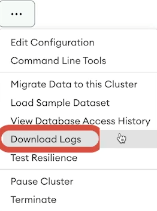
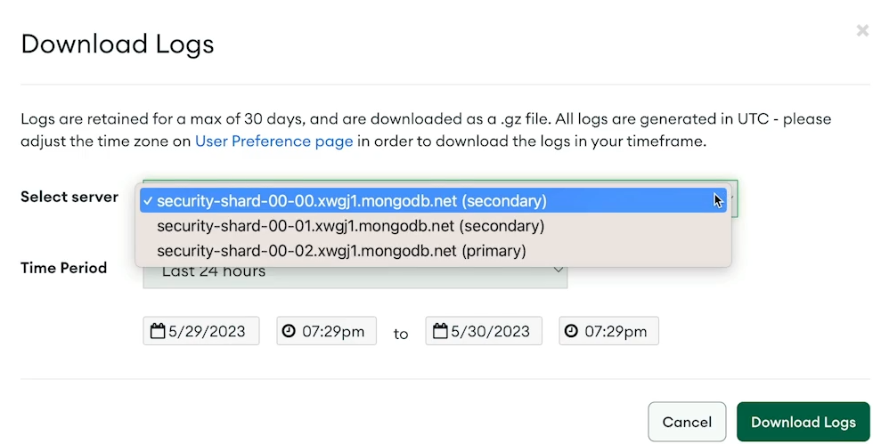
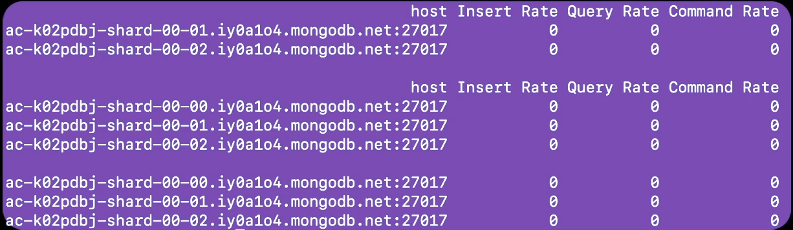
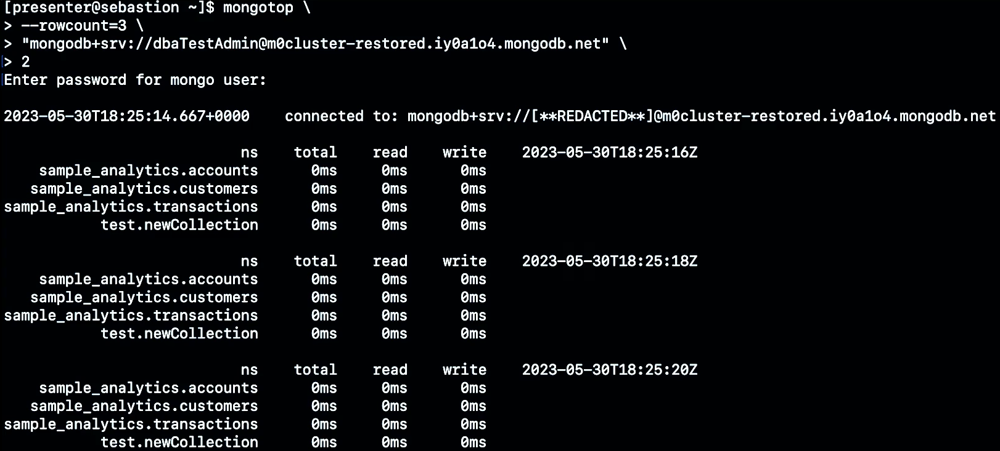
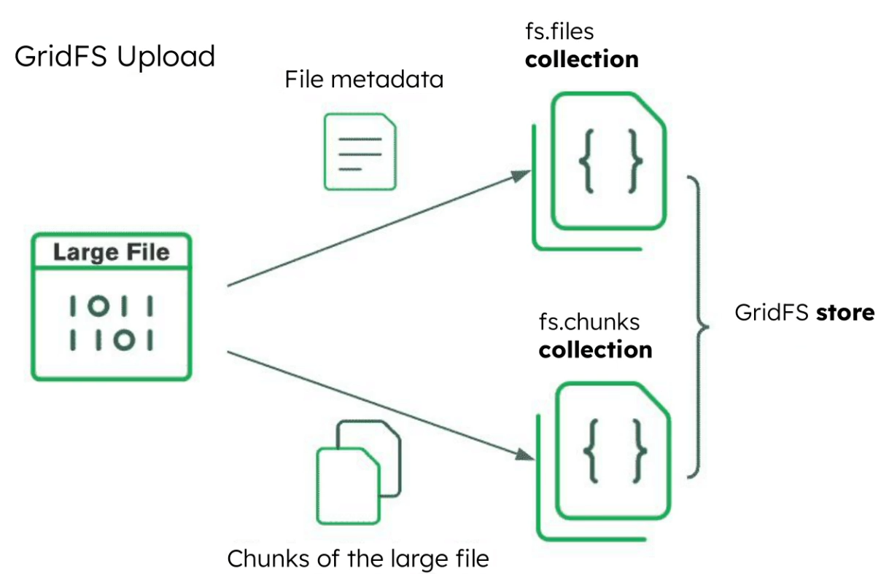

<!-- TOC -->

- [4주차](#4주차)
  - [Unit 10. MongoDB Logging Basics](#unit-10-mongodb-logging-basics)
    - [Lesson 1. MongoDB Logs in Atlas](#lesson-1-mongodb-logs-in-atlas)
      - [Check you have the necessary access permissions to download logs in Atlas](#check-you-have-the-necessary-access-permissions-to-download-logs-in-atlas)
        - [Downloading logs requires:](#downloading-logs-requires)
          - [Atlas](#atlas)
          - [CLI](#cli)
      - [Download logs by using the Atlas UI and CLI](#download-logs-by-using-the-atlas-ui-and-cli)
        - [Atlas UI](#atlas-ui)
        - [CLI](#cli-1)
      - [Extract the archived file](#extract-the-archived-file)
      - [Quiz](#quiz)
    - [Lesson 2. MongoDB Logs on Self-Managed Instances](#lesson-2-mongodb-logs-on-self-managed-instances)
      - [Default Location on Linux](#default-location-on-linux)
      - [Check Permissions of the Log File](#check-permissions-of-the-log-file)
      - [Access the Log File](#access-the-log-file)
      - [Retrieve Log Messages](#retrieve-log-messages)
      - [Quiz](#quiz-1)
      - [Lab](#lab)
    - [Lesson 3. MongoDB Log Events](#lesson-3-mongodb-log-events)
      - [What to look for](#what-to-look-for)
      - [Log messages:](#log-messages)
        - [Three Areas of focus:](#three-areas-of-focus)
          - [OS-level warnings](#os-level-warnings)
          - [Authorization attempts](#authorization-attempts)
          - [Replica set elections](#replica-set-elections)
      - [Quiz](#quiz-2)
    - [Lesson 4. MongoDB Server Log Customizations](#lesson-4-mongodb-server-log-customizations)
      - [Diagnostic log:](#diagnostic-log)
      - [Record slow operations](#record-slow-operations)
        - [slowms:](#slowms)
          - [Setting the threshold:](#setting-the-threshold)
      - [Adjust the verbosity level of logs](#adjust-the-verbosity-level-of-logs)
        - [Set a slowms Threshold](#set-a-slowms-threshold)
        - [Find Slow Operations in a Log](#find-slow-operations-in-a-log)
        - [Set the Verbosity Level](#set-the-verbosity-level)
        - [Generate Log Messages Related to Slow Operations](#generate-log-messages-related-to-slow-operations)
      - [Quiz](#quiz-3)
    - [Lesson 5. MongoDB Server Log Rotation and Retention](#lesson-5-mongodb-server-log-rotation-and-retention)
      - [Logs](#logs)
      - [Log Rotation](#log-rotation)
      - [Retention period for logs in Atlas](#retention-period-for-logs-in-atlas)
      - [MongoDB’s standard approach to log rotation](#mongodbs-standard-approach-to-log-rotation)
        - [Rotating Logs](#rotating-logs)
        - [Rotating Logs Using Rename and Reopen](#rotating-logs-using-rename-and-reopen)
        - [Automating Log Rotation with the logrotate Service](#automating-log-rotation-with-the-logrotate-service)
        - [Testing the logrotate Configuration](#testing-thelogrotate-configuration)
      - [Quiz](#quiz-4)
    - [Summary](#summary)
        - [Resources](#resources)
  - [Unit 11. MongoDB Database Administrator Tools](#unit-11-mongodb-database-administrator-tools)
    - [Lesson 1. Get Started with DBA Tools](#lesson-1-get-started-with-dba-tools)
      - [MongoDB Database Tools](#mongodb-database-tools)
        - [Install MongoDB Database Tools](#install-mongodb-database-tools)
      - [Quiz](#quiz-5)
    - [Lesson 2. Backup Tools](#lesson-2-backup-tools)
      - [mongodump](#mongodump)
        - [Syntax](#syntax)
        - [Options](#options)
      - [Quiz](#quiz-6)
    - [Lesson 3. Restore Tools](#lesson-3-restore-tools)
      - [mongorestore:](#mongorestore)
        - [Syntax](#syntax-1)
        - [Authentication is enabled](#authentication-is-enabled)
        - [Options](#options-1)
        - [Examples](#examples)
      - [Quiz](#quiz-7)
    - [Lesson 4. Data Export Tools](#lesson-4-data-export-tools)
      - [mongoexport](#mongoexport)
        - [Syntax](#syntax-2)
        - [Authentication is enabled](#authentication-is-enabled-1)
        - [Options](#options-2)
        - [Examples](#examples-1)
      - [Quiz](#quiz-8)
    - [Lesson 5. Data Import Tools](#lesson-5-data-import-tools)
      - [mongoimport](#mongoimport)
        - [Syntax](#syntax-3)
        - [Authentication is enabled:](#authentication-is-enabled-2)
        - [Options](#options-3)
        - [Examples](#examples-2)
      - [Quiz](#quiz-9)
    - [Lesson 6. Diagnostic Tools: mongostat](#lesson-6-diagnostic-tools-mongostat)
      - [mongostat](#mongostat)
        - [Syntax](#syntax-4)
        - [Authentication is enabled:](#authentication-is-enabled-3)
        - [Options](#options-4)
        - [Examples](#examples-3)
      - [Quiz](#quiz-10)
    - [Lesson 7. Diagnostic Tools: mongotop](#lesson-7-diagnostic-tools-mongotop)
      - [mongotop](#mongotop)
        - [Syntax](#syntax-5)
        - [Authentication is enabled](#authentication-is-enabled-4)
        - [Options](#options-5)
        - [Examples](#examples-4)
      - [Quiz](#quiz-11)
    - [Lesson 8: Diagnostic Tools: bsondump](#lesson-8-diagnostic-tools-bsondump)
      - [bsondump](#bsondump)
        - [Syntax](#syntax-6)
        - [Options](#options-6)
        - [Examples](#examples-5)
      - [Quiz](#quiz-12)
    - [Lesson 9. MongoDB as a Filesystem](#lesson-9-mongodb-as-a-filesystem)
      - [GridFs](#gridfs)
        - [Limitations of GridFS](#limitations-of-gridfs)
      - [mongofiles](#mongofiles)
        - [Syntax](#syntax-7)
        - [Authentication is enabled](#authentication-is-enabled-5)
        - [Commands](#commands)
        - [Options](#options-7)
        - [Examples](#examples-6)
      - [Quiz](#quiz-13)
      - [Summary](#summary-1)
        - [Resources](#resources-1)
  - [Unit 12. Self-Managed Server Administration](#unit-12-self-managed-server-administration)
    - [Lesson 1. Managing MongoDB Servers](#lesson-1-managing-mongodb-servers)
      - [mongod](#mongod)
      - [Install MongoDB Community Edition](#install-mongodb-community-edition)
      - [Start, Stop, and Check the Status of mongod](#start-stop-and-check-the-status-of-mongod)
      - [Quiz](#quiz-14)
    - [Lesson 2. Configuring MongoDB Servers](#lesson-2-configuring-mongodb-servers)
      - [Edit Default Configuration Settings](#edit-default-configuration-settings)
      - [Quiz](#quiz-15)
    - [Lesson 3. Connecting to MongoDB Servers](#lesson-3-connecting-to-mongodb-servers)
      - [mongosh (MongoDB Shell)](#mongosh-mongodb-shell)
      - [Localhost Exception](#localhost-exception)
      - [Connect to mongosh](#connect-to-mongosh)
      - [Create the First admin Database User](#create-the-first-admin-database-user)
        - [Use db.adminCommand()](#use-dbadmincommand)
        - [Use db.help()](#use-dbhelp)
      - [Quiz](#quiz-16)
    - [Lesson 4. Logging Basics for MongoDB Servers](#lesson-4-logging-basics-for-mongodb-servers)
      - [Use the File Path to Access the Log File](#use-the-file-path-to-access-the-log-file)
      - [Access Logs in mongosh](#access-logs-in-mongosh)
      - [MongoDB log format](#mongodb-log-format)
      - [Quiz](#quiz-17)
    - [Summary](#summary-2)
      - [Resources](#resources-2)

<!-- /TOC -->
# 4주차

## Unit 10. MongoDB Logging Basics

### Lesson 1. MongoDB Logs in Atlas

#### Check you have the necessary access permissions to download logs in Atlas

##### Downloading logs requires:

- Project Data Access Read Only role, or greater
- In the Atlas CLI, this rule is also referred to as GROUP_DATA_ACCESS_READ_ONLY
- Only available for M10-or-above Atlas clusters

###### Atlas

- Atlas Database Deployment 확인
    - Organization, project 확인
    - Project Setting → Access Manager
        - GROUP_DATA_ACCESS_READ_ONLY 역할이 없으면 organization owner나 project creator에게 문의

###### CLI

```jsx
// This command returns a JSON object for each member of the project
// This output uses the Atlas API role names.
atlas project users list -o json
```

#### Download logs by using the Atlas UI and CLI

##### Atlas UI





##### CLI

```jsx

// Download logs from an M10 Atlas cluster
atlas logs <hostname> <file>

// atlas logs download security-shard-00-02.xwgj1.mongodb.net mongodb.gz
```

- For example, if you want to download the `mongod` log file for the past 30 days from the primary node of your Atlas cluster, you would run the following:

```
atlas logs download uml3-shard-00-00.xwgj1.mongodb.net mongodb.gz
```

#### Extract the archived file

- Log files will be compressed in a `.gz` archive.
- To extract a `.gz` archive in Linux, use the following command:

```
gunzip mongodb.log.gz
```

---

#### Quiz

1. **Which of the following are valid methods to download logs from M10-and-above Atlas clusters? (Select all that apply.)**
- **A.** Using the Atlas UI
    
    **Correct.** When using the Atlas dashboard, you can download logs for a node in a given cluster by first navigating to the **Database** tab and locating the cluster in the list. Then click the ellipsis icon to expand the drop-down menu and select the **Download Logs** option.
    
- **B.** Contacting MongoDB Support
    
    **Incorrect.** MongoDB Support can help with a lot of issues, but there are easier and quicker ways to acquire logs for your Atlas deployment.
    
- **C.** Using the Atlas CLI
    
    **Correct.**
    
    You can download logs for several different services (`mongod`, `mongos`, `mongodbsql`, etc.) by using the `atlas logs download <hostname> <filename>` command in the Atlas CLI.
    
- **D.** Using a service like SCP (Secure Copy Protocol) or FTP (File Transfer Protocol)
    
    **Incorrect.**
    
    While you cannot use SCP (Secure Copy Protocol) or FTP (File Transfer Protocol), Atlas logs can be downloaded easily by using a few different methods.
    

2. **What is the minimum privilege you need to download logs from an Atlas cluster? (Select one.)**
- **A.** Organization Read Only
    
    **Incorrect.**
    
    The Organization Read Only role gives users of an organization the ability to read settings, view users, view projects, and view some billing information within the organization.
    
- **B.** Project Data Access Read Only
    
    **Correct.**
    
    The Project Data Access Read Only role gives users the ability to view databases and collections, view documents (in the UI only), view indexes, view and download process and audit logs, and view the Performance Advisor, profiler, and real-time stats. This role is also known by its API equivalent, `GROUP_DATA_ACCESS_READ_ONLY`.
    
- **C.** Project Read Only
    
    **Incorrect.**
    
    This limited role grants users view-only access to the project control panel. This role does not allow users to view or edit data in the data explorer or to access log files.
    
- **D.** Organization Member
    
    **Incorrect.**
    
    This role applies to an organization rather than a project. Organization members can access projects that they have been invited to, but they need to be explicitly added.

### Lesson 2. MongoDB Logs on Self-Managed Instances

#### Default Location on Linux

- On Linux, the MongoDB log file is found in the following directory by default and is named `mongod.log`:

```jsx
/var/log/mongodb/mongod.log
```

#### Check Permissions of the Log File

- To check the file permissions of the `mongod.log` file, use the `ls` command, which lists all files and subdirectories in the current directory.
- When `ls` is used with the `-l` option, long format is used.
- This option includes the user and group that can access the file.

```jsx
> ls -l /var/log/mongodb/mongod.log
-rw------- 1 mongodb mongodb 95068 May 30 20:07 /var/log/mongodb/mongod.log
// mongodb user와 mongodb group이 이 파일에 access 가능
```

#### Access the Log File

- To access the log file, prepend the `sudo` command to the directory name.
- The following example uses the `head` command to print the first five lines of the `mongod.log` file:

```jsx
sudo head -5 /var/log/mongodb/mongod.log
// 파일의 5행 출력됨
```

- If the log file is not in its default location, check the `mongod.conf` file to determine if an alternate path was provided.
- The following example uses the `cat` command to check the value of the `systemLog.path` property:

```
sudo cat /etc/mongod.conf
```

#### Retrieve Log Messages

- To show recent global log messages from the RAM cache in `mongosh`, use the `show log` helper and provide it with one of the available filters, such as `global` or `startupWarnings`.
    - Available on self-managed deployments and M10+ clusters

```jsx
show log <type>
// Returns most recent logged events
// 1024 most recent entries
// Regardless of where they are stored
```

- To view the available filters that can be provided to the `show log` helper, use the following helper command in `mongosh`:

```jsx
show logs
```

- The `mongosh` helper `show log global` internally calls the `getLog` command to return recent log messages from the RAM cache:

```jsx
show log global

db.adminCommand( { getLog:'global'} )
```

---

#### Quiz

1. **While trying to access the `mongod.log` file for a self-managed deployment, you realize that it’s not in its default location. Which of the following options would help you find the location of the `mongod.log` file? (Select all that apply.)**
- **A.** The path for the log file can be found by running the db.getLogPath() helper method in mongosh.
    
    **Incorrect.**
    
    The `db.getLogPath()` helper method does not exist in `mongosh`. Running this command will result in an error.
    
- **B.** The path for the log file can be found by viewing the value provided to the --logpath argument when viewing the mongod process information with a command such as “ps aux | grep mongod”.
    
    **Correct.**
    
    The `--logpath` argument can be used to specify the path to the log file when starting the `mongod` process. If this argument is not provided, the default path is `/var/log/mongodb/mongod.log`. However, if a path is provided, the log file will be written to that location instead.
    
- **C.** The path for the log file can be found by checking the systemLog.path value in the mongod.conf file.
    
    **Correct.**
    
    The `systemLog.path` value in the `mongod.conf` file can be used to find the path to the log file.
    
- **D.** The path for the log file can be found by running db.adminCommand({getLog: "global"}) in mongosh.
    
    **Incorrect.**
    
    The `db.adminCommand({getLog: "global"})` command will return the contents of the RAM cache for the global log. This command does not return the path to the log file.
    

2. **Which of the following users can successfully open a `mongod.log` file? (Select all that apply.)**
- **A.** A user with access to the sudo command in Linux.
    
    **Correct.**
    
    The `sudo` command can be used to open the log file with elevated privileges. For example, running `sudo cat /var/log/mongodb/mongod.log | jq` will print the contents of the log file to the terminal, regardless of the permissions of the user running the command.
    
- **B.** A user that has been added to the mongodb group.
    
    **Correct.**
    
    Adding the user to the `mongodb` group will allow the user to open the log file.
    
- **C.** The file can be opened by any user on the system, regardless of permissions.
    
    **Incorrect.**
    
    The log file is owned by the `mongodb` user and the `mongodb` group. If the user is not a member of the `mongodb` group or a superuser with access to the `sudo` command, they will not be able to open the log file.
    

---

#### Lab

```jsx
// check the file access permissions for the log file.
cd /var/log/mongodb
// The l option is used to display the long format, which includes file permissions and ownership.
// The h option is used to print the size of the log file in human-readable format (K for kilobytes, M for megabytes, etc.).
ls -lh
-rw------- 1 mongodb mongodb 1728 May 17 18:22 mongod.log
// The file permissions are rw for read/write
// The user ownership and group ownership for the file are both mongodb

// view the log entries in the file.
cat mongod.log | jq -c
```

```jsx

db.zips.insertOne({
      zip: "90001",
      city: "LOS ANGELES",
      state: "CA",
      pop: 60000,
      loc: { x: -118.24805, y: 33.9999 },
    });
{
  acknowledged: true,
  insertedId: ObjectId("669f5f84a5bf1fe878636533")
}

db.adminCommand( { getLog: "*" } );
{ names: [ 'global', 'startupWarnings' ], ok: 1 }

db.adminCommand( { getLog: "global" } );
```

### Lesson 3. MongoDB Log Events

#### What to look for

- MongoDB keeps a running log of events:
    - Connections
    - Commands
    - Queries
    - Storage
    - Replication
    - , …

#### Log messages:

- Stored in the mongo.log file
- Structured JSON format
    - Key-value pairs
    - Vary in length depending on the type of event
- Example
    
    ```jsx
    {
    	"t": {
    		"$date": "2023-05-12T22:33:55.138+00:00" 
    	},
    	"s": "I",
    	"c": "COMMAND",
    	"id": 51806,
    	"ctx": "conn34",
    	"msg": "CMD: dropIndexes",
    	"attr": {
    		"namespace": "sample_airbnb.listingsAndReviews",
    		"uuid": {
    			"uuid": {
    				"$uuid": "fb68bcee-9561-48da-8f5d-f2a0b8807174"
    			}
    		},
    	"indexes": "*"
    	}
    }
    ```
    
    - t : a timestamp (ISO standard format)
    - s : the severity code of the log message
        - F : Fatal error
        - E : Error
        - W : Warning
        - I : Info
        - D : Debugging (D1~D5)
    - c : the full component string fot the log message
        - COMMAND : relates to database commands like find, delete, insert, …
        - ACCESS
        - STORAGE
        - NETWORK
        - REPL
        - CONTROL
        - INDEX
        - ELECTION : one of the nodes is responding to a vote request.
    - id : the unique ID for this log message
    - ctx : context which is also the name of the operating system thread that prompted the log message
    - msg : the actual message generated by the component originator within MongoDB.
    - attr : the attribute field which is present only if there are additional attributes included in the log message.
        - namespace : the namespace of the collection
        - uuid : a unique identifier for the log message
        - indexes : indexes to drop

##### Three Areas of focus:

###### OS-level warnings

- Caused by conditions in the operating system
- Could impact MongoDB’s performance
- Could be a sign of a larger issue
- Example
    
    ```jsx
    {
    	"t": { "$date": "2023-05-12T21:31:33.208+00:00" },
    	"s": "W",
    	"c": "CONTROL",
    	"id": 5123300,
    	"ctx": "initandlisten",
    	"msg": "vm.max_map_count is too low",
    	"attr": {
    		"currentValue": 65530,
    		"recommendedMinimum": 102400,
    		"maxConns": 51200
    	},
    	"tags": ["startupWarnings"]
    }
    ```
    
    - the mappable memory might not be enough for MongoDB
    - Notice that the current value is much lower than the production recommended value
    - To filter for specific types of log messages, you can use the `tags` field, which is an array of strings.
    - For example, to view all the messages with a tag of `startupWarnings`, you would use the following command in `mongosh`:
    
    ```sql
    # get all the recent messages related to that tag
    show log startupWarnings
    ```
    

###### Authorization attempts

- Log messages generated when users attempt to accesss or modify a resource that they have not been granted acces to.
- Example
    
    ```jsx
    {
    	"t": { "$date": "2023-05-12T21:27:10.738+00:00"},
    	"s": "I",
    	"c": "ACCESS",
    	"id": 20436,
    	"ctx": "conn107",
    	"msg": "Checking authorization failed",
    	"attr": {
    		"error": {
    			"code": 13,
    			"codeName": "Unauthorized",
    			"errmsg": "not authorized on test to execute command { insert: \"test\", documents:
    		...
    			}
    		}
    }
    ```
    

###### Replica set elections

- A replica set is a MongoDB deployment configuration consisting of multiple nodes.
- An election is the process of selecting a new primary node when the current primary node is unavailbable or purposely steps down.
- Examples
    
    ```jsx
    {
    	"t": {
    		"$date": "2023-05-12T21:09:58.661+00:00"
    	},
    	"s": "I",
    	"c": "REPL",
    	"id": 21358,
    	"ctx": "conn54",
    	"msg": "Replica set state transition",
    	"attr": {
    		"newState": "SECONDARY",
    		"oldState": "PRIMARY"
    	}
    }
    ```
    
    - In this message, we step down the primary node using rs.stepDown to initiate an election.
    
    ```jsx
    {
    	"t": {
    		"$date": "2023-05-12T21:09:58.663+00:00"
    	},
    	"s": "I",
    	"c": "REPL",
    	"id": 21347,
    	"ctx": "conn54",
    	"msg": "Handing off election",
    	"attr": {
    		"target": "mongod1.replset.com:27017"
    	}
    }
    ```
    
    - This is the node that will become the new primary.
    
    ```jsx
    {
    	"t": { "$date": "2023-05-12T21:09:58.666+00:00" },
    	"s": "I",
    	"c": "ELECTION",
    	"msg": "Responding to vote request",
    	"attr": {
    		"request": "{ replSetRequestVotes: 1, setName: \"replset\", dryRun: false, term: 2, candidateIndex: 1,
    	configVersion: 1, configTerm: 1, lastAppliedOpTime: { ts: Timestamp(1683925796, 1), t: 1 } }",
    		"response": "{ term: 2, voteGranted: true, reason: \"\"}",
    		"replicaSetStatus": "Current replSetGetStatus output: { set: \"replset\", date: new Date(1683925798666),
    	myState: 2, term: 2, syncSourceHost: \"\", syncSourceId: 1, heartbeatIntervalMillis: 2000,
    	...
    }
    ```
    
    - The attribute field contains the request and response messages that are sent between the nodes, as well as the current status of the relica set.

---

#### Quiz

1. **Given the following log message, identify the correct field name that relates to the operating system thread that prompted the log message. (Select one.)**

```json
{
 "t": {
   "$date": "2023-05-12T21:09:58.661+00:00"
 },
 "s": "I",
 "c": "REPL",
 "id": 21358,
 "ctx": "conn54",
 "msg": "Replica set state transition",
 "attr": {
   "newState": "SECONDARY",
   "oldState": "PRIMARY"
 }
}

```

- **A.** The "t" field
    
    **Incorrect.**
    
    The `"t"` field in a MongoDB log message relates to the timestamp of the log message.
    
- **B.** The "s" field
    
    **Incorrect.**
    
    The `"s"` field in a MongoDB log message relates to the severity of the log message.
    
- **C.** The "ctx" field
    
    **Correct.**
    
    The `"ctx"` field in a MongoDB log message relates to the thread that generated the log message, in this case, `"conn54"`. This field will be present in all log messages.
    
- **D.** The "id" field
    
    **Incorrect.**
    
    The `"id"` field in a MongoDB log message relates to the unique ID of the log message.
    

2. **Which of the following fields in a MongoDB log relates to the level of debugging verbosity? (Select one.)**
- **A.** "msg"
    
    **Incorrect.**
    
    The `"msg"` field in a MongoDB log message relates to the message itself.
    
- **B.** "s"
    
    **Correct.**
    
    The `"s"` field in a MongoDB log message relates to the severity of the log message, which will be set to a value for the debugging verbosity level. The severity is indicated by a number preceded by a "D" between 0 and 5, with 0 being the least severe and 5 being the most severe. For example, `D1` indicates a debugging message with a severity of 1.
    
- **C.** "attr"
    
    **Incorrect.**
    
    The `"attr"` field in a MongoDB log message relates to the attributes of the log message. If there are no attributes, this field will not be present in the log message.
    
- **D.** "id"
    
    **Incorrect.**
    
    The `"id"` field in a MongoDB log message relates to the unique ID of the log message.

### Lesson 4. MongoDB Server Log Customizations

#### Diagnostic log:

- mongod.log
- a file generated by MongoDB that contains information about events taking place in the database.

#### Record slow operations

##### slowms:

- Defines the maximum amount of time for an operation to complete before it’s considered slow.
    - slowms 조작 전 오래 걸리거나 버그가 있는 최대 쿼리 처리 시간을 설정
- Any operations above this threshold, which is in milliseconds, will be written to the diagnostic log.
    - 최대 쿼리 처리 시간을 초과하는 조작은 진단 로그에 기록됨
- Useful when troubleshooting slow operations.
- The default value for slowms is set to 100 milliseconds.
- The slowms threshold can be set for both self-managed and M10 or above Atlas clusters
- Impacts profiler and performance advisor(Atlas)
    - generate suggestions and service slow queries

###### Setting the threshold:

- Use —slowms launch parameter to the MongoDB service
- Use db.setProfilingLevel() method in mongosh
- Add the slowOpsThreshold property in the configuration file

#### Adjust the verbosity level of logs

- Set a `slowms` threshold
- Find slow operations in a log
- Set the verbosity level
- Generate log messages related to slow operations

##### Set a slowms Threshold

- To set a `slowms` threshold for an M10-or-above Atlas cluster or a self-managed MongoDB deployment, use the `db.setProfilingLevel()` method in `mongosh`.
- This method accepts two parameters: the profiler level and an options object.
- The profiler level is set to `0` to disable profiling completely, set to `1` for profiling operations that take longer than the threshold, and set to `2` for profiling all operations.
- In the following example, the command leaves the profile disabled but changes the `slowms` threshold to 30 milliseconds:

```scss
db.setProfilingLevel(0, { slowms: 30 })
```

- **Note:** When the profiler is disabled, `db.setProfilingLevel()` configures which slow operations are written to the diagnostic log.
- Profiling can have a negative impact on performance and disk space.
    - enable only for troubleshooting

##### Find Slow Operations in a Log

- The following example shows how to find slow operations in a log file.
- First, find a specific document in the `listingsAndReviews` collection by running the following code:

```jsx
db.listingsAndReviews.findOne({ "host.host_id": '1282196'})
```

- Then find all documents sorted by the number of listings by running the following code.
- Without an index, the query will be inefficient and slow.

```scss
db.listingsAndReviews.find({}).sort( {"host.host_total_listings_count":-1})
```

- To find log messages related to slow operations, use the `grep` command to find instances of the phrase `“Slow query”`, and then pipe the result into `jq`, a utility for processing and pretty-printing JSON:
    - grep : a tool that finds strings within a file
    - jq : a utility for processing and filtering JSON data

```bash
sudo grep "Slow query" /var/log/mongodb/mongod.log | jq
```

##### Set the Verbosity Level

- The following code sets the verbosity level on a self-managed instance by using the configuration file.
- Not supported on Atlas clusters
    - Set global verbosity level by using db.setLogLevel() or config file
- Verbosity level
    - the amount of debugging information
- First, open the file in the Vim text editor to make some changes:

```
vim /etc/mongod.conf
```

- To set a global verbosity level for all components, add the following property to the `mongod.conf` file under the `systemLog` section:
    - default : 0
        - only fatal errors, warnings, and information messages are logged.
    - 1~5
        - increases the amount of debugging information that gets included in the log.
        - 1 : debug messages related to indexing operations, such as index builds and index drops.

```
...
systemLog:
  verbosity: 1
...

```

- To set the verbosity level for a single component, add the following to the `systemLog` section of the file:

```
...
systemLog:
  ...
  component:
    index:
      verbosity: 1
...

```

- Restart the `mongod` service on a Linux environment that is managed by `systemctl` by using the following command:

```bash
sudo systemctl mongod restart
```

##### Generate Log Messages Related to Slow Operations

- To generate log messages related to the index component, create an index on the `host` field to support the slow query.
- To do so, use the `createIndex()` method in `mongosh`.
- This command also uses the `--eval` parameter, which allows you to immediately pass commands to `mongosh` without entering the shell.
- The `--quiet` option reduces noise in the output.

```jsx
"mongodb://localhost:27017/sample_airbnb" --quiet --eval "db.listingsAndReviews.createIndex({ host: 1 })"
```

- To find log messages related to the `INDEX` component, use the following command:

```bash
sudo grep INDEX /var/log/mongodb/mongod.log | jq
```

---

#### Quiz

1. **Which of the following statements are true regarding the `slowms` property? (Select all that apply.)**
- **A.** The slowms threshold can be set only for self-managed deployments. It cannot be changed for Atlas clusters.
    
    **Incorrect.**
    
    The `slowms` threshold can be set for both self-managed deployments and M10-or-above Atlas clusters.
    
- **B.** The slowms property defines the maximum amount of time for an operation to complete before it’s considered slow.
    
    **Correct.** Any operations that run longer than the `slowms` threshold will be written to the diagnostic log.
    
- **C.** The default value for the slowms property is set to 100 milliseconds.
    
    **Correct.**
    
    The default value for the `slowms` property can be adjusted at any time.
    
- **D.** The only way to set a custom threshold for the slowms property is by using the db.setProfilingLevel() method in mongosh.
    
    **Incorrect.**
    
    You can set a custom threshold in one of three ways: by using the `db.setProfilingLevel()` method in `mongosh`, by using the `slowms` launch parameter to the MongoDB service, or by adding the `slowOpsThreshold` property in the configuration file.
    

2. **Which of the following options would successfully set a `slowms` threshold to 50 milliseconds in the MongoDB Shell? (Select one.)**

**Option A.** `db.setProfilingLevel(0, { slowms: 500 })`

**Option B.** `db.setProperty(0, { slowms: 500 })`

**Option C.** `db.setProperty(0, { slowms: 50 })`

**Option D.** `db.setProfilingLevel(0, { slowms: 50 })`

- **A.** Option A
    
    **Incorrect.**
    
    This method would set a `slowms` threshold to 500 milliseconds, not 50 milliseconds.
    
- **B.** Option B
    
    **Incorrect.**
    
    `db.setProperty()` is not a valid MongoDB Shell method and will return an error when run.
    
- **C.** Option C
    
    **Incorrect.**
    
    `db.setProperty()` is not a valid MongoDB Shell method and will return an error when run.
    
- **D.** Option D
    
    **Correct.**
    
    This command will set a `slowms` threshold to 50 milliseconds in the MongoDB Shell.
    

3. **Which of the following statements are true regarding the verbosity of the logs? (Select all that apply.)**
- **A.** The verbosity level refers to the amount of debugging information to include in the log file.
    
    **Correct.**
    
    The verbosity level refers to the amount of debugging information to include in the log file. The verbosity level is set to 0 by default to preserve disk space.
    
- **B.** To increase the verbosity for only one component, such as the INDEX component, edit the configuration file for a self-managed deployment.
    
    **Correct.**
    
    You can adjust the verbosity for a single component or for all components in the configuration file.
    
- **C.** The setLogLevel() method can be used on Atlas clusters to adjust the verbosity of the logs.
    
    **Incorrect.** The `setLogLevel()` method can be used to adjust the verbosity level only on self-managed deployments.
    
- **D.** The verbosity level for a self-managed deployment can be adjusted by setting the verbosity property under the systemLog section of the configuration file.
    
    **Correct.**
    
    Setting the `verbosity` property to a value of 1 to 5 determines the amount of debugging information that is included in the log.

### Lesson 5. MongoDB Server Log Rotation and Retention

#### Logs

- Provide detailed information about deployments
- Help diagnose issues
- always growing
- important to have a rotation and retention strategy
    - Regularly rotating and archiving logs can prevent them from occupying excessive disk space and taking several minutes to open.
        - Low disk space, degraded performance, Inhibited ability to troubleshoot
- MongoDB recommends you automate log rotation
    - based on a specific log file size or at a specific time interval.
        - A sustainable file size will depend on your configuration, but generally, the log file should be small enough to share
- Performance issues can arise when:
    - Log files and database files are co-located

#### Log Rotation

- Process of maintaining a log’s size
- Can be done automatically or manually
- Goal is to prevent logs from growing without bounds
- Two main types of log rotation behavior
    - rename
        - MongoDB’s default method
        - Responds to logRotate command or SIGUSR1 signal
        - Renames log with UTC timestamp
        - Opens a new log
        - Closes the old log
        - Sends new events to the new log file
    - reopen
        - Responds to logRotate or SIGUSR1 signal
        - Closes and reopens the file
        - Follows Linux logrotate service
        - Requires logappend option
            - Without logappend, the MongoDB sersvice creates a new log file every time.

#### Retention period for logs in Atlas

- Atlas retains the last 30 days of log messages and system event audit messages for each node in a cluster.
    - Audit Messages?
        - https://www.mongodb.com/docs/manual/reference/audit-message/
- For example, if you have a primary and two secondary nodes, Atlas would keep logs for all three nodes.
- Automatic and works out of the box
- Minimum privilege for Atlas logs:
    - “Project Data Access Read Only” role
    - M10+ Atlas clusters

#### MongoDB’s standard approach to log rotation

- Self-managed deplyments:
    - Log files retained indefinitely unless explicitly told to rotate logs
    - SIGUSR1
    - db.adminCommand({logRotate:1})

##### Rotating Logs

- To rotate logs for a self-managed `mongod` deployment, use the `db.adminCommand()` in `mongosh`:

```jsx
db.adminCommand( { logRotate : 1 } )
```

- Alternatively, you can issue the `SIGUSR1` signal to the `mongod` process with the following command:

```bash
sudo kill -SIGUSR1 $(pidof mongod)
```

##### Rotating Logs Using Rename and Reopen

- To start `mongod` with MongoDB’s standard `rename` log rotation behavior, invoke the daemon with the `--logpath` argument.
- Even though `rename` is not explicitly specified, it’s the default if the `--logpath` argument is used:

```bash
> mongod -v --logpath /var/log/mongodb/server1.log
```

- To start the `mongod` process with the `reopen` approach, invoke the daemon with the `--logpath`, `--logRotate`, and `--logappend` command-line arguments:
    - `-logpath` sends all diagnostic logging information to a log file
    - `-logappend` appends new entries to the end of the existing log file
    - `-logRotate` determines the behavior for the `logRotate` command (`rename` or `reopen`)

```sql
mongod -v --logpath /var/log/mongodb/server1.log --logRotate reopen --logappend
```

##### Automating Log Rotation with the logrotate Service

- To automate the rotation of MongoDB logs by using the Linux `logrotate` service, first make the following changes to the `mongod.conf` file.
    - On Linux, logrotate was designed to help system admins manage the large number of log files being generated from all sorts of utilities in a Linux environment.
        - Renames current log, creates new log, uses logic to complete the rotation process.
        - Configured to rotate logs daily, weekly, or monthly
- Open the file in Vim or another text editor by using the following command:

```bash
sudo vim /etc/mongod.conf
```

- In the configuration file, add the following lines to enable the `reopen` method of log rotation and append new lines to the re-opened file:

```jsx
...
systemLog:
  destination: file
  logAppend: true
  path: /var/log/mongodb/mongod.log
  logRotate: reopen
...

```

- To leverage the `logrotate` service in Linux, create a script that provides instructions to `logrotate`, located in the `etc` directory for the `logrotate` service:

```
sudo vim /etc/logrotate.d/mongod.conf
```

- To configure `logrotate` to send a `SIGUSR1` signal to `mongod` once per day, or when the file size reaches 10 MB, use the following configuration.
- **Note:** The MongoDB configuration file and the `logrotate` script have the same filename.
- The following file should be created in `/etc/logrotate.d/` and named `mongod.conf`.

```bash
/var/log/mongodb/mongod.log {
   daily
   size
   rotate 10
   missingok
   compress
   compresscmd /usr/bin/bzip2
   uncompresscmd /usr/bin/bunzip2 # command to uncompress the file
   compressoptions -9 # options for the compression utility
   compressext .bz2 # file format of the compressed archive
   delaycompress # wait to compress files until it's an opportune time
   notifempty # don't bother compressing if the log file is empty
   create 640 mongodb mongodb # creates the log  file with specific permissions
   sharedscripts # don't run multiple rotations at once
   postrotate # tell mongod to rotate, remove empty files
       /bin/kill -SIGUSR1 `cat /var/run/mongodb/mongod.pid 2>/dev/null` >/dev/null 2>&1
       find /var/log/mongodb -type f -size 0 -regextype posix-awk -regex "^\/var\/log\/mongodb\/mongod\.log\.[0-9]{4}-[0-9]{2}-[0-9]{2}T[0-9]{2}-[0-9]{2}-[0-9]{2}$" -execdir rm {} \; >/dev/null 2>&1
   endscript # end of the script
}

```

- With the `logrotate` file in place, restart the `mongod` service by using the following command:

```
sudo systemctl restart mongod
```

##### Testing the logrotate Configuration

- To test the `logrotate` configuration, use the `tail` command on the `mongod.log` file while issuing a `SIGUSR1` signal to the `mongod` process:
- View the `mongod.log` file in real time by using the following code:

```bash
sudo tail -F /var/log/mongodb/mongod.log
```

- Then tell `mongod` process to rotate the logs:

```scss
sudo kill -SIGUSR1 $(pidof mongod)
```

- In the `mongod.log` file, notice the following line, indicating that the log was reopened.
- Depending on your distribution of Linux, the language in this line may vary.

```jsx
tail: /var/log/mongodb/mongod.log: file truncated;
```

---

#### Quiz

1. **What is the maximum number of days that MongoDB Atlas will retain logs for? (Select one.)**
- **a.** 30 days
    
    **Correct.**
    
    MongoDB Atlas will retain the last 30 days of log messages for each service run on your cluster, for example, `mongod`, `mongos`, and `mongodbsql`. These logs are downloadable by using the Atlas UI or Atlas CLI on M10-or-above Atlas clusters.
    
- **b.** 90 days
    
    **Incorrect.**
    
    MongoDB Atlas retains logs, but not for 90 days. The logs can be downloaded by using the Atlas UI or Atlas CLI for M10-or-above Atlas clusters.
    
- **c.** 120 days
    
    **Incorrect.**
    
    MongoDB Atlas retains logs, but not for 120 days. The logs can be downloaded by using the Atlas UI or Atlas CLI for M10-or-above Atlas clusters.
    
- **d.** 365 days
    
    **Incorrect.**
    
    MongoDB Atlas retains logs, but not for an entire year. The logs can be downloaded by using the Atlas UI or Atlas CLI for M10-or-above Atlas clusters.
    
2. **Which of the following are valid methods for rotating `mongod` log files? (Select all that apply.)**
- **a.** Using the db.adminCommand({ logRotate: 1 }) method in mongosh
    
    **Correct.**
    
    Rotating logs can be done in `mongosh` by using the `db.adminCommand({ logRotate: 1 })` method. Depending on your configuration, MongoDB will either reopen the current log file and append new messages to it, or rename the existing log file, open a new one, and append new messages to the new file.
    
- **b.** Forcefully ending the mongod process by using pkill $(pidof mongod)
    
    **Incorrect.**
    
    Ending the `mongod` process by issuing the `pkill` command will not cause the logs to rotate. You also run the risk of losing some messages if they were not logged before the process was ended.
    
- **c.** Running the rotate logs helper in mongosh
    
    **Incorrect.**While it’s possible to initiate a log rotation in `mongosh`, the `rotate logs` helper is not an actual command.
    
- **d.** Issuing a SIGUSR1 signal to the mongod process manually or automatically by using the Linux logrotate utility
    
    **Correct.**
    
    The `mongod` process will respond to a `SIGUSR1` signal in Linux by initiating a log rotation. This method allows log rotations to occur without using `mongosh`.

### Summary

In this unit, you learned how to:

- Download logs by using the Atlas UI and CLI
- Verify user access permissions for log files on a self-managed instance
- Locate logs generated by a self-managed `mongod` instance with the file, syslog, or standard output
- Get the most recent lines in the log by using the `db.adminCommand({getLog: <type})` method, `show log <name>`, and `show logs`
- Identify fields in log messages and their meanings
- Identify the different types of information that can be found in log messages, such as OS-level warnings, authorization attempts, and replica set elections
- Adjust the verbosity and `slowms` property of logs
- Identify a log’s retention period and minimum privilege
- Use MongoDB’s standard log rotation approach
- Configure the Linux `logrotate` service to rotate `mongod` logs for a self-managed deployment

##### Resources

Use the following resources to learn more about MongoDB logging basics:

Lesson 1: MongoDB Logs in Atlas

- [Project Data Access Read Only](https://www.mongodb.com/docs/atlas/reference/user-roles/#mongodb-authrole-Project-Data-Access-Read-Only)
- [View and Download MongoDB Logs](https://www.mongodb.com/docs/atlas/mongodb-logs/)
- [atlas logs download](https://www.mongodb.com/docs/atlas/cli/stable/command/atlas-logs-download/)

Lesson 2: MongoDB Logs on Self-Managed Instances

- [Retrieve Recent Events from Log](https://www.mongodb.com/docs/manual/reference/command/getLog/#retrieve-recent-events-from-log)

Lesson 3: MongoDB Log Events

- [Log Messages](https://www.mongodb.com/docs/manual/reference/log-messages/)
- [View Database Access History](https://www.mongodb.com/docs/atlas/access-tracking/)
- [Recommended Values (Operations Checklist)](https://www.mongodb.com/docs/manual/administration/production-checklist-operations/)

Lesson 4: MongoDB Server Log Customizations

- [db.setLogLevel()](https://www.mongodb.com/docs/manual/reference/method/db.setLogLevel/?_ga=2.148385527.1926118966.1686611566-1191611927.1686611566)
- [db.setProfilingLevel()](https://www.mongodb.com/docs/manual/reference/method/db.setProfilingLevel/?_ga=2.80019927.1700198120.1686746185-1499070701.1686746185)
- [slowOpThresholdMs](https://www.mongodb.com/docs/manual/reference/configuration-options/?_ga=2.80019927.1700198120.1686746185-1499070701.1686746185#mongodb-setting-operationProfiling.slowOpThresholdMs)
- [Logging Slow Operations](https://www.mongodb.com/docs/manual/reference/log-messages/?_ga=2.80019927.1700198120.1686746185-1499070701.1686746185#logging-slow-operations)
- [Analyzing Slow Queries](https://www.mongodb.com/docs/manual/reference/log-messages/#analyzing-slow-queries)
- [Log Parsing Examples](https://www.mongodb.com/docs/manual/reference/log-messages/#log-parsing-examples)

Lesson 5: MongoDB Server Log Rotation and Retention

- [Rotate Log Files](https://www.mongodb.com/docs/manual/tutorial/rotate-log-files/)
- For more information on the `logrotate` service, try searching the web for resources on `logrotate` in Linux.

## Unit 11. MongoDB Database Administrator Tools

### Lesson 1. Get Started with DBA Tools

#### MongoDB Database Tools

- a suite of command-line utilities for working with MongoDB
- Import and export data
- Restore backups
- View diagnostics
- GridFS Tools
- Before installing, refer to the compatibility table for tools in MongoDB’s documentation

##### Install MongoDB Database Tools

- Follow these steps to install MongoDB 6.0 Community Edition on LTS (long-term support) releases of Ubuntu Linux, using the `apt` package manager.

```bash
# 20240725 MongoDB Database Admin Path (Self-Managed) 영상 기준
sudo apt-get install gnupg

# import the MongoDB public GPG key
curl -fsSL https://pgp.mongodb.com/server-6.0.asc | \
sudo gpg -o /usr/share/keyrings/mongodb-server-6.0.gpg \
--dearmor

# echo
echo "deb [ arch=amd64, arm64 signed-by=/usr/share/keyrings/mongodb-server-6.0.gpg] https://repo.mongodb.or pt/ubuntu jammy/mongodb-org/6.0 multiverse" | sudo tee /etc/apt/sources.list.d/mongodb-org-6.0.list
deb [ arch=amd64, arm64 signed-by=/usr/share/keyrings/mongodb-server-6.0.gpg] https://repo.mongodb.org/apt/ubuntu jammy/mong
-org/6.0 multiverse

# Reload
sudo apt-get update

# Install the lastest stable version
sudo apt-get install -y mongodb-org-tools

# check installation
dpkg -l mongodb* | grep tools | grep ^ii
```

1. In the terminal, use the following command to import the public key used by the package management system:
    
    `wget -qO - https://www.mongodb.org/static/pgp/server-6.0.asc | sudo apt-key add -`
    
2. Create a list file for MongoDB:
    
    `echo “deb [ arch=amd64,arm64 ] https://repo.mongodb.org/apt/ubuntu jammy/mongodb-org/6.0 multiverse” | sudo tee /etc/apt/sources.list.d/mongodb-org-6.0.list`
    
3. Reload the local package database:
    
    `sudo apt-get update`
    
4. Install the latest stable version of MongoDB Community Edition:
    
    `sudo apt-get install -y mongodb-org`
    

---

#### Quiz

1. **Which of the following statements are true about the MongoDB Database Tools suite? (Select all that apply.)**
- **a.** To gain access to the MongoDB Database Tools suite, the package must be installed separately from MongoDB Community Edition or MongoDB Enterprise Edition.
    
    **Incorrect.**
    
    The MongoDB Database Tools suite is included when you install MongoDB Community Edition or MongoDB Enterprise Edition. If you wish to use MongoDB Database Tools with an Atlas deployment, it must be installed separately.
    
- **b.** MongoDB Database Tools are a suite of command-line utilities for working with MongoDB.
    
    **Correct.**
    
    MongoDB Database Tools are a suite of command-line utilities that support the management and administration of your deployment.
    
- **c.** MongoDB Database Tools allow you to import and export data, restore backups, and view diagnostics for your deployments.
    
    **Correct.** MongoDB Database Tools fall into four categories: Backup and Restore, Data Import and Export, Diagnostic Tools, and GridFS Tools.
    
- **d.** Version compatibility between MongoDB Database Tools and the target MongoDB server is crucial to ensure interoperability and data integrity.
    
    **Correct.**
    
    Before installing MongoDB Database Tools, be sure to refer to the compatibility table in MongoDB’s documentation to verify version compatibility.
    

2. **Which of the following is an example of a task that can be accomplished with the MongoDB Database Tools? (Select all that apply.)**
- **a.** Importing JSON files from an external source into an Atlas cluster
    
    **Correct.**
    
    `mongoimport` can be used to import data into an Atlas cluster or a self-managed MongoDB deployment.
    
- **b.** Monitoring the status of a self-managed MongoDB deployment from the MongoDB Shell
    
    **Incorrect.**
    
    `mongostat` can be used to monitor a self-managed deployment or an Atlas cluster from the command line, not from the MongoDB Shell.
    
- **c.** Creating a backup of a small Atlas cluster
    
    **Correct.**
    
    `mongodump` can be used to create a backup of a small Atlas cluster or a self-managed MongoDB deployment.
    
- **d.** Diagnosing problems when attempting to restore data from a BSON file to a self-managed MongoDB deployment
    
    **Correct.**
    
    `bsondump` can be used to diagnose issues that may arise when trying to restore data from a binary file to a self-managed MongoDB deployment.

### Lesson 2. Backup Tools

#### mongodump

- Used to back up the content of a simple cluster
- Suited for the transfer of small databases and/or collections from one cluster to another
- Creates BSON files that are stored in a directory called “dump” in the current working directory
- Not suitable for large deployments or sophisticated recovery needs
- Can be used on standalone and replica sets but not sharded clusters
- Handles network partitions poorly and does not pick up where it left off on restart
- Provides limited support for point-in-time restores
- Does not contain index data
- For production-quality backup and recovery strategies
    - MongoDB Atlas
    - MongoDB Cloud Manager
    - MongoDB OpsManager
- Authentication is enabled:
    - find privilege is required for each database to back up
    - The backup role provides required privileges

##### Syntax

```jsx
mongodump <options> <connection-string>
```

##### Options

- --out
    - Changes the default output directory from dump to one of our choice
- --db
    - Limits the backup to a single database instead of the entire cluster
- --collection
    - Limits the backup to a single collection within a database
- --readPreference
    - Reduces pressure on the primary
    - Using anything other than the primary can result in stale data
- --gzip
    - Compresses data
- --archive
    - Collapses all data into a single file instead of a set of files in the dump folder
    - Stream to stdout on Linux if we omit the filename argument to this option
- --oplog
    - Captures incoming write operations during the backup phase
    - Produces an additional BSON file at the top of the output folder
    - Works only when dumping an entire cluster
    - Not compatible with --db or --collection options
    - Backup will fail if another client renames a collection or issues an aggregation with the $out parameter during the backup phase
    - Atlas : Available only with M10 or higher clusters

The following command creates a backup of the `sample_analytics` database running at the URI `"mongodb+srv://dbaTestAdmin@cluster1.xwgj1.mongodb.net/"`, and zips the file by using `--gzip` to compress a file called `backup.gz`.

```sql
 mongodump \
 -v \
 --gzip \
 --archive=backup.gz \
 "mongodb+srv://dbaTestAdmin@m0cluster-restored.iy0a104.mongodb.net/sample_analytics"
# "mongodb+srv://dbaTestAdmin@cluster1.xwgj1.mongodb.net/sample_analytics"
```

---

#### Quiz

1. **Which of the following best describes the MongoDB Database Tool `mongodump`? (Select one.)**
- **a.** mongodump is a utility that is used to back up the contents of a sharded MongoDB cluster.
    
    **Incorrect.**
    
    The `mongodump` utility is used to back up the contents of simple standalone deployments and replica sets. It should not be used on sharded clusters.
    
- **b.** mongodump is a utility that is used to restore the contents of a sharded MongoDB cluster.
    
    **Incorrect.** The `mongodump` utility is used to back up the contents of simple standalone deployments and replica sets. It should not be used on sharded clusters. To restore the contents of a non-sharded cluster, you can use the `mongorestore` utility.
    
- **c.** mongodump is a utility that is used to back up the contents of a simple MongoDB cluster.
    
    **Correct.**
    
    The `mongodump` utility is used to back up the contents of simple standalone deployments and replica sets.
    
- **d.** mongodump is a utility that is used to restore the contents of a simple MongoDB cluster.
    
    **Incorrect.**
    
    The `mongodump` utility is used to back up the contents of simple standalone deployments and replica sets. To restore the contents of a non-sharded cluster, you can use the `mongorestore` utility.
    

2. **Which of the following commands will back up only the `grades` collection from the `sample_training` database in a `dump` directory? (Select all that apply.)**

**Option A.**

**`mongodump --db sample_training --collection grades`**

**Option B.**

`mongodump --collection grades "mongodb+srv://dbaTestAdmin@m0-example-cluster.iy0a1o4.mongodb.net/sample_training"`

**Option C.**

`mongodump -v --gzip --archive=backup.gz "mongodb+srv://dbaTestAdmin@m0-example-cluster.iy0a1o4.mongodb.net/sample_training"`

**Option D.**

`mongodump --db sample_training`

- **a.** Option A
    
    **Correct.**
    
    This command will back up the `grades` collection from the `sample_training` database in a standalone instance running on the default port.
    
- **b.** Option B
    
    **Correct.**
    
    This command will back up the `grades` collection from the `sample_training` database in an Atlas cluster.
    
- **c.** Option C
    
    **Incorrect.**
    
    This command will compress the data from the `grades` collection from the `sample_training` database and collapse it into a single file called `backup.gz`. This file will not be stored in a `dump` directory.
    
- **d.** Option D
    
    **Incorrect.**
    
    Incorrect. This command will back up the entire `sample_training` database. To limit the backup to the `grades` collection, the command must include `--collection grades`.

### Lesson 3. Restore Tools

#### mongorestore:

- Utility that loads data from a mongodump into a MongoDB cluster
- Can be used on standalone deployments and replica sets, but not sharded clusters
- Version compatibility between source and target clusters
- Version compatibility between mongodump and mongorestore
- Handles network partitions poorly and does not pick up where it left off on restart.
- Limited support for point-in-time restores
- Does not update matching documents but does insert new ones
- Does not restore system.profile
- Can trigger index builds which can be time consuming and taxing on the target cluster

##### Syntax

- `mongorestore <options> <connection-string> <directory or file to restore from>`

##### Authentication is enabled

- Restore role is recommended
- User must have dbAdmin or dbAdminAnyDatabase role if the backup data includes system.profile collection data.
    - Or if you run mongorestore with the oplogReplay option is used even though the collection will not actually be restored.
- User must have a custom role with anyAction on anyResource as privileges when attempting a point-in-time restore

##### Options

```python
 --nsInclude
 --nsExclude
 --drop
 --noIndexRestore
 --writeConcern
 --gzip
 --archive
 --oplogReplay
```

- --nsInclude and --nsExclude
    - Give us more control over the namespaces we want to restore
    - Support wilcard usage via the asterisk
- --drop
    - Removes matching collections from the target database before reloading them
    - Restored documents will get a new _id
- --noIndexRestore
    - mongorestore can impact the performance of the cluster due to index generation
    - Eliminates this concern and does not create any indexes
- --writeConcern
    - Controls the durability requirements for the restore when using a replica set
    - Default is majority
- --gzip
    - Tells mongorestore that the source data is compressed by mongodump
- --archive
    - Tells mongorestore to use the given filename as the singular source of data instead of a directory.
- --oplogReplay
    - Provides replica sets with a point-in-time restore option
    - Searches for oplog data in the source
    - Applies it to the target after restoring the source documents
- Check out the [MongoDB documentation](https://www.mongodb.com/docs/database-tools/mongodump/) for more information.

##### Examples

- Restores all of the databases running on the cluster at the URI `"mongodb+srv://dbaTestAdmin@cluster1.xwgj1.mongodb.net/"` from a file called `backup.gz`
- `-v`
    - using mongorestore with increased verbosity to improve progeress reporting
- `-gzip`
    - Unzips the file by using
- `--archive=backup.gz`
    - restore all data from a previous backup. The backup is in a compressed archive file
- `--drop`
    - Drops any existing data before restoring the cluster with the data in the file

```sql
 mongorestore \
 -v \
 --gzip \
 --archive=backup.gz \
 --drop \
 "mongodb+srv://dbaTestAdmin@cluster1.xwgj1.mongodb.net"
 "mongodb+srv://dbaTestAdmin@m0cluster-restored.iy0a1o4.mongodb.net"
```

---

#### Quiz

1. **Which of the following best describes the MongoDB Database Tool `mongorestore`? (Select one.)**
- **a.** mongorestore is a utility that is used to back up the contents of a sharded MongoDB cluster.
    
    **Incorrect.**
    
    The `mongorestore` utility is used to restore the contents of simple standalone deployments and replica sets. It should not be used on sharded clusters. If you want to back up the contents of a non-sharded cluster, use the `mongodump` utility.
    
- **b.** mongorestore is a utility that is used to restore the contents of a sharded MongoDB cluster.
    
    **Incorrect.**
    
    The `mongorestore` utility is used to restore the contents of simple standalone deployments and replica sets. It should not be used on sharded clusters.
    
- **c.** mongorestore is a utility that is used to back up the contents of a simple MongoDB cluster.
    
    **Incorrect.**
    
    The `mongorestore` utility can be used to restore the contents of simple standalone deployments and replica sets. If you want to back up the contents of a non-sharded cluster, use the `mongodump` utility.
    
- **d.** mongorestore is a utility that is used to restore the contents of a simple MongoDB cluster.
    
    **Correct.**
    
    The `mongorestore` utility can be used to restore the contents of simple standalone deployments and replica sets.
    
2. **Which of the following commands will restore only the `grades` collection from the `sample_training` database from a `dump` directory? (Select all that apply.)**

**Option A.**

`mongorestore --nsInclude=grades dump/`

**Option B.**

`mongorestore --nsInclude=sample_training.grades dump/sample_training/school/grades`

**Option C.**

`mongorestore --nsInclude=sample_training.grades dump/`

**Option D.**

`mongorestore --db sample_training –collection grades`

- **a.** Option A
    
    **Incorrect.**
    
    This command uses `--nsInclude` to specify the `grades` collection, but it’s missing the database name.
    
- **b.** Option B
    
    **Incorrect.**
    
    This command uses `--nsInclude` to specify the `grades` collection in the `sample_training` database, but it specifies the incorrect folder for the backup.
    
- **c.** Option C
    
    **Correct.**
    
    This command will restore the data from the `grades` collection in the `sample_training` database, from the file created by the `mongodump` command.
    
- **d.** Option D
    
    **Incorrect.**
    
    `mongorestore` uses the `--nsInclude` option to specify the database and collection.

### Lesson 4. Data Export Tools

#### mongoexport

- a command-line tool that helps with moving data between MongoDB and other systems.
- Exports data from a MongoDB collection to a JSON or CSV text file
- Can be used on standalone, replica set, and sharded cluster deployments
- Converts from MongoDB BSON to the text format you choose
- Type information can be lost during the conversion process
- Export to JSON in canonical mode to preserve rich BSON data types
- document field names prefixed with a dollar sign or containing a dot are not supported

##### Syntax

- `mongoexport <options> <connection-string>`

##### Authentication is enabled

- mongoexport requires read access to the source database

##### Options

```sql
 --collection
 --type
 --out
 --jsonFormat
 --query
```

- --collection
    - required
    - Determines the set of documents to be exported
- --type
    - Specifies the output format used for exporting documents
    - By defaults, uses the Extended JSON v2.0 relaxed format
- --out
    - Specifies a file to use for the export data
    - mongoexport writes data to stdout by default
    - Useful when streaming data for further processing
- --jsonFormat
    - Determines the level of type fidelity for the exported documents
    - Relaxed
        - the default mode, and maps some BSON-rich types to less restricted types in JSON
    - Canonical
        - preserves all rich BSON data types
- --query
    - Reduces the number of documents selected for export
    - Must be expressed as a JSON document in Extended v2.0 format with canonical or relaxed mode
    - Must be enclosed in single quotation marks
- Check out the [MongoDB documentation](https://www.mongodb.com/docs/database-tools/mongodump/) for more information.
    - https://www.mongodb.com/docs/database-tools/mongoexport/

##### Examples

- The following command exports documents from the `transactions` collection in the `sample_training` database running on the cluster at the URI `"mongodb+srv://dbaTestAdmin@cluster1.xwgj1.mongodb.net/"`.
- The exported documents contain a field `transaction_count` where the value is greater than or equal to 50.
- The documents are exported to a file named `export.json` in canonical JSON format.

```sql
 mongoexport \
 -v \
 --collection transactions \
 --query '{"transaction_count": {"$gte": 50}}'
 --out export.json \
 --jsonFormat canonical \
 "mongodb+srv://dbaTestAdmin@cluster1.xwgj1.mongodb.net/sample_analytics"
 "mongodb+src://dbaTestAdmin@m0cluster-restored.iy0a1o4.mongodb.net/sample_analytics"
```

---

#### Quiz

1. **Which of the following best describes the MongoDB Database Tool `mongoexport`? (Select one.)**
- **a.** mongoexport is a command-line tool that produces a binary dump of data stored in a MongoDB instance.
    
    **Incorrect.**
    
    The `mongoexport` utility is used to produce an export of data stored in a MongoDB instance, but only in JSON or CSV file format.
    
- **b.** mongoexport is a command-line tool that takes a JSON or CSV file and uploads it to a MongoDB instance.
    
    **Incorrect.**
    
    The `mongoexport` utility creates a backup file from a MongoDB instance. To restore the contents of a cluster, you can use the `mongoimport` utility.
    
- **c.** mongoexport is a command-line tool that produces a YAML export of data stored in a MongoDB instance.
    
    **Incorrect.**
    
    The `mongoexport` utility is used to produce an export of data stored in a MongoDB instance, but only in JSON or CSV file format.
    
- **d.** mongoexport is a command-line tool that produces a JSON or CSV export of data stored in a MongoDB instance.
    
    **Correct.**
    
    The `mongoexport` utility is used to produce a JSON export of data stored in a MongoDB instance. To restore the contents of a cluster, you can use the `mongoimport` utility.
    
2. **Which of the following commands will export only the `grades` collection from the `sample_training` database in a dump directory? (Select all that apply.)**

**Option A.**

`mongoexport --collection=grades --db=sample_training --out=grades.json`

**Option B.**

`mongoexport --ns=sample_training.grades --out=grades.json`

**Option C.**

`mongoexport --collection=grades --db=sample_training --out=grades.yaml`

**Option D.**

`mongoexport --db=sample_training --out=grades.json`

- **a.** Option A
    
    **Correct.**
    
    This command will successfully export the `grades` collection from the `sample_training` database in a file called `grades.json`.
    
- **b.** Option B
    
    **Incorrect.**
    
    The options to specify the database and collection in the `mongoexport` command are `--collection` and `--db`.
    
- **c.** Option C
    
    **Incorrect.**
    
    You cannot export a YAML file by using `mongoexport`.
    
- **d.** Option D
    
    **Incorrect.**
    
    This command will export the entire `sample_training` database. To limit the export to the `grades` collection, the command must include `--collection grades`.

### Lesson 5. Data Import Tools

#### mongoimport

- a command line tool that imports data into MongoDB
- Loads data from JSON, CSV, or TSV text files from another system into a MongoDB cluster.
- Can be used on standalone, replica set and sharded cluster deployments
- Supports only data files that are UTF-8 encoded
- The version of mongoimport should match the version of mongoexport
- JSON text files should be in Extended JSON v2.0 format, either canonical or relaxed
- Uses batching to efficiently load data
    - Maximum batch size is 100,000 bulk insert/upsert
- document field names prefixed with a dollar sign or containing a dot are not supported by Mongo Import

##### Syntax

- `mongoimport <options> <connection-string> <file>`

##### Authentication is enabled:

- mongoimport requires readWrite access to the target database

##### Options

```sql
 --db
 --collection
 --type
 --mode
 --upsertFields
 --drop
 --file
```

- --db
    - Required
    - Determines the target database for upload
    - Can be specified as a separate argument or as part of the connection string
- --collection
    - Specifies the name of the collection where documents will be manipulated
    - When the name of the collection is not specified, MongoDB uses the name of the source text file minus the extension as the default collection name.
- --type
    - Specifies the input format used when reading the source documents from the input text file
    - mongoimport will automatically use the JSON format found in the input documents when loading data
        - By default, mongoimport assumes JSON format, but it’s also possible to import CSV and TSV files.
- --mode
    - Determines how to handle document collisions during import
        - Collisions can occur when a source document contains a duplicate value for a field with a unique index, such as ID.
    - insert (Default mode)
        - Attemps to insert documents with the _id field as the unique key and logs an error when a collision occurs
    - upsert
        - Updates matching documents or inserts non-matching documents
    - merge
        - Merges matching documents
    - delete
        - Removes matching documents and ignores non-matching documents
- --upsertFields
    - Specifies a field or set of fields to uniquely identify the source document
    - Available only when using the upsert, merge, or delete mode options
    - An index should exist for the specified field or fileds
- --drop
    - Tells mongoimport to eliminate and recreate the target collection before loading any data.
- --file
    - Specifies the location and name for the source file
    - mongoimport reads data from stdout by default
- Check out the [MongoDB documentation](https://www.mongodb.com/docs/database-tools/mongodump/) for more information.

##### Examples

- The following command imports the documents from the `export.json` file into a collection called `newCollection` in the `test` database at the URI `"mongodb+srv://dbaTestAdmin@cluster1.xwgj1.mongodb.net/"`.
- It drops existing data in the new collection before inserting the documents from the export file.

```sql
 mongoimport \
 -v \
 --collection newCollection \
 --type json \
 --mode insert \
 --drop \
 --file export.json \
 "mongodb+srv://dbaTestAdmin@cluster1.xwgj1.mongodb.net/test"
 "mongodb+srv://dbaTestAdmin@m0cluster-restored.iy0a1o4.mongodb.net/test"
```

---

#### Quiz

1. **Which of the following best describes the MongoDB Database Tool `mongoimport`? (Select all that apply.)**
- **a.** mongoimport is a command-line tool that is used to create a new database with a JSON or CSV file of data from another database.
    
    **Correct.**
    
    The `mongoimport` utility is used to add data to a new database from a CSV or JSON file.
    
- **b.** mongoimport is a command-line tool that is used to restore the contents of a database with a JSON or CSV file of data from a database.
    
    **Correct.**
    
    The `mongoimport` utility is used to restore an existing database with data from a CSV or JSON file.
    
- **c.** mongoimport is a command-line tool that is used to directly connect two databases together and have them share data.
    
    **Incorrect.**
    
    The `mongoimport` utility is used to add data to a database, but it does not connect databases.
    
- **d.** mongoimport is a command-line tool that produces a JSON or CSV export of data that’s stored in a MongoDB instance.
    
    **Incorrect.**
    
    The `mongoimport` utility is used to restore the contents of a database from a CSV or JSON file. To create that CSV or JSON file, you can use the `mongoexport` utility.
    

2. **Which of the following commands will import data to a collection called `grades` in the `students` database from a file named `grades.json`, and replace documents in the database that match the documents in the import file? (Select one.)**

**Option A.**

`mongoimport --collection=grades --db=students --file=grades.json`

**Option B.**

`mongoimport --collection=grades --db=students --mode=delete --file=grades.json`

**Option C.**

`mongoimport --collection=grades --db=students --mode=upsert --file=grades.json`

**Option D.**

`mongoimport --collection=grades --db=students --mode=merge --file=grades.json`

- **a.** Option A
    
    **Incorrect.** To replace documents in the database that match the documents in the import file, you must include `--mode=upsert`.
    
- **b.** Option B
    
    **Incorrect.**
    
    - `-mode=delete` deletes existing documents in the database that match a document in the import file. To replace documents in the database that match the documents in the import file, you must use `-mode=upsert`.
- **c.** Option C
    
    **Correct.**
    
    With `--mode=upsert`, `mongoimport` replaces existing documents in the database that match a document in the import file with the document from the import file.
    
- **d.** Option D
    
    **Incorrect.**
    
    - `-mode=merge` merges fields from a new record with an existing document in the database. To replace documents in the database that match the documents in the import file, you must use `-mode=upsert`.

### Lesson 6. Diagnostic Tools: mongostat

#### mongostat

- Provides a real-time view of a currently running MongoDB instance.
- Prints server statistics including
    - Operation breakdown
    - MongoDB memory statistics
    - Lock queues
    - Connections
- Recommended Monitoring Tools:
    - Cloud Manager
    - MongoDB Atlas Real-Time Performance Panel
    - Third Party Monitoring Tools
- By default, mongostat reports values that reflect operations over a 1-second period.

##### Syntax

- `mongostat <options> <connection-string> <polling interval in seconds>`

##### Authentication is enabled:

- mongostat requires the clusterMonitor role

##### Options

```sql
 --o
 --O
 --rowcount
```

- --o
    - Specifies fields to include in the output
    - --o=’opLatencies.reads=Read Stats’
    - .diff()
        - How much a serverStatus field has changed since the previous mongostat call
    - .rate()
        - The rate per second at which a serverStatus field changes from mongostat call to call.
- --O
    - Returns serverStatus fields and standard mongostat output but also include additional fields.
- --rowcount
    - Limits the number of rows displayed
    - If the rowcount is not specified, mongostat will continue to output statistics in real time until the command is terminated.
- Check out the [MongoDB documentation](https://www.mongodb.com/docs/database-tools/mongodump/) for more information.
    - https://www.mongodb.com/docs/database-tools/mongostat/

##### Examples

- The following example uses `mongostat` to show the server statistics of a MongoDB cluster running at the URI `mongodb+srv://dbaTestAdmin@cluster0.mntqoh9.mongodb.net`.

```sql
mongostat “mongodb+srv://dbaTestAdmin@cluster0.mntqoh9.mongodb.net”
```

- The next example demonstrates how to use `mongostat` to show the insert rate, query rate, and command rate in groups of three rows on the cluster running at the URI `"mongodb+srv://dbaTestAdmin@cluster1.xwgj1.mongodb.net/"`.
- This command also specifies that the server statistics should be updated every two seconds.

```sql
mongostat -o='host,opcounters.insert.rate()=Insert Rate,opcounters.query.rate()=Query Rate,opcounters.command.rate()=Command Rate'
--rowcount=3 "mongodb+srv://dbaTestAdmin@m0cluster-restored.iy0a1o4.mongodb.net"
 2
```



---

#### Quiz

1. **Which of the following best describes the MongoDB Database Tool `mongostat`? (Select one.)**
- **a.** mongostat is a diagnostic tool that provides a day-old view of a currently running MongoDB instance.
    
    **Incorrect.** The `mongostat` tool is useful because it provides the current status of a MongoDB instance in real time, not day-old information.
    
- **b.** mongostat is a diagnostic tool that provides a real-time view of a currently running MongoDB instance.
    
    **Correct.**
    
    The `mongostat` tool provides a real-time overview of a currently running MongoDB instance.
    
- **c.** mongostat is a diagnostic tool that provides a list of all MongoDB instances that are running on your local machine.
    
    **Incorrect.**
    
    The `mongostat` tool is used to get statistics for a particular MongoDB instance that could be running on any server.
    
- **d.** mongostat is a diagnostic tool that provides a history of all actions performed in a cluster.
    
    **Incorrect.**
    
    The `mongostat` tool doesn't show a history of a running instance, but it does show the current status.
    

2. **Which of the following commands will show the status of the insert rate, query rate, and command rate of the MongoDB instance running at `mongodb+srv://username@businesscluster.iy0a1o4.mongodb.net` with a polling time of 2 seconds? (Select one.)**

**Option A.**

`mongostat -o='host,opcounters.insert.rate()=Insert Rate,opcounters.query.rate()=Query Rate,opcounters.command.rate()=Command Rate' "mongodb+srv://username@businesscluster.iy0a1o4.mongodb.net" 2`

**Option B.**

`mongostat -o='host,opcounters.insert.rate()=Insert Rate,opcounters.query.rate()=Query Rate,opcounters.command.rate()=Command Rate' "mongodb+srv://username@businesscluster.iy0a1o4.mongodb.net" 2000`

**Option C.**

`mongostatus -stats='host,opcounters.insert.rate()=Insert Rate,opcounters.query.rate()=Query Rate' "mongodb+srv://username@businesscluster.iy0a1o4.mongodb.net" 2`

**Option D.**

`mongostat -stats='host,opcounters.insert.rate()=Insert Rate,opcounters.query.rate()=Query Rate,opcounters.command.rate()=Command Rate' "mongodb+srv://username@businesscluster.iy0a1o4.mongodb.net" 2`

- **a.** Option A
    
    **Correct.** This command will show the insert rate, query rate, and command rate of the cluster at `mongodb+srv://username@businesscluster.iy0a1o4.mongodb.net`
    
- **b.** Option B
    
    **Incorrect.**
    
    The polling time should be given in seconds.
    
- **c.** Option C
    
    **Incorrect.**
    
    You must use the `mongostat` command with the `-o` option to specify what statistics to show in the output.
    
- **d.** Option D
    
    **Incorrect.**
    
    You must use the `-o` option to specify what statistics to show in the output.

### Lesson 7. Diagnostic Tools: mongotop

#### mongotop

- Outputs a list of all the active collections in the database, with the time spent on reads, writes and in total within the polling interval
- Provides insight into the most active operations
- Helps identify performance issues and bottlenecks
- By default, Mongotop reports values that reflect operations over a one-second period

##### Syntax

- `mongotop <options> <connection-string> <polling interval in seconds>`

##### Authentication is enabled

- mongotop requires the serverStatus and top privileges
- clusterMonitor role provides these privileges

##### Options

```sql
 --rowCount
 --json
```

- --rowCount
    - Limits the number of rows displayed
    - If the row count is not specified, Mongotop will continue to ouput statistics in real time until the command is terminated
- --json
    - Returns outputs in JSON format
    - Returns a count of the number of operations which took place during the polling interval.
- Check out the [MongoDB documentation](https://www.mongodb.com/docs/database-tools/mongodump/) for more information.
    - https://www.mongodb.com/docs/database-tools/mongotop/

##### Examples

- The following command uses `mongotop` to output the read and write times of the cluster running at the URI `"mongodb+srv://dbaTestAdmin@cluster1.xwgj1.mongodb.net/"`.
- It polls every two seconds and shows the outputs in groups of three rows.

```sql
mongotop "mongodb+srv://dbaTestAdmin@cluster0.mntqoh9.mongodb.net" 2 --rowcount=3

mongotop \
--rowcount=3 \
"mongodb+srv://dbaTestAdmin@m0cluster-restored.iy0a1o4.mongodb.net" \
2
```



---

#### Quiz

1. **Which of the following best describes the MongoDB Database Tool `mongotop`? (Select one.)**
- **a.** mongotop provides a method to track the amount of time a MongoDB instance spends writing data, but it does not provide information about time spent reading data.
    
    **Incorrect.**
    
    The `mongotop` utility is used to track the amount of time a MongoDB instance spends writing *and* reading data.
    
- **b.** mongotop is a utility that tracks the database users who spend the most time modifying the data.
    
    **Incorrect.**
    
    The `mongotop` utility is not used to track database user activity, but it can be used to track the time spent on data operations.
    
- **c.** mongotop provides a method to track the amount of time a MongoDB instance spends reading and writing data.
    
    **Correct.**
    
    The `mongotop` utility tracks the amount of time a MongoDB instance spends reading and writing data. It provides statistics per collection.
    
- **d.** mongotop is a utility to track the amount of space left in a MongoDB instance running on Atlas.
    
    **Incorrect.**
    
    The `mongotop` utility is used to track activity, not space. If you need to know the size of your database, you can use the `dbStats()` method.
    
2. **Which of the following commands will show the read and write activity of ar MongoDB instance at `mongodb+srv://username@businesscluster.iy0a1o4.mongodb.net` every 30 seconds? (Select one.)**

**Option A.**

`mongotop 30000 --uri='mongodb+srv://username@businesscluster.iy0a1o4.mongodb.net'`

**Option B.**

`mongotop 30 --uri='mongodb+srv://username@businesscluster.iy0a1o4.mongodb.net'`

**Option C.**

`mongotop -–int=30`

**Option D.**

`mongotop 30 --database='mongodb+srv://username@businesscluster.iy0a1o4.mongodb.net'`

- **a.** Option A
    
    **Incorrect.**
    
    The `mongotop` command expects the interval for updates to be specified in seconds.
    
- **b.** Option B
    
    **Correct.**
    
    This command will show the read and write activity on the cluster running at `mongodb+srv://username@businesscluster.iy0a1o4.mongodb.net`.
    
- **c.** Option C
    
    **Incorrect.**
    
    This command is missing the URI for the database, and the update interval is not specified correctly.
    
- **d.** Option D
    
    **Incorrect.**
    
    Use the `--uri` option to specify the URI of the cluster, not `--database`.

### Lesson 8: Diagnostic Tools: bsondump

#### bsondump

- a diagnostic tool for converting BSON files into human-readable text format
- Reads BSON files
- Can be used to diagnose issues that arise when using mongorestore
- Bsondump is for inspecting BSON files, not for data ingestion or other application uses

##### Syntax

- `bsondump <options> <file>`

##### Options

```sql
 --outFile
 --pretty
 --type
```

- --outFile
- **`-outFile=<file>`**
    - Specifies the path of the file to which `bsondump` should write its output JSON data.
    - By default, `bsondump` writes to standard output.
- --pretty
- **`-pretty`**
    - Outputs documents in a pretty-printed format JSON.
- --type
- **`-type=<json|debug>`**
    - Set to JSON by default
    - When set to debug, the output will include debugging information about each object.
    - Changes the operation of `bsondump` from outputting JSON (the default) to a debugging format.
- **`-help`**
    - Returns information on the options and use of `bsondump`.
- **`-verbose, -v`**
    - Increases the amount of internal reporting returned on standard output or in log files.
    - Increase the verbosity with the `-v` form by including the option multiple times, (e.g. `-vvvvv`.)
- **`-quiet`**
    - Runs `bsondump` in a quiet mode that attempts to limit the amount of output.
    This option suppresses:
        - output from [database commands](https://www.mongodb.com/docs/manual/reference/glossary/#std-term-database-command)
        - replication activity
        - connection accepted events
        - connection closed events
- **`-version`**
    - Returns the `bsondump` release number.
- **`-objcheck`**
    - Validates each [BSON](https://www.mongodb.com/docs/manual/reference/glossary/#std-term-BSON) object before outputting it in [JSON](https://www.mongodb.com/docs/manual/reference/glossary/#std-term-JSON) format. By default, `bsondump` enables `--objcheck <bsondump --objcheck>`.
    - For objects with a high degree of sub-document nesting, `--objcheck <bsondump --objcheck>` can have a small impact on performance.
- **`-bsonFile`**
    - Specifies the path to a BSON file to dump to JSON.
    - `--bsonFile` is an alternative to the positional `\<bsonFilename\>` option.
    - By default, `bsondump` reads from standard input.
- **`<bsonFilename>`**
    - The final argument to `bsondump` is a document containing BSON.
    - This data is typically generated by `bsondump` or by MongoDB in a [rollback](https://www.mongodb.com/docs/manual/reference/glossary/#std-term-rollback) operation.
- Check out the [MongoDB documentation](https://www.mongodb.com/docs/database-tools/mongodump/) for more information.
    - https://www.mongodb.com/docs/database-tools/bsondump/

##### Examples

- The following code uses `bsondump` to output the documents in the `accounts.bson` file in a readable JSON format.

```sql
bsondump --pretty accounts.bson
```

- The next example uses `bsondump` with the `debug` option to see the different data types and sizes of the objects represented in the documents in the `accounts.bson` file.

```sql
bsondump --type=debug accounts.bson
```

---

#### Quiz

1. **Which of the following best describes the MongoDB Database Tool `bsondump`? (Select one.)**
- **a.** bsondump converts the JSON from the mongodump command into a binary format for storage efficiency.
    
    **Incorrect.**
    
    The `mongodump` utility outputs the data as BSON, which is not a human-readable format. The `bsondump` utility helps make those `mongodump` files more human-readable.
    
- **b.** bsondump outputs the entire database in binary format in the MongoDB Shell.
    
    **Incorrect.**
    
    The `bsondump` utility is useful because it enables the user to view the data in a human-readable format, rather than in binary format.
    
- **c.** bsondump encrypts BSON files for storage on less secure servers.
    
    **Incorrect.**
    
    The `bsondump` utility does not encrypt files, and in fact is meant to make files human-readable.
    
- **d.** bsondump converts BSON files into human-readable formats, including JSON.
    
    **Correct.**
    
    The `bsondump` utility is used for converting BSON documents into a human-readable format, such as JSON.
    

2. **Which of the following commands will output a prettified JSON file from the `grades.bson` file? (Select one.)**

**Option A.** `bsondump --outFile=grades.json -–pretty grades.bson`

**Option B.** `bsondump grades.bson->grades.json -–pretty`

**Option C.** `bsondump --inputFile=grades.bson --outputFile=grades.json -–pretty`

**Option D.** `bsondump --outFile=grades.json grades.bson`

- **a.** Option A
    
    **Correct.**
    
    This command will create a prettified JSON file from the `grades.bson` file.
    
- **b.** Option B
    
    **Incorrect.**
    
    You must specify `grades.bson` as the file you want to convert, and then use the `--outFile` option to specify the path of a file where `bsondump` should write its output.
    
- **c.** Option C
    
    **Incorrect.**
    
    - `-inputFile` is not a valid option for the `bsondump` command. No option is necessary when specifying a BSON file with the `bsondump` command.
- **d.** Option D
    
    **Incorrect.**
    
    Remember that the JSON output should be prettified by using the `-–pretty` option.

### Lesson 9. MongoDB as a Filesystem

#### GridFs

- A specification for storing files in a MongoDB database
- It was designed to allow for the storage of files larger than 16 megabytes
- Files of any size are supported



- File metadata
    - file, items, such as the name, size, and upload timestamp
- Chunks of the large file
    - the binary chunks that comprise the file contents
    - Each document in this collection is limited to 255 kilobytes of binary file data

##### Limitations of GridFS

- Does not support multi-document transactions
    - So you should not use GridFS to store files, if you need to update the content of an entire file atomically
- Cannot query the content of the file

#### mongofiles

- A utility that provides an interface between objects stored in your local file system and GridFs
- Specific commands to:
    - Upload
    - Download
    - Delete
    - List

##### Syntax

- `mongofiles <options> <connection-string> <command> <filename or _id>`

##### Authentication is enabled

- mongofiles requires `read` role when using the `list, search, and get` commands
- mongofiles requires `readWrite` role when using the `put and delete` commands

##### Commands

- `list`
    - allows you to list all files in a GridFS store
- `search <string>`
    - find all files in a GridFS store whose names match a provided string
- `get <filename>`
    - downloads a file from the GridFS store to your local file system.
- `put <filename>`
    - will upload a file from your local file system to a GridFS store
- `delete <filename>`
    - will delete a file from a GridFS store

##### Options

```sql
 --db
 --local
 --replace
 --writeConcern
 --readPreference
```

- --db
    - Specifies the name fo the database on which to run mongofiles
- --local
    - Specifies the local file system name of a file for `get and put` operations
        - In the put and get commands, the required file name refers to the name the object will have in the GridFS store.
        - mongofiles assumes that this name is the same as the file’s name on the local file system.
        - The local option overrides this default and allows you to provide a different file name.
- --replace
    - GridFS allows us to upload files with the same name, but sometimes, we want to replace a file instead
    - Used with `put` to replace GridFS objects with a local file
    - By default, existing files will not be overwritten by the put command.
- --writeConcern
    - Controls the durability requirements for the file upload when using a replica set
    - The default writeConcern is majority
- --readPreference
    - Helpful when reading from a replica set to reduce pressure on the primary
    - Using anything other than primary can result in stale data
- Check out the [MongoDB documentation](https://www.mongodb.com/docs/database-tools/mongodump/) for more information.
    - https://www.mongodb.com/docs/database-tools/mongofiles/

##### Examples

- The following command adds a file called `myVideoFile.mp4` to our GridFS store on the `myFiles` database running on the cluster at the URI `"mongodb+srv://dbaTestAdmin@cluster1.xwgj1.mongodb.net/"`.

```sql
 mongofiles \
 -v \
 put myVideoFile.mp4 \
 "mongodb+srv://dbaTestAdmin@cluster0.mntqoh9.mongodb.net/myFiles"
```

```python
mongofiles \
-v \
put MongoDB_ForestGreen.png \
"mongodb+srv://dbaTestAdmin@m0cluster-restored.iy0a1o4.mongodb.net/myFiles"
```

---

#### Quiz

1. **Which of the following best describes the MongoDB Database Tool `mongofiles`? (Select one.)**
- **a.** mongofiles enables you to store BSON documents in a human-readable format instead of binary.
    
    **Incorrect.**
    
    The `mongofiles` utility doesn't change the format of your data, but it does enable you to manipulate your files.
    
- **b.** mongofiles enables you to manipulate files stored in your MongoDB instance in GridFS objects from the command line.
    
    **Correct.**
    
    `mongofiles` is a utility that enables you to manipulate files stored in your MongoDB instance in GridFS objects from the command line.
    
- **c.** mongofiles enables you to manipulate files stored in your MongoDB instance in the Atlas UI.
    
    **Incorrect.**
    
    The `mongofiles` utility enables you to manipulate files stored in your MongoDB instance, but not in the Atlas UI.
    
- **d.** mongofiles enables you to run diagnostics on files stored in your MongoDB instance to find any documents that do not match the schema.
    
    **Incorrect.**
    
    The `mongofiles` utility is not used for running diagnostics, but it can be used to manipulate files.
    

2. **Which of the following commands will list all of the files in the GridFS collection in the `grades` database that start with the word "final"? (Select one.)**

**Option A.** `mongofiles -d=grades list final`

**Option B.** `mongofiles -d=grades list --files="final"`

**Option C.** `mongofiles -d=grades search final`

**Option D.** `mongofiles -d=grades put final`

- **a.** Option A
    
    **Correct.**
    
    This command will output a list of files in the `grades` database's GridFS collection that start with the word "final".
    
- **b.** Option B
    
    **Incorrect.**
    
    The command to specify the word the files start with does not require a flag.
    
- **c.** Option C
    
    **Incorrect.**
    
    The `search` option will list the files in the GridFS store with names that contain the string “final”. To list the files that begin with the string “final”, you must use the `list` command.
    
- **d.** Option D
    
    **Incorrect.**
    
    The `mongofiles` command can be used with the `put` command to add files, but in this case, you want to list the files with the `list` command.

#### Summary

In this unit, you learned how to:

- Install MongoDB Database Tools on Ubuntu Linux
- Identify the basic syntax and commonly used options for MongoDB Database Tools
- Use `mongodump` as a part of a backup strategy for small deployments
- Use `mongorestore` as a part of a recovery strategy to restore data backed up with `mongodump`
- Use `mongoexport` to move data between MongoDB and other systems
- Use `mongoimport` to import data into MongoDB
- Use `mongostat` to view server statistics for a currently running MongoDB deployment in real time
- Use `mongotop` to monitor the amount of time that a MongoDB instance spends reading and writing data per collection
- Use `bsondump` to convert BSON files into human-readable formats
- Use `mongofiles` as an interface between files stored in your local file system and GridFS

##### Resources

Use the following resources to learn more about the MongoDB Database Tools suite:

Lesson 1: Get Started with DBA Tools

- [Install MongoDB](https://www.mongodb.com/docs/manual/installation/)
- [The MongoDB Database Tools Documentation](https://www.mongodb.com/docs/database-tools/)

Lesson 2: Backup Tools

- [mongodump](https://www.mongodb.com/docs/database-tools/mongodump/#mongodb-binary-bin.mongodump)

Lesson 3: Restore Tools

- [mongorestore](https://www.mongodb.com/docs/database-tools/mongorestore/)

Lesson 4: Data Export Tools

- [mongoexport](https://www.mongodb.com/docs/database-tools/mongoexport/)

Lesson 5: Data Import Tools

- [mongoimport](https://www.mongodb.com/docs/database-tools/mongoimport/)

Lesson 6: Diagnostic Tools: mongostat

- [mongostat](https://www.mongodb.com/docs/database-tools/mongostat/)

Lesson 7: Diagnostic Tools: mongotop

- [mongotop](https://www.mongodb.com/docs/database-tools/mongotop/)

Lesson 8: Diagnostic Tools: bsondump

- [bsondump](https://www.mongodb.com/docs/database-tools/bsondump/)

Lesson 9: MongoDB as a Filesystem

- [mongofiles](https://www.mongodb.com/docs/database-tools/mongofiles/)
- [GridFS](https://www.mongodb.com/docs/manual/core/gridfs/)

## Unit 12. Self-Managed Server Administration

### Lesson 1. Managing MongoDB Servers

#### mongod

- the primary daemon process for the MongoDB system.
    - A daemon is a computer program that runs as a background service.
    - By convention, daemons have a D appended to their name, hence the name mongod.
- handles connections, requests, persisting your data.

#### Install MongoDB Community Edition

Follow these steps to install MongoDB 6.0 Community Edition on LTS (long-term support) releases of Ubuntu Linux, using the `apt` package manager.

1. In the terminal, use the following command to import the public key that’s used by the package management system:

```sql
wget -qO - https://www.mongodb.org/static/pgp/server-6.0.asc | sudo apt-key add -
```

2. Create a list file for MongoDB:

```scss
echo "deb [ arch=amd64,arm64 ] https://repo.mongodb.org/apt/ubuntu jammy/mongodb-org/6.0 multiverse" | sudo tee /etc/apt/sources.list.d/mongodb-org-6.0.list

```

3. Reload the local package database:

```sql
sudo apt-get update
```

4. Install the latest stable version of MongoDB Community Edition:

```sql
sudo apt-get install -y mongodb-org

```

#### Start, Stop, and Check the Status of mongod

- To start the `mongod` service, use the following command:

```sql
sudo systemctl start mongod
```

- To check the status of a `mongod` service, use the following command:

```
sudo systemctl status mongod
```

- To stop a `mongod` service from running, use the following command:

```
sudo systemctl stop mongod
```

---

#### Quiz

1. **Which of the following statements best describes `mongod`? (Select one.)**
- **a.** mongod is the primary daemon process for the MongoDB system.
    
    **Correct.**
    
    As the primary daemon process for the MongoDB system, `mongod` handles connections, requests, and most importantly, persisting your data.
    
- **b.** mongod is the client that is used to interact with the main daemon process for MongoDB.
    
    **Incorrect.**
    
    `mongosh` is the client that is used to interact with the main daemon process for MongoDB. `mongod` handles connections, requests, and most importantly, persisting your data.
    
- **c.** mongod provides the client interface between client applications and a sharded cluster.
    
    **Incorrect.**
    
    `mongos` provides the client interface between client applications and a sharded cluster. `mongod` handles connections, requests, and most importantly, persisting your data.
    
- **d.** mongod is a collection of command-line utilities for working with a MongoDB deployment.
    
    **Incorrect.**
    
    MongoDB Database Tools is a collection of command-line utilities for working with a MongoDB deployment. `mongod` handles connections, requests, and most importantly, persisting your data.
    

2. **Which of the following commands would successfully start a `mongod` service? (Select one.)**

**Option A.** `sudo systemctl start mongod`

**Option B.** `sudo apt-get install -y mongodb-org`

**Option C.** `start mongod`

**Option D.** `mongosh mongodb://localhost:27011`

- **a.** Option A
    
    **Correct.**
    
    `mongod` will start a process in the background with default settings.
    
- **b.** Option B
    
    **Incorrect.** This command will install the latest stable version of MongoDB Community Edition.
    
- **c.** Option C
    
    **Incorrect.**
    
    To start a service on a Linux system, we need to include the “super user do” (`sudo`) command and the `systemd` command `systemctl`.
    
- **d.** Option D
    
    **Incorrect.**
    
    This command will connect to a service running on localhost port 27011.
    

3. **What will running the following command do? (Select one.)**

`sudo systemctl status mongod`

- **a.** Start a mongod service.
    
    **Incorrect.**
    
    The `sudo systemctl start mongod` command starts a `mongod` service.
    
- **b.** Stop a mongod service.
    
    **Incorrect.**
    
    To stop a `mongod` process, run `sudo systemctl start mongod` on the `admin` database in the MongoDB Shell.
    
- **c.** Connect to a deployment by using the MongoDB Shell.
    
    **Incorrect.**
    
    The `mongosh` command connects to a deployment by using the MongoDB Shell.
    
- **d.** Output details about a mongod service that is currently running.
    
    **Correct.**
    
    This command returns details of the `mongod` service and allows you to confirm that it is running.

### Lesson 2. Configuring MongoDB Servers

#### Edit Default Configuration Settings

- MongoDB Configuration File
    - Easy-to-read YAML file
- Default Configuration File Path
    - `/etc/mongod.conf`
- Open the default configuration file with Nano, the Linux command line text editor:

```bash
sudo nano /etc/mongod.conf
```

```yaml
systemLog:
	destination: file
	path: "/var/log/mongodb/mongod.log"
	logAppend: true
storage:
	journal:
		enabled: true
processManagement:
	fork: true
net:
	bindIp: 127.0.0.1
	port: 27017
setParameter:
	enableLocalhostAuthBypass: false
```

- port: 27000으로 수정 후 mongod 포트 확인

```bash
sudo ss -ltp | grep mongo
# 여전히 27017
```

- After saving your changes to the default configuration settings, restart the `mongod` service:

```bash
sudo systemctl restart -l mongod

sudo ss -ltp | grep mongo
```

---

#### Quiz

1. **You want to set the log path and the verbosity of log messages. To do this, which of the following core configuration option families must you modify in a configuration file? (Select one.)**
- **a.** net
    
    **Incorrect.**
    
    The `net` option family is where you specify the TCP port. You need to modify the `systemLog` family of options to set the log path and verbosity.
    
- **b.** storage
    
    **Incorrect.**
    
    The `storage` family of options identifies where the `mongod` instance stores data. You need to modify the `systemLog` family of options to set the log path and verbosity.
    
- **c.** security
    
    **Incorrect.**
    
    The `security` family of options is used to enable authorization. You need to modify the `systemLog` family of options to set the log path and verbosity.
    
- **d.** systemLog
    
    **Correct.**
    
    To set the log `path` and `verbosity`, you need to modify the path and verbosity variables, which are part of the `systemLog` family of options.
    

2. **Access control is enabled by default under the `security.authorization` setting in a configuration file. (Select one.)**
- **a.** True
    
    **Incorrect.**
    
    `security.authorization` is not enabled by default. To protect your deployment, it’s important to activate access control by enabling this feature right away.
    
- **b.** False
    
    **Correct.**
    
    To protect your deployment, it’s important to activate access control by enabling `security.authorization` right away.
  
### Lesson 3. Connecting to MongoDB Servers

#### mongosh (MongoDB Shell)

- Fully functional REPL environment for interacting with MongoDB deployments
    - Read, Evaluate, Print, Loop
- mongosh methods allow us to interact with mongod
    - Create a new database user
    - Use db.adminCommand()
    - Database methods
        - Interact with data
        - Manage databases, collection, and users
        - Check status of database
    - Replication methods

#### Localhost Exception

- Allows all connections from the localhost interface to have full access to that instance so that the first user can be created
- Applies only when there are no user or roles created in the MongoDB instance.
- Create only the first user

#### Connect to mongosh

- Start the `mongod` service:

```bash
sudo systemctl start mongod
```

- Connect to `mongosh` on the default port:

```bash
mongosh
```

#### Create the First admin Database User

- Switch to the `admin` database:

```bash
use admin
```

- Use the `createUser()` method with the username set to `"dbaTestAdmin"`, password set to `"dbaTestPassword"`, and role set to `'root'`:

```jsx
db.createUser(
  {
    user: "dbaTestAdmin",
    pwd: "dbaTestPassword",
    roles: [ { role: 'root', db: 'admin' } ]
  }
)

```

- To see the database users, run the following command:

```jsx
show users
# MongoServerError: command usersInfo requires authentication
db.auth( "dbaTestAdmin", passwordPrompt() )
show users
[
	{
		_id: 'admin.dbaTestAdmin',
		userId: new UUID("26115210-abd4-4e11-835a-c4bb89fa39d3"),
		user: 'dbaTestAdmin',
		db: 'admin',
		roles: [ { role: 'root', db: 'admin' } ],
		mechanisms: [ 'SCRAM-SHA-1', 'SCRAM-SHA-256' ]
	}
]
```

##### Use db.adminCommand()

- the preferred method for running commands on the admin database
- To create the first `admin` database user, use the `db.adminCommand()` method:

```jsx
 db.adminCommand(
  {
    createUser: "dbaTestAdmin",
    pwd: "dbaTestPassword",
    roles: [
      { role: "userAdminAnyDatabase", db: "admin" }
    ]
  }
)

```

- To stop the `mongod` service by using `mongosh`, use `db.adminCommand(<command>)`:

```scss
db.adminCommand( { shutdown: 1 } )
```

##### Use db.help()

- To retrieve a list of common `mongosh` database methods, run the following command:

```scss
db.help()
```

---

#### Quiz

1. **Which of the following are valid `mongosh` methods? (Select all that apply.)**
- **a.** db.createUser
    
    **Correct.**
    
    `db` methods wrap commands that interact with a database. `db.createUser` creates a new user for the database on which the method is run.
    
- **b.** db.adminCommand()
    
    **Correct.**
    
    `db` methods wrap commands that interact with a database. `db.adminCommand()` can be used on the `admin` database.
    
- **c.** db.help()
    
    **Correct.**
    
    This database method displays a list of common `mongosh` database methods.
    
- **d.** sudo systemctl start mongod
    
    **Incorrect.**
    
    This `mongod` command starts a new process. It is not a `mongosh` method.
    

2. **You want to create your first database user. What database should you create the first database user on? (Select one.)**
- **a.** local
    
    **Incorrect.**
    
    Every `mongod` instance has its own `local` database, which stores data that’s used in the replication process and other instance-specific data. You should create the first database user on the `admin` database to ensure that user has the correct privileges.
    
- **b.** test_db
    
    **Incorrect.**
    
    A MongoDB deployment does not come with a `test_db` database. You would need to create this database after creating the first database user on the `admin` database.
    
- **c.** admin
    
    **Correct.**
    
    The localhost exception allows you to enable access control and then create only the first user or role in the system on the `admin` database. Once the first user is created, the localhost exception is disabled, so it’s important that this user has privileges to create other users.
    
- **d.** config
    
    **Incorrect.**
    
    The collections in the `config` database support sharded cluster operations. You should create the first database user on the `admin` database to ensure that user has the correct privileges.

### Lesson 4. Logging Basics for MongoDB Servers

#### Use the File Path to Access the Log File

- From the MongoDB Shell, run the following command to return the file path for the log file:

```bash
db.serverCmdLineOpts().parsed.systemLog.path
# /var/log/mongodb/mongod.log
```

#### Access Logs in mongosh

- To display a list of accessible tag names, use:

```jsx
show logs
# [ 'global', 'startupWarnings' ]
```

- To display all log entries associated with a tag name or type, use:

```jsx
show log <type>
```

- To display the combined output of all recent log entries, use:

```jsx
show log global
show log startupWarnings
```

#### MongoDB log format

- Starting in MongoDB 4.4, mongod instances output all log messages in structured JSON format.
- Each key indicates a log message field type
- Each corresponding value records the associated logging information for that field type

```jsx
{
	"t": <Datetime>, // timestamp
	"s": <String>, // severity
	"c": <String>, // component
	"id": <Integer>, // unique identifier
	"ctx": <String>, // context
	"msg": <String>, // message body
	"attr": <Object> // additional attributes (optional)
	"tags": <Array of strings> // tags (optional)
	"truncated": <Object> // truncation info (if truncated)
	"size": <Integer> // original size of entry (if truncated)
}
```

---

#### Quiz

1. **Which of the following are valid methods to access logs from MongoDB? (Select all that apply.)**
- **a.** Run “show logs” in mongosh.
    
    **Incorrect.**
    
    `show logs` displays a list of available tags that the MongoDB logging system uses to group and identify messages by name.
    
- **b.** Run “show log global” in mongosh.
    
    **Correct.**
    
    `show log global` displays the combined output of all recent log entries.
    
- **c.** Open the log file at the log path that’s specified in the configuration file.
    
    **Correct.**
    
    You can access the system logs by opening the log file at the path that’s specified in the configuration file.
    

2. **Given the following configuration file, what path should you follow to access the logs? (Select one.)**

```jsx
storage:
  dbPath: /var/mongodb/db/
  journal:
    enabled: true
  wiredTiger:
    engineConfig:
      cacheSizeGB: 0.3

systemLog:
  destination: file
  logAppend: true
  path: /var/log/mongodb/mongod.log

net:
  port: 27000
  bindIp: 127.0.0.1

processManagement:
  timeZoneInfo: /usr/share/zoneinfo
  fork: true

security:
  keyFile: /etc/mongodb/pki/mongod-keyfile
  authorization: enabled
```

- **a.** /var/mongodb/db
    
    **Incorrect.**
    
    This is the path to the directory where the `mongod` instance stores its data.
    
- **b.** /usr/share/zoneinfo
    
    **Incorrect.**
    
    This is the full path to load the time zone database from.
    
- **c.** /etc/mongodb/pki/mongod-keyfile
    
    **Incorrect.**
    
    This is the path to a keyfile that’s used for authentication.
    
- **d.** /var/log/mongodb/mongod.log
    
    **Correct.**
    
    The `path` variable in the configuration file contains the path to the log file.

### Summary

In this unit, you learned how to:

- Install MongoDB Community Edition on Ubuntu Linux
- Start, stop, and check the status of a `mongod` service
- Identify default configuration options and their purpose
- Locate the default configuration file
- Modify a configuration file
- Connect to the MongoDB Shell on a new `mongod` instance
- Use the localhost exception to create the first admin user
- Use basic database commands
- Use `db.adminCommand()` to run administrative commands on the `admin` database
- Use `show log` and `show log global` to access the logs from the MongoDB Shell
- Retrieve the `logPath` from the MongoDB Shell

#### Resources

Use the following resources to learn more about Self-Managed Server Administration with MongoDB.

Lesson 1: Managing MongoDB Servers

- [Install MongoDB](https://www.mongodb.com/docs/manual/installation/)

Lesson 2: Configuring MongoDB Servers

- [Configuration File](https://www.mongodb.com/docs/manual/reference/configuration-options/?_ga=2.140502330.804211251.1684162822-271375205.1657642106&_gac=1.158394184.1683738643.CjwKCAjwge2iBhBBEiwAfXDBR1iF6MjqGfPmauf-b6KuROVC0atOxkJsebKdLeIoeX9FH3AO0ti0hxoC3DwQAvD_BwE#std-label-conf-file)

Lesson 3: Connecting to MongoDB Servers

- [MongoDB Shell (mongosh)](https://www.mongodb.com/docs/mongodb-shell/?_ga=2.149703414.1926118966.1686611566-1191611927.1686611566)
- [Connect to a Deployment](https://www.mongodb.com/docs/mongodb-shell/connect/#std-label-mdb-shell-connect)
- [mongosh Methods](https://www.mongodb.com/docs/manual/reference/method/)
- [db.adminCommand()](https://www.mongodb.com/docs/manual/reference/method/db.adminCommand/#mongodb-method-db.adminCommand)

Lesson 4: Logging Basics for MongoDB Servers

- [Log Messages](https://www.mongodb.com/docs/manual/reference/log-messages/)
